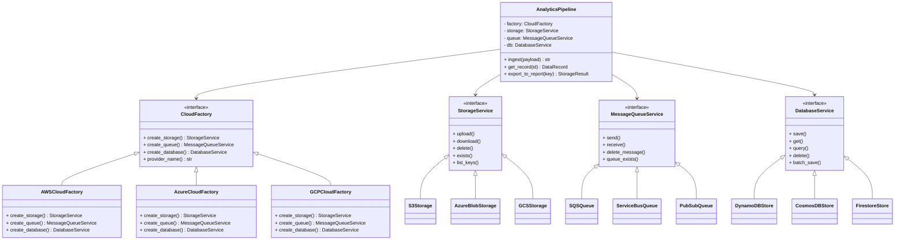

# Abstract Factory

> *"Provide an interface for creating families of related or dependent objects without specifying their concrete classes."* — Gang of Four, *Design Patterns: Elements of Reusable Object-Oriented Software*, 1994.

Có bao giờ bạn gặp tình huống phải đảm bảo rằng một nhóm object "sinh ra là phải đi cùng nhau" — không thể trộn lẫn? Tôi thì có, và nó từng làm tôi đau đầu đến mất ngủ.

**Abstract Factory** thuộc nhóm **Creational Patterns**, cung cấp một interface để tạo **cả một họ object có liên quan** mà không cần chỉ định class cụ thể. Khác với Factory Method (tạo một object), Abstract Factory giải quyết bài toán đảm bảo tính **tương thích** giữa các object trong cùng một họ — một yêu cầu cực kỳ quan trọng trong các hệ thống phức tạp.

## Bài toán chi tiết

Bạn đang xây dựng một **nền tảng phân tích dữ liệu đám mây đa nhà cung cấp** (multi-cloud data analytics platform). Hệ thống phải hỗ trợ đồng thời ba nhà cung cấp cloud lớn: **AWS**, **Azure**, và **GCP**. Mỗi cloud provider có dịch vụ tương ứng cho ba loại tài nguyên:

1. **Storage**: AWS S3, Azure Blob Storage, GCP Cloud Storage.
2. **Message Queue**: AWS SQS, Azure Service Bus, GCP Pub/Sub.
3. **Database**: AWS DynamoDB, Azure Cosmos DB, GCP Firestore.

Yêu cầu khắt khe nhất: **khách hàng doanh nghiệp** chỉ muốn dùng một cloud provider duy nhất cho toàn bộ hệ thống. Họ không thể trộn lẫn — ví dụ, không thể dùng S3 để lưu file nhưng dùng Azure Service Bus để queue message. Lý do: bảo mật, compliance (GDPR, HIPAA), vendor lock-in policy, và đơn giản hóa operation.

Vấn đề bắt đầu khi bạn code:

```python
class DataPipeline:
    def __init__(self, provider: str):
        self.provider = provider

    def process(self, data):
        if self.provider == "aws":
            storage = S3Storage()
            queue = SQSQueue()
            db = DynamoDB()
        elif self.provider == "azure":
            storage = AzureBlobStorage()
            queue = ServiceBusQueue()
            db = CosmosDB()
        elif self.provider == "gcp":
            storage = GCSStorage()
            queue = PubSubQueue()
            db = FirestoreDB()
        # ... logic xử lý
```

Mỗi lần thêm cloud provider mới (ví dụ: Alibaba Cloud, Oracle Cloud), bạn phải:
1. Thêm một `elif` mới vào `DataPipeline`.
2. Đảm bảo `elif` được thêm vào *tất cả* các class có logic tương tự (có thể có 20+ class khác nhau trong codebase).
3. Viết unit test cho từng tổ hợp provider x class — số lượng test tăng theo cấp số nhân.

Khi dự án lớn dần, số lượng class liên quan đến cloud provider có thể lên đến 50+. Mỗi class đều có `if/elif` chain. Một ngày đẹp trời, khách hàng yêu cầu thêm support **Alibaba Cloud**. Bạn thêm 50 `elif` — và 3 trong số đó bị sai tên service. Hệ thống test không phát hiện ra vì không có integration test. Đến khi lên production, dữ liệu khách hàng bị ghi sai chỗ, mất 6 tiếng để debug.

Tôi đã thấy chuyện này xảy ra. Không đẹp chút nào.

Vấn đề cốt lõi:
1. **Vi phạm OCP**: Mỗi provider mới = sửa code khắp nơi.
2. **Không có ràng buộc**: Không ai đảm bảo các service trong cùng provider khớp với nhau.
3. **Complexity lây lan**: Logic chọn provider xuất hiện ở mọi tầng của ứng dụng.

## Giải pháp với Pattern

Abstract Factory giải quyết triệt để bằng cách:

1. **Abstract Products**: Định nghĩa interface cho từng loại service: `Storage`, `MessageQueue`, `NoSQLDatabase`.
2. **Concrete Products**: Implement cụ thể cho từng provider (AWS, Azure, GCP).
3. **Abstract Factory**: Interface duy nhất: `create_storage()`, `create_queue()`, `create_database()`.
4. **Concrete Factories**: Mỗi provider có factory riêng: `AWSCloudFactory`, `AzureCloudFactory`, `GCPCloudFactory`.

Client code (ví dụ `DataPipeline`) chỉ làm việc với `CloudFactory` interface — nó **không bao giờ** gọi tên class cụ thể. Khi cần thêm provider mới:
1. Tạo concrete products (implement 3 interface).
2. Tạo concrete factory (implement `CloudFactory`).
3. Truyền factory mới vào client — **không sửa một dòng code cũ nào**.

Quan trọng hơn: **tính tương thích được đảm bảo bởi factory**. Một factory chỉ tạo ra các product từ cùng một provider. Không thể vô tình trộn S3 với Service Bus — vì chúng đến từ hai factory khác nhau.

## Phân tích thiết kế

**OOP Principles áp dụng:**

- **Open/Closed Principle**: Hệ thống mở cho provider mới, đóng cho sửa đổi.
- **Single Responsibility Principle**: Factory chịu trách nhiệm tạo product, Product chịu trách nhiệm business logic.
- **Liskov Substitution Principle**: Bất kỳ ConcreteFactory nào cũng thay thế được AbstractFactory.
- **Interface Segregation Principle**: Abstract Factory interface chỉ gồm các method tạo product — không có method business logic.
- **Dependency Inversion Principle**: Client phụ thuộc vào abstraction (`CloudFactory`), không phụ thuộc vào concrete.

**Trade-offs:**

- **Complexity cao nhất trong Creational patterns**: Cần tạo nhiều interface và class nhất.
- **Khó thêm product mới**: Nếu cần thêm loại service mới (ví dụ: `CDN`, `DNS`), phải sửa Abstract Factory interface — kéo theo sửa tất cả Concrete Factories.
- **Overkill cho ứng dụng nhỏ**: Nếu chỉ có 2-3 product và không có kế hoạch mở rộng, Factory Method hoặc Simple Factory đã đủ.

**Khi nào KHÔNG nên dùng Abstract Factory:**

- Khi các product không thực sự "liên quan" — ví dụ, bạn không cần đảm bảo Storage và Queue đến từ cùng một provider.
- Khi số lượng product trong một họ quá lớn (>10-15) — interface factory sẽ quá cồng kềnh.
- Khi mỗi họ product chỉ có một hoặc hai product — chi phí tạo abstraction không tương xứng.
- Khi bạn cần tạo object theo runtime parameters phức tạp — Prototype pattern có thể phù hợp hơn.

## Ví dụ code hoàn chỉnh

### Cách làm sai (Không dùng Abstract Factory)

```python
from dataclasses import dataclass, field
from typing import Any, Optional
from enum import Enum
import json


class CloudProvider(Enum):
    AWS = "aws"
    AZURE = "azure"
    GCP = "gcp"


@dataclass
class DataRecord:
    id: str
    payload: dict
    timestamp: float


class DataPipeline:
    """Cách sai: if/elif chain — vi phạm OCP, khó bảo trì."""

    def __init__(self, provider: str, config: dict) -> None:
        self.provider = provider
        self.config = config
        self._init_services()

    def _init_services(self) -> None:
        if self.provider == "aws":
            from somewhere.aws import S3Storage, SQSQueue, DynamoDBStore
            self.storage = S3Storage(self.config.get("s3_bucket", ""))
            self.queue = SQSQueue(self.config.get("sqs_url", ""))
            self.db = DynamoDBStore(self.config.get("dynamo_table", ""))
        elif self.provider == "azure":
            from somewhere.azure import AzureBlobStorage, ServiceBusQueue, CosmosDBStore
            self.storage = AzureBlobStorage(self.config.get("blob_container", ""))
            self.queue = ServiceBusQueue(self.config.get("servicebus_namespace", ""))
            self.db = CosmosDBStore(self.config.get("cosmos_db", ""))
        elif self.provider == "gcp":
            from somewhere.gcp import GCSStorage, PubSubQueue, FirestoreStore
            self.storage = GCSStorage(self.config.get("gcs_bucket", ""))
            self.queue = PubSubQueue(self.config.get("pubsub_topic", ""))
            self.db = FirestoreStore(self.config.get("firestore_collection", ""))
        else:
            raise ValueError(f"Unknown provider: {self.provider}")

    def ingest(self, record: DataRecord) -> None:
        self.storage.upload(f"raw/{record.id}.json", json.dumps(record.payload))
        self.queue.send(record.id, record.payload)
        self.db.save(record)

    def query(self, record_id: str) -> Optional[DataRecord]:
        return self.db.get(record_id)
```

### Refactored với Abstract Factory

```python
from abc import ABC, abstractmethod
from dataclasses import dataclass, field
from typing import Any, Optional, Protocol
from enum import Enum, auto
import json
import uuid
from datetime import datetime


# ============== DOMAIN MODELS ==============

@dataclass(frozen=True)
class DataRecord:
    id: str
    payload: dict[str, Any]
    timestamp: datetime
    source: str = ""

    @classmethod
    def create(cls, payload: dict[str, Any], source: str = "") -> "DataRecord":
        return cls(
            id=str(uuid.uuid4()),
            payload=payload,
            timestamp=datetime.now(),
            source=source,
        )


@dataclass
class StorageResult:
    path: str
    size_bytes: int
    etag: str
    success: bool


@dataclass
class QueueResult:
    message_id: str
    receipt_handle: str = ""
    success: bool = True


# ============== ABSTRACT PRODUCTS ==============

class StorageService(ABC):
    """Abstract Product: lưu trữ object (S3, Blob, GCS)."""

    @abstractmethod
    def upload(self, key: str, data: str | bytes, content_type: str = "application/json") -> StorageResult: ...

    @abstractmethod
    def download(self, key: str) -> Optional[str | bytes]: ...

    @abstractmethod
    def delete(self, key: str) -> bool: ...

    @abstractmethod
    def exists(self, key: str) -> bool: ...

    @abstractmethod
    def list_keys(self, prefix: str) -> list[str]: ...


class MessageQueueService(ABC):
    """Abstract Product: message queue (SQS, Service Bus, Pub/Sub)."""

    @abstractmethod
    def send(self, queue_name: str, message: dict[str, Any]) -> QueueResult: ...

    @abstractmethod
    def receive(self, queue_name: str, max_messages: int = 1) -> list[QueueResult]: ...

    @abstractmethod
    def delete_message(self, queue_name: str, receipt_handle: str) -> bool: ...

    @abstractmethod
    def queue_exists(self, queue_name: str) -> bool: ...


class DatabaseService(ABC):
    """Abstract Product: NoSQL database (DynamoDB, Cosmos DB, Firestore)."""

    @abstractmethod
    def save(self, record: DataRecord) -> bool: ...

    @abstractmethod
    def get(self, record_id: str) -> Optional[DataRecord]: ...

    @abstractmethod
    def query(self, field: str, value: Any) -> list[DataRecord]: ...

    @abstractmethod
    def delete(self, record_id: str) -> bool: ...

    @abstractmethod
    def batch_save(self, records: list[DataRecord]) -> int: ...


# ============== CONCRETE PRODUCTS: AWS ==============

class S3Storage(StorageService):
    """AWS S3 implementation — mô phỏng."""

    def __init__(self, bucket: str, region: str = "ap-southeast-1") -> None:
        self.bucket = bucket
        self.region = region
        self._store: dict[str, str | bytes] = {}

    def upload(self, key: str, data: str | bytes, content_type: str = "application/json") -> StorageResult:
        self._store[key] = data
        size = len(data) if isinstance(data, bytes) else len(data.encode("utf-8"))
        return StorageResult(
            path=f"s3://{self.bucket}/{key}",
            size_bytes=size,
            etag=f"\"{hash(key) & 0xFFFFFFFF:08x}\"",
            success=True,
        )

    def download(self, key: str) -> Optional[str | bytes]:
        return self._store.get(key)

    def delete(self, key: str) -> bool:
        return self._store.pop(key, None) is not None

    def exists(self, key: str) -> bool:
        return key in self._store

    def list_keys(self, prefix: str) -> list[str]:
        return [k for k in self._store if k.startswith(prefix)]


class SQSQueue(MessageQueueService):
    """AWS SQS implementation — mô phỏng."""

    def __init__(self, region: str = "ap-southeast-1") -> None:
        self.region = region
        self._queues: dict[str, list[dict]] = {}

    def send(self, queue_name: str, message: dict[str, Any]) -> QueueResult:
        if queue_name not in self._queues:
            self._queues[queue_name] = []
        msg_id = str(uuid.uuid4())
        self._queues[queue_name].append({"id": msg_id, "body": message})
        return QueueResult(message_id=msg_id)

    def receive(self, queue_name: str, max_messages: int = 1) -> list[QueueResult]:
        if queue_name not in self._queues:
            return []
        msgs = self._queues[queue_name][:max_messages]
        results = []
        for msg in msgs:
            handle = f"receipt-{msg['id']}"
            results.append(QueueResult(message_id=msg["id"], receipt_handle=handle))
        return results

    def delete_message(self, queue_name: str, receipt_handle: str) -> bool:
        # Mô phỏng: tìm và xóa message theo receipt handle
        return True

    def queue_exists(self, queue_name: str) -> bool:
        return queue_name in self._queues


class DynamoDBStore(DatabaseService):
    """AWS DynamoDB implementation — mô phỏng."""

    def __init__(self, table_name: str, region: str = "ap-southeast-1") -> None:
        self.table_name = table_name
        self.region = region
        self._store: dict[str, DataRecord] = {}

    def save(self, record: DataRecord) -> bool:
        self._store[record.id] = record
        return True

    def get(self, record_id: str) -> Optional[DataRecord]:
        return self._store.get(record_id)

    def query(self, field: str, value: Any) -> list[DataRecord]:
        return [r for r in self._store.values()
                if field in r.payload and r.payload[field] == value]

    def delete(self, record_id: str) -> bool:
        return self._store.pop(record_id, None) is not None

    def batch_save(self, records: list[DataRecord]) -> int:
        for r in records:
            self._store[r.id] = r
        return len(records)


# ============== CONCRETE PRODUCTS: AZURE ==============

class AzureBlobStorage(StorageService):
    """Azure Blob Storage implementation — mô phỏng."""

    def __init__(self, container: str, connection_string: str = "") -> None:
        self.container = container
        self._store: dict[str, str | bytes] = {}

    def upload(self, key: str, data: str | bytes, content_type: str = "application/json") -> StorageResult:
        self._store[key] = data
        size = len(data) if isinstance(data, bytes) else len(data.encode("utf-8"))
        return StorageResult(
            path=f"azure://{self.container}/{key}",
            size_bytes=size,
            etag=f"\"{hash(key) & 0xFFFFFFFF:08x}\"",
            success=True,
        )

    def download(self, key: str) -> Optional[str | bytes]:
        return self._store.get(key)

    def delete(self, key: str) -> bool:
        return self._store.pop(key, None) is not None

    def exists(self, key: str) -> bool:
        return key in self._store

    def list_keys(self, prefix: str) -> list[str]:
        return [k for k in self._store if k.startswith(prefix)]


class ServiceBusQueue(MessageQueueService):
    """Azure Service Bus implementation — mô phỏng."""

    def __init__(self, namespace: str = "") -> None:
        self.namespace = namespace
        self._queues: dict[str, list[dict]] = {}

    def send(self, queue_name: str, message: dict[str, Any]) -> QueueResult:
        if queue_name not in self._queues:
            self._queues[queue_name] = []
        msg_id = str(uuid.uuid4())
        self._queues[queue_name].append({"id": msg_id, "body": message})
        return QueueResult(message_id=msg_id)

    def receive(self, queue_name: str, max_messages: int = 1) -> list[QueueResult]:
        if queue_name not in self._queues:
            return []
        msgs = self._queues[queue_name][:max_messages]
        return [QueueResult(message_id=msg["id"], receipt_handle=f"sb-{msg['id']}") for msg in msgs]

    def delete_message(self, queue_name: str, receipt_handle: str) -> bool:
        return True

    def queue_exists(self, queue_name: str) -> bool:
        return queue_name in self._queues


class CosmosDBStore(DatabaseService):
    """Azure Cosmos DB implementation — mô phỏng."""

    def __init__(self, database_name: str, container_name: str = "records") -> None:
        self.database_name = database_name
        self.container_name = container_name
        self._store: dict[str, DataRecord] = {}

    def save(self, record: DataRecord) -> bool:
        self._store[record.id] = record
        return True

    def get(self, record_id: str) -> Optional[DataRecord]:
        return self._store.get(record_id)

    def query(self, field: str, value: Any) -> list[DataRecord]:
        return [r for r in self._store.values()
                if field in r.payload and r.payload[field] == value]

    def delete(self, record_id: str) -> bool:
        return self._store.pop(record_id, None) is not None

    def batch_save(self, records: list[DataRecord]) -> int:
        for r in records:
            self._store[r.id] = r
        return len(records)


# ============== CONCRETE PRODUCTS: GCP ==============

class GCSStorage(StorageService):
    """GCP Cloud Storage implementation — mô phỏng."""

    def __init__(self, bucket: str, project: str = "") -> None:
        self.bucket = bucket
        self.project = project
        self._store: dict[str, str | bytes] = {}

    def upload(self, key: str, data: str | bytes, content_type: str = "application/json") -> StorageResult:
        self._store[key] = data
        size = len(data) if isinstance(data, bytes) else len(data.encode("utf-8"))
        return StorageResult(
            path=f"gs://{self.bucket}/{key}",
            size_bytes=size,
            etag=f"\"{hash(key) & 0xFFFFFFFF:08x}\"",
            success=True,
        )

    def download(self, key: str) -> Optional[str | bytes]:
        return self._store.get(key)

    def delete(self, key: str) -> bool:
        return self._store.pop(key, None) is not None

    def exists(self, key: str) -> bool:
        return key in self._store

    def list_keys(self, prefix: str) -> list[str]:
        return [k for k in self._store if k.startswith(prefix)]


class PubSubQueue(MessageQueueService):
    """GCP Pub/Sub implementation — mô phỏng."""

    def __init__(self, project: str = "my-project") -> None:
        self.project = project
        self._topics: dict[str, list[dict]] = {}

    def send(self, topic_name: str, message: dict[str, Any]) -> QueueResult:
        if topic_name not in self._topics:
            self._topics[topic_name] = []
        msg_id = str(uuid.uuid4())
        self._topics[topic_name].append({"id": msg_id, "body": message})
        return QueueResult(message_id=msg_id)

    def receive(self, subscription_name: str, max_messages: int = 1) -> list[QueueResult]:
        if subscription_name not in self._topics:
            return []
        msgs = self._topics[subscription_name][:max_messages]
        return [QueueResult(message_id=msg["id"], receipt_handle=f"gcp-{msg['id']}") for msg in msgs]

    def delete_message(self, subscription_name: str, receipt_handle: str) -> bool:
        return True

    def queue_exists(self, topic_name: str) -> bool:
        return topic_name in self._topics


class FirestoreStore(DatabaseService):
    """GCP Firestore implementation — mô phỏng."""

    def __init__(self, collection: str, project: str = "") -> None:
        self.collection = collection
        self.project = project
        self._store: dict[str, DataRecord] = {}

    def save(self, record: DataRecord) -> bool:
        self._store[record.id] = record
        return True

    def get(self, record_id: str) -> Optional[DataRecord]:
        return self._store.get(record_id)

    def query(self, field: str, value: Any) -> list[DataRecord]:
        return [r for r in self._store.values()
                if field in r.payload and r.payload[field] == value]

    def delete(self, record_id: str) -> bool:
        return self._store.pop(record_id, None) is not None

    def batch_save(self, records: list[DataRecord]) -> int:
        for r in records:
            self._store[r.id] = r
        return len(records)


# ============== ABSTRACT FACTORY ==============

class CloudFactory(ABC):
    """Abstract Factory — tạo họ product cho một cloud provider."""

    @abstractmethod
    def create_storage(self) -> StorageService: ...

    @abstractmethod
    def create_queue(self) -> MessageQueueService: ...

    @abstractmethod
    def create_database(self) -> DatabaseService: ...

    @abstractmethod
    def provider_name(self) -> str: ...


# ============== CONCRETE FACTORIES ==============

class AWSCloudFactory(CloudFactory):
    def __init__(self, bucket: str = "default-bucket",
                 region: str = "ap-southeast-1",
                 table_name: str = "records") -> None:
        self.bucket = bucket
        self.region = region
        self.table_name = table_name

    def create_storage(self) -> StorageService:
        return S3Storage(bucket=self.bucket, region=self.region)

    def create_queue(self) -> MessageQueueService:
        return SQSQueue(region=self.region)

    def create_database(self) -> DatabaseService:
        return DynamoDBStore(table_name=self.table_name, region=self.region)

    def provider_name(self) -> str:
        return "AWS"


class AzureCloudFactory(CloudFactory):
    def __init__(self, container: str = "default-container",
                 namespace: str = "default-ns",
                 database_name: str = "analytics") -> None:
        self.container = container
        self.namespace = namespace
        self.database_name = database_name

    def create_storage(self) -> StorageService:
        return AzureBlobStorage(container=self.container)

    def create_queue(self) -> MessageQueueService:
        return ServiceBusQueue(namespace=self.namespace)

    def create_database(self) -> DatabaseService:
        return CosmosDBStore(database_name=self.database_name)

    def provider_name(self) -> str:
        return "Azure"


class GCPCloudFactory(CloudFactory):
    def __init__(self, bucket: str = "default-bucket",
                 project: str = "my-project",
                 collection: str = "records") -> None:
        self.bucket = bucket
        self.project = project
        self.collection = collection

    def create_storage(self) -> StorageService:
        return GCSStorage(bucket=self.bucket, project=self.project)

    def create_queue(self) -> MessageQueueService:
        return PubSubQueue(project=self.project)

    def create_database(self) -> DatabaseService:
        return FirestoreStore(collection=self.collection, project=self.project)

    def provider_name(self) -> str:
        return "GCP"


# ============== CLIENT CODE ==============

class AnalyticsPipeline:
    """
    Client — chỉ làm việc với CloudFactory interface.
    Hoàn toàn không biết class cụ thể nào đang được dùng.
    """

    def __init__(self, factory: CloudFactory, pipeline_name: str = "default") -> None:
        self._factory = factory
        self.pipeline_name = pipeline_name
        self.storage = factory.create_storage()
        self.queue = factory.create_queue()
        self.db = factory.create_database()
        self._ingested_count = 0

    def ingest(self, payload: dict[str, Any], source: str = "") -> str:
        """Nhận dữ liệu, lưu storage, gửi queue, ghi DB."""
        record = DataRecord.create(payload=payload, source=source)

        # 1. Upload raw data lên storage
        key = f"{self.pipeline_name}/{record.id}.json"
        result = self.storage.upload(key, json.dumps(record.payload))
        if not result.success:
            raise RuntimeError(f"Upload thất bại: {key}")

        # 2. Gửi message đến queue để xử lý async
        self.queue.send(
            f"{self.pipeline_name}-ingest",
            {"record_id": record.id, "storage_path": result.path},
        )

        # 3. Lưu metadata vào database
        self.db.save(record)
        self._ingested_count += 1

        return record.id

    def get_record(self, record_id: str) -> Optional[DataRecord]:
        return self.db.get(record_id)

    def export_to_report(self, output_key: str) -> StorageResult:
        """Tạo báo cáo và lưu lên storage (sử dụng factory)."""
        all_records = self.db.query("source", "mobile_app")
        report_data = [
            {"id": r.id, "timestamp": r.timestamp.isoformat(), **r.payload}
            for r in all_records
        ]
        return self.storage.upload(output_key, json.dumps(report_data, default=str))

    @property
    def provider(self) -> str:
        return self._factory.provider_name()

    @property
    def ingested_count(self) -> int:
        return self._ingested_count


# ========== SỬ DỤNG THỰC TẾ ==========

if __name__ == "__main__":
    import os

    # Chọn factory dựa trên môi trường — single source of truth
    provider = os.getenv("CLOUD_PROVIDER", "aws").lower()

    factory_map: dict[str, CloudFactory] = {
        "aws": AWSCloudFactory(
            bucket="analytics-raw-data",
            region="ap-southeast-1",
            table_name="ingestion_records",
        ),
        "azure": AzureCloudFactory(
            container="analytics-raw-data",
            namespace="analytics-ns",
            database_name="ingestion_db",
        ),
        "gcp": GCPCloudFactory(
            bucket="analytics-raw-data",
            project="analytics-prod",
            collection="ingestion_records",
        ),
    }

    factory = factory_map.get(provider)
    if factory is None:
        raise ValueError(f"Unsupported provider: {provider}")

    # Tạo pipeline — chỉ dùng factory, không biết provider cụ thể
    pipeline = AnalyticsPipeline(factory=factory, pipeline_name="user-events")

    # Ingest dữ liệu
    record_id = pipeline.ingest(
        payload={
            "user_id": "user_12345",
            "event": "purchase",
            "amount": 250000,
            "currency": "VND",
            "items": ["MacBook Air", "AirPods Pro"],
        },
        source="mobile_app",
    )
    print(f"[{pipeline.provider}] Ingested record: {record_id}")

    # Ingest thêm dữ liệu
    pipeline.ingest(
        payload={"user_id": "user_12345", "event": "login", "ip": "192.168.1.1"},
        source="web_app",
    )
    pipeline.ingest(
        payload={"user_id": "user_67890", "event": "purchase", "amount": 50000},
        source="mobile_app",
    )

    print(f"[{pipeline.provider}] Total ingested: {pipeline.ingested_count}")

    # Query records
    record = pipeline.get_record(record_id)
    if record:
        print(f"[{pipeline.provider}] Fetched record: {record.id} | Source: {record.source}")

    # Export báo cáo
    result = pipeline.export_to_report("reports/mobile_app_users.json")
    print(f"[{pipeline.provider}] Report saved: {result.path} ({result.size_bytes} bytes)")
```

## Sơ đồ UML



## So sánh với Pattern liên quan

| Pattern | Điểm giống | Điểm khác biệt chính |
|---------|-----------|---------------------|
| **Factory Method** | Đều tạo object thông qua interface | Factory Method tạo *một* object, dùng inheritance. Abstract Factory tạo *một họ* object, dùng composition. Abstract Factory thường được implement bằng nhiều Factory Methods. |
| **Builder** | Đều tách quá trình tạo object | Builder tập trung vào *cách xây dựng* một object phức tạp từng bước. Abstract Factory tập trung vào *họ product nào* được tạo. Builder thường trả về product ở bước cuối, Abstract Factory trả về product ngay. |
| **Prototype** | Đều tạo object mà không cần chỉ định class cụ thể | Prototype tạo object bằng cách clone instance có sẵn. Abstract Factory tạo object bằng cách gọi factory method. Prototype phù hợp khi việc khởi tạo tốn kém, Abstract Factory phù hợp khi cần đảm bảo tính tương thích. |

**Khi nào chọn Abstract Factory thay vì Builder?**
- Khi bạn cần tạo nhiều loại object khác nhau (không phải các bước của cùng một object).
- Khi bạn muốn đảm bảo các object được tạo ra tương thích với nhau.
- Khi số lượng product trong một họ là cố định và không thay đổi thường xuyên.

**Khi nào dùng Prototype + Abstract Factory kết hợp?**
- Khi việc tạo product từ đầu tốn kém (ví dụ: kết nối database, load config) — dùng Prototype để clone.
- Khi bạn có nhiều họ product và mỗi họ có nhiều biến thể — Abstract Factory chọn họ, Prototype tạo biến thể.

## Ứng dụng thực tế

### 1. Django Database Backend — Abstract Factory pattern

Django sử dụng Abstract Factory để hỗ trợ nhiều database backend (PostgreSQL, MySQL, SQLite, Oracle):

```python
from django.db.backends.base.base import BaseDatabaseWrapper

# Mỗi database backend là một factory tạo connection và operations
from django.db import connections

# connections['default'] trả về DatabaseWrapper cụ thể
with connections['default'].cursor() as cursor:
    cursor.execute("SELECT 1")
    row = cursor.fetchone()

# Thêm backend mới: chỉ cần implement BaseDatabaseWrapper
# Không sửa bất kỳ code client nào (models, querysets, v.v.)
```

### 2. AWS SDK — Boto3 Session

Boto3 dùng Session làm Abstract Factory, tạo client cho nhiều service:

```python
import boto3

# Session là Abstract Factory
session = boto3.Session(
    aws_access_key_id="...",
    aws_secret_access_key="...",
    region_name="ap-southeast-1",
)

# Mỗi client là một product
s3 = session.client("s3")         # StorageService
sqs = session.client("sqs")       # MessageQueueService
dynamodb = session.client("dynamodb")  # DatabaseService
lambda_client = session.client("lambda")

# Đổi region = tạo session mới
europe_session = boto3.Session(region_name="eu-west-1")
s3_eu = europe_session.client("s3")  # Khác region, implementation khác
```

### 3. Java Swing — Look and Feel

Java Swing dùng Abstract Factory cho cross-platform UI:

```python
# Mô phỏng Java Swing LookAndFeel
class LookAndFeel(ABC):
    @abstractmethod
    def create_button(self) -> Button: ...
    @abstractmethod
    def create_text_field(self) -> TextField: ...
    @abstractmethod
    def create_menu(self) -> Menu: ...

class WindowsLookAndFeel(LookAndFeel):
    def create_button(self) -> Button:
        return WindowsButton()  # Bo tròn, gradient xanh
    def create_text_field(self) -> TextField:
        return WindowsTextField()
    def create_menu(self) -> Menu:
        return WindowsMenu()

class MacLookAndFeel(LookAndFeel):
    def create_button(self) -> Button:
        return MacButton()  # Phẳng, tối giản
    def create_text_field(self) -> TextField:
        return MacTextField()
    def create_menu(self) -> Menu:
        return MacMenu()
```

### 4. Pytest — Plugin system

Pytest dùng abstract factory pattern trong plugin system — mỗi plugin tạo ra các fixture, hooks, và config items:

```python
# pytest plugin như một Abstract Factory
class PytestPlugin(ABC):
    @abstractmethod
    def pytest_runtest_setup(self, item): ...
    @abstractmethod
    def pytest_runtest_call(self, item): ...
    @abstractmethod
    def pytest_runtest_teardown(self, item): ...

class DjangoPlugin(PytestPlugin):
    def pytest_runtest_setup(self, item):
        # Setup Django database
        pass

class SQLAlchemyPlugin(PytestPlugin):
    def pytest_runtest_setup(self, item):
        # Setup SQLAlchemy session
        pass
```

## Kiểm thử

Abstract Factory tạo điều kiện lý tưởng cho unit testing — có thể mock từng product hoặc toàn bộ factory:

```python
import pytest
from unittest.mock import MagicMock, patch, PropertyMock
from datetime import datetime


@pytest.fixture
def mock_factory() -> MagicMock:
    """Tạo mock factory để test client độc lập với provider."""
    factory = MagicMock(spec=CloudFactory)
    factory.create_storage.return_value = MagicMock(spec=StorageService)
    factory.create_queue.return_value = MagicMock(spec=MessageQueueService)
    factory.create_database.return_value = MagicMock(spec=DatabaseService)
    type(factory).provider_name = PropertyMock(return_value="MockCloud")
    return factory


class TestAnalyticsPipeline:
    """Test client với mock factory — không cần provider thật."""

    def test_ingest_calls_all_services(self, mock_factory):
        pipeline = AnalyticsPipeline(factory=mock_factory, pipeline_name="test")

        result_id = pipeline.ingest(
            payload={"event": "test", "value": 42},
            source="unit_test",
        )

        # Kiểm tra storage được gọi
        pipeline.storage.upload.assert_called_once()
        # Kiểm tra queue được gọi
        pipeline.queue.send.assert_called_once()
        # Kiểm tra database được gọi
        pipeline.db.save.assert_called_once()
        assert result_id is not None

    def test_ingest_storage_failure(self, mock_factory):
        pipeline = AnalyticsPipeline(factory=mock_factory)
        pipeline.storage.upload.return_value = StorageResult(
            path="", size_bytes=0, etag="", success=False,
        )

        with pytest.raises(RuntimeError, match="Upload thất bại"):
            pipeline.ingest(payload={"fail": True})

    def test_get_record(self, mock_factory):
        test_record = DataRecord(
            id="test-123",
            payload={"key": "value"},
            timestamp=datetime.now(),
        )
        pipeline = AnalyticsPipeline(factory=mock_factory)
        pipeline.db.get.return_value = test_record

        result = pipeline.get_record("test-123")
        assert result == test_record
        pipeline.db.get.assert_called_once_with("test-123")

    def test_export_to_report(self, mock_factory):
        records = [
            DataRecord(id="1", payload={"source": "mobile_app", "event": "login"},
                       timestamp=datetime.now()),
            DataRecord(id="2", payload={"source": "mobile_app", "event": "purchase"},
                       timestamp=datetime.now()),
        ]
        pipeline = AnalyticsPipeline(factory=mock_factory)
        pipeline.db.query.return_value = records
        pipeline.storage.upload.return_value = StorageResult(
            path="gs://bucket/report.json", size_bytes=500, etag="\"abc\"",
            success=True,
        )

        result = pipeline.export_to_report("report.json")
        assert result.success
        pipeline.db.query.assert_called_once_with("source", "mobile_app")
        pipeline.storage.upload.assert_called_once()


class TestConcreteFactories:
    """Test concrete factory tạo đúng loại product."""

    def test_aws_factory_creates_aws_products(self):
        factory = AWSCloudFactory()
        assert isinstance(factory.create_storage(), S3Storage)
        assert isinstance(factory.create_queue(), SQSQueue)
        assert isinstance(factory.create_database(), DynamoDBStore)
        assert factory.provider_name() == "AWS"

    def test_azure_factory_creates_azure_products(self):
        factory = AzureCloudFactory()
        assert isinstance(factory.create_storage(), AzureBlobStorage)
        assert isinstance(factory.create_queue(), ServiceBusQueue)
        assert isinstance(factory.create_database(), CosmosDBStore)
        assert factory.provider_name() == "Azure"

    def test_gcp_factory_creates_gcp_products(self):
        factory = GCPCloudFactory()
        assert isinstance(factory.create_storage(), GCSStorage)
        assert isinstance(factory.create_queue(), PubSubQueue)
        assert isinstance(factory.create_database(), FirestoreStore)
        assert factory.provider_name() == "GCP"

    def test_factory_isolation(self):
        """Đảm bảo không có shared state giữa các factory."""
        aws_factory = AWSCloudFactory()
        azure_factory = AzureCloudFactory()

        aws_storage = aws_factory.create_storage()
        azure_storage = azure_factory.create_storage()

        aws_storage.upload("key", "aws-data")
        assert not azure_storage.exists("key")


class TestFactoryIntegration:
    """Integration test với factory thật — test toàn bộ flow."""

    @pytest.fixture(params=["aws", "azure", "gcp"])
    def factory(self, request):
        if request.param == "aws":
            return AWSCloudFactory(bucket="test-bucket", table_name="test-table")
        elif request.param == "azure":
            return AzureCloudFactory(container="test-container", database_name="test-db")
        elif request.param == "gcp":
            return GCPCloudFactory(bucket="test-bucket", collection="test-collection")

    def test_full_ingest_flow(self, factory):
        pipeline = AnalyticsPipeline(factory=factory, pipeline_name="integration-test")
        record_id = pipeline.ingest(
            payload={"integration": True, "value": 123},
            source="pytest",
        )
        assert record_id is not None
        fetched = pipeline.get_record(record_id)
        assert fetched is not None
        assert fetched.payload["integration"] is True
```

## Ưu và nhược điểm

| Ưu điểm | Nhược điểm |
|---------|-----------|
| **Tính tương thích**: Đảm bảo các product trong cùng họ được dùng cùng nhau | **Complexity cao nhất**: Nhiều interface, nhiều class, nhiều abstraction |
| **Open/Closed**: Thêm họ mới không sửa code client | **Khó mở rộng**: Thêm product mới (loại service mới) phải sửa interface Factory |
| **Single Responsibility**: Factory chỉ tạo product, Product chỉ xử lý business | **Overkill**: Với ứng dụng 1-2 product, đây là over-engineering |
| **Kiểm thử dễ dàng**: Mock cả factory, test client độc lập | **Code khó đọc**: Cần nhiều file/class, tracing luồng khó hơn |
| **Loose coupling**: Client không biết class cụ thể nào đang chạy | **Rigid interface**: Abstract Factory interface khó thay đổi sau khi đã dùng |
| **Consistent look and feel**: Đảm bảo UI toolkit nhất quán trên mọi nền tảng | **Nested factory**: Nếu factory cần config phức tạp, có thể cần AbstractFactory cho Factory chính |
| **Product family constraint**: Ràng buộc mạnh mẽ — không thể dùng nhầm product | **Startup cost**: Khởi tạo nhiều object, đặc biệt nếu mỗi product cần resources |
| **Dễ dàng swap**: Đổi provider = đổi một dòng code (factory được inject) | **Discovery**: Developer mới có thể khó tìm ra class thực sự đang chạy |

---

## Kết luận

Abstract Factory là pattern mạnh mẽ nhất trong nhóm Creational — nhưng cũng phức tạp nhất. **Golden rule**: Chỉ dùng Abstract Factory khi bạn có **ít nhất 2 họ product**, mỗi họ có **ít nhất 2 product**, và bạn cần đảm bảo **tính tương thích** giữa các product trong cùng họ.

Như một nhà thiết kế nội thất — bạn không thể mua ghế IKEA rồi đặt cạnh bàn Pháp cổ được. Nó chỉ tạo ra một "hỗn loạn thẩm mỹ". Abstract Factory cũng vậy — nó đảm bảo mọi thứ trong cùng một phòng đều cùng "phong cách".

Pattern này đặc biệt phù hợp với:
1. **Cross-platform applications**: UI toolkit, database driver, file system abstraction.
2. **Multi-cloud/on-premise systems**: Storage, queue, database — mỗi environment một factory.
3. **Theming systems**: Material Design, Fluent Design, custom theme — mỗi theme một factory.
4. **Testing infrastructure**: Production factory, test factory (in-memory), staging factory.

Hãy nhớ: Abstract Factory đi kèm với chi phí — không chỉ là số lượng class, mà còn là độ phức tạp trong việc thay đổi interface. Trước khi dùng, hãy tự hỏi: "Liệu tôi có thực sự cần thêm product type mới trong tương lai?" Nếu câu trả lời là "có", hãy thiết kế interface factory thật tổng quát. Nếu "không", có lẽ Factory Method hoặc Simple Factory là đủ.

---

*Trân trọng!*
