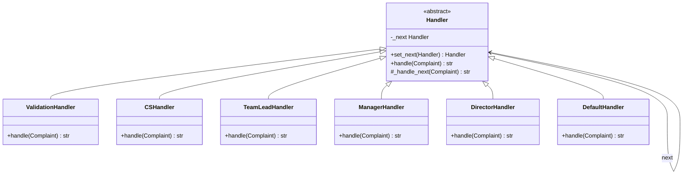

# Chain of Responsibility

> **Chain of Responsibility** — *"Avoid coupling the sender of a request to its receiver by giving more than one object a chance to handle the request. Chain the receiving objects and pass the request along the chain until an object handles it."* — GoF, 1994

## Bài toán chi tiết

Bạn đã bao giờ phải viết một cái `if-else` khổng lồ để xử lý các loại request khác nhau chưa? Tôi thì có — và nó không vui chút nào...

Hãy tưởng tượng bạn xây một hệ thống xử lý khiếu nại khách hàng. Có khiếu nại cấp thấp (quên mật khẩu), có khiếu nại cấp cao (lỗi thanh toán), có cả sự cố bảo mật. Mỗi loại cần một bộ phận khác nhau xử lý. Cách thông thường? Một class đồ sộ với đủ loại `if-else` — và nó lớn dần theo thời gian.

**Đây là vấn đề:** class đó vi phạm cả Open/Closed Principle lẫn Single Responsibility Principle. Mỗi lần thêm cấp xử lý mới, bạn phải sửa class hiện tại. Mỗi lần sửa, bạn có nguy cơ làm hỏng logic cũ. Bảo trì trở thành cơn ác mộng.

Chưa kể, mỗi bộ phận xử lý có logic riêng: gửi email, ghi log, tích hợp CRM... Nếu tất cả nằm trong một class, unit test sẽ là địa ngục — bạn phải mock quá nhiều thứ.

Và còn một vấn đề tinh vi hơn: có khiếu nại cần nhiều handler cùng xử lý (ví dụ vừa sửa lỗi kỹ thuật vừa bồi thường). Với `if-else` truyền thống, bạn phải viết lại toàn bộ cấu trúc điều khiển. **Không linh hoạt, không bảo trì được.**

## Giải pháp với Pattern

Chain of Responsibility đến như một cứu tinh. Thay vì một class phình to, bạn biến mỗi bước xử lý thành một **handler** độc lập và kết nối chúng thành một chuỗi.

Mỗi handler chỉ giữ một tham chiếu đến handler kế tiếp (`_next`). Khi nhận request, nó có hai lựa chọn: tự xử lý (và dừng chain), hoặc chuyển tiếp cho handler tiếp theo. **Đơn giản, thanh lịch, và dễ bảo trì.**

Bản chất của pattern này là một pipeline xử lý tuần tự. Nhưng khác với pipeline bắt buộc, mỗi handler có toàn quyền quyết định. Không xử lý được? Gọi `self._next.handle(request)`. Xử lý xong? Return kết quả và kết thúc. Muốn vừa xử lý vừa chuyển tiếp (như Decorator)? Cũng được nốt.

Pattern này đặc biệt hữu ích khi số lượng handler không cố định, thứ tự xử lý quan trọng, và bạn muốn cấu hình động pipeline qua file config hoặc dependency injection. Từ middleware HTTP đến logging framework, từ xử lý sự kiện đến approval workflow — **Chain of Responsibility là giải pháp kinh điển cho bài toán phân tách trách nhiệm theo chiều dọc.**

## Phân tích thiết kế

**OOP Principles:**
- **Single Responsibility Principle (SRP)**: Mỗi handler chỉ chịu trách nhiệm xử lý một loại request duy nhất (hoặc một tầng xử lý duy nhất). Class CSHandler chỉ xử lý `Low`, không biết gì về `High` hay `Critical`.
- **Open/Closed Principle (OCP)**: Có thể thêm handler mới (VD: `VipHandler`) mà không cần sửa đổi handler cũ hoặc class khởi tạo chain. Chỉ cần nối handler mới vào chain.
- **Liskov Substitution Principle (LSP)**: Tất cả handler kế thừa từ `Handler` hoặc implement interface `IHandler`, đảm bảo có thể thay thế lẫn nhau trong chain.
- **Law of Demeter (LoD)**: Sender (client) chỉ giao tiếp với handler đầu tiên, không cần biết cấu trúc nội bộ của chain.

**Trade-offs:**
- **Không đảm bảo xử lý**: Request có thể đi hết chain mà không handler nào xử lý. Cần thêm handler mặc định (default handler) ở cuối chain.
- **Khó debug**: Khi chain dài, rất khó xác định handler nào đã xử lý request. Nên thêm log trace hoặc correlation ID trong chain.
- **Performance overhead**: Mỗi request phải đi qua toàn bộ chain (trừ khi handler sớm kết thúc). Với chain quá dài (>20 handler), cần cân nhắc dùng biến thể có break condition hoặc priority queue.

**Khi không nên dùng:**
- Khi chỉ có 1–2 handler cố định. Dùng `if-else` đơn giản hơn.
- Khi request bắt buộc phải được xử lý và có thứ tự xử lý cứng nhắc (dùng Strategy pattern hoặc Template Method sẽ thích hợp hơn).
- Khi các handler không có quan hệ thứ tự và cần chạy song song hoặc tổng hợp kết quả (dùng Composite hoặc Observer).

## Ví dụ code hoàn chỉnh

### Cách làm sai: Hard-coded if-else

```python
from __future__ import annotations
from dataclasses import dataclass
from enum import Enum, auto
from typing import Optional


class Severity(Enum):
    LOW = auto()
    MEDIUM = auto()
    HIGH = auto()
    CRITICAL = auto()


@dataclass
class Complaint:
    ticket_id: str
    customer_name: str
    severity: Severity
    description: str
    contact_email: str


class ComplaintHandler:
    """Hard-coded handler — vi phạm OCP và SRP."""
    def handle(self, complaint: Complaint) -> str:
        # Vừa phân loại, vừa xử lý, vừa gửi thông báo — SRP bị phá vỡ
        if complaint.severity == Severity.LOW:
            self._notify_cs_team(complaint)
            return f"[CS] Xử lý khiếu nại #{complaint.ticket_id}: {complaint.description}"
        elif complaint.severity == Severity.MEDIUM:
            if self._validate_complaint(complaint):
                self._escalate_to_team_lead(complaint)
                return f"[TeamLead] Xử lý #{complaint.ticket_id}"
            return "[VALIDATION FAILED]"
        elif complaint.severity == Severity.HIGH:
            self._escalate_to_manager(complaint)
            return f"[Manager] Xử lý #{complaint.ticket_id}"
        elif complaint.severity == Severity.CRITICAL:
            self._escalate_to_director(complaint)
            return f"[Director] Xử lý #{complaint.ticket_id}"
        else:
            return "[UNKNOWN] Không xác định được mức độ"

    # Các private method lộn xộn, khó kiểm thử riêng
    def _notify_cs_team(self, c: Complaint) -> None: ...
    def _validate_complaint(self, c: Complaint) -> bool: ...
    def _escalate_to_team_lead(self, c: Complaint) -> None: ...
    def _escalate_to_manager(self, c: Complaint) -> None: ...
    def _escalate_to_director(self, c: Complaint) -> None: ...
```

### Cách làm đúng: Chain of Responsibility

```python
from __future__ import annotations
from abc import ABC, abstractmethod
from dataclasses import dataclass, field
from enum import Enum, auto
from typing import Optional, Protocol
import logging

logger = logging.getLogger(__name__)


class Severity(Enum):
    LOW = auto()
    MEDIUM = auto()
    HIGH = auto()
    CRITICAL = auto()


@dataclass
class Complaint:
    ticket_id: str
    customer_name: str
    severity: Severity
    description: str
    contact_email: str
    attachments: list[str] = field(default_factory=list)


class Handler(ABC):
    """Abstract handler với chain linking."""
    def __init__(self) -> None:
        self._next: Optional[Handler] = None

    def set_next(self, handler: Handler) -> Handler:
        self._next = handler
        return handler

    @abstractmethod
    def handle(self, complaint: Complaint) -> Optional[str]:
        ...

    def _handle_next(self, complaint: Complaint) -> Optional[str]:
        if self._next is not None:
            return self._next.handle(complaint)
        return None


class ValidationHandler(Handler):
    """Xác thực request trước khi xử lý."""
    def handle(self, complaint: Complaint) -> Optional[str]:
        if not complaint.ticket_id or not complaint.contact_email:
            logger.warning(f"Validation failed for ticket {complaint.ticket_id}")
            return f"[VALIDATION] Complaint #{complaint.ticket_id} thiếu thông tin bắt buộc"
        if complaint.severity not in Severity:
            return f"[VALIDATION] Mức độ không hợp lệ"
        logger.info(f"Validation passed for ticket {complaint.ticket_id}")
        return self._handle_next(complaint)


class CSHandler(Handler):
    """Xử lý khiếu nại mức Low."""
    def handle(self, complaint: Complaint) -> Optional[str]:
        if complaint.severity == Severity.LOW:
            self._log_to_crm(complaint)
            self._send_ack_email(complaint)
            return f"[CS] #{complaint.ticket_id} — Nhân viên CS đã tiếp nhận: {complaint.description}"
        return self._handle_next(complaint)

    def _log_to_crm(self, complaint: Complaint) -> None:
        logger.info(f"CRM logged: {complaint.ticket_id}")

    def _send_ack_email(self, complaint: Complaint) -> None:
        logger.info(f"Email ack sent to {complaint.contact_email}")


class TeamLeadHandler(Handler):
    """Xử lý khiếu nại mức Medium — có validation nâng cao."""
    def handle(self, complaint: Complaint) -> Optional[str]:
        if complaint.severity == Severity.MEDIUM:
            if not self._check_business_hours():
                return f"[TeamLead] #{complaint.ticket_id} — Ngoài giờ hành chính, chuyển lịch xử lý"
            self._assign_to_specialist(complaint)
            return f"[TeamLead] #{complaint.ticket_id} — Trưởng nhóm đã phân công xử lý"
        return self._handle_next(complaint)

    def _check_business_hours(self) -> bool:
        return True  # Simplified

    def _assign_to_specialist(self, complaint: Complaint) -> None:
        logger.info(f"Assigned {complaint.ticket_id} to specialist")


class ManagerHandler(Handler):
    """Xử lý khiếu nại mức High — có approve workflow."""
    def handle(self, complaint: Complaint) -> Optional[str]:
        if complaint.severity == Severity.HIGH:
            approval_code = self._request_approval(complaint)
            if approval_code:
                self._initiate_compensation(complaint)
                return f"[Manager] #{complaint.ticket_id} — Đã phê duyệt (mã: {approval_code})"
            return f"[Manager] #{complaint.ticket_id} — Từ chối phê duyệt"
        return self._handle_next(complaint)

    def _request_approval(self, complaint: Complaint) -> Optional[str]:
        return "APPR-2024-001"

    def _initiate_compensation(self, complaint: Complaint) -> None:
        logger.info(f"Compensation initiated for {complaint.ticket_id}")


class DirectorHandler(Handler):
    """Xử lý mức Critical — kích hoạt incident response."""
    def handle(self, complaint: Complaint) -> Optional[str]:
        if complaint.severity == Severity.CRITICAL:
            self._trigger_incident_response(complaint)
            self._notify_board(complaint)
            return f"[Director] #{complaint.ticket_id} — Incident response đã kích hoạt"
        return self._handle_next(complaint)

    def _trigger_incident_response(self, complaint: Complaint) -> None:
        logger.warning(f"INCIDENT: {complaint.ticket_id} — {complaint.description}")

    def _notify_board(self, complaint: Complaint) -> None:
        logger.info(f"Board notified for {complaint.ticket_id}")


class DefaultHandler(Handler):
    """Handler cuối cùng — xử lý fallback."""
    def handle(self, complaint: Complaint) -> Optional[str]:
        return f"[DEFAULT] #{complaint.ticket_id} — Không có handler phù hợp. Đã ghi nhận và chuyển lên hệ thống dự phòng."


# --- Usage ---
def build_complaint_chain() -> Handler:
    validation = ValidationHandler()
    cs = CSHandler()
    tl = TeamLeadHandler()
    mgr = ManagerHandler()
    director = DirectorHandler()
    default = DefaultHandler()

    validation.set_next(cs).set_next(tl).set_next(mgr).set_next(director).set_next(default)
    return validation


if __name__ == "__main__":
    logging.basicConfig(level=logging.INFO)
    chain = build_complaint_chain()

    complaints = [
        Complaint("T001", "Alice", Severity.LOW, "Quên mật khẩu", "alice@example.com"),
        Complaint("T002", "Bob", Severity.MEDIUM, "Sai số dư tài khoản", "bob@example.com"),
        Complaint("T003", "Charlie", Severity.HIGH, "Lỗi thanh toán 5 triệu", "charlie@example.com"),
        Complaint("T004", "Dave", Severity.CRITICAL, "Hệ thống ngân hàng sập", "dave@example.com"),
        Complaint("T005", "Eve", Severity.LOW, "", "eve@example.com"),  # Invalid
    ]

    for c in complaints:
        result = chain.handle(c)
        print(f"{'='*50}\n{result}")
```

## Sơ đồ UML



## So sánh với Pattern liên quan

**1. Decorator Pattern:**

Nghe giống nhau nhỉ? Cả hai đều tạo chuỗi xử lý. Nhưng Decorator **luôn chuyển tiếp** request và **mở rộng hành vi** (thêm tính năng). Nó không biết "dừng" là gì. Chain of Responsibility thì khác — handler có toàn quyền quyết định: dừng hoặc chuyển tiếp.

**2. Composite Pattern:**

Composite tạo cấu trúc cây để client xử lý đồng nhất leaf và composite. Chain of Responsibility chỉ là danh sách liên kết đơn (singly linked list). Composite dùng cho quan hệ part-whole; Chain dùng cho phân luồng xử lý. **Khác nhau cơ bản về mục đích.**

**3. Observer Pattern:**

Observer phân phát event đồng thời đến tất cả subscriber (broadcast). Chain of Responsibility chuyển request tuần tự đến đúng một handler. Observer phù hợp khi nhiều object cùng cần phản ứng với một sự kiện; Chain phù hợp khi chỉ một handler sẽ xử lý.

## Ứng dụng thực tế

**1. Django Middleware:**

Có bao giờ bạn viết Django middleware chưa? Đó chính là Chain of Responsibility. Mỗi middleware là một handler trong chain. Request đi qua `process_request` của từng middleware theo thứ tự `MIDDLEWARE` setting. Middleware có thể return response (ngắn mạch chain) hoặc gọi middleware tiếp theo.

```python
# Django middleware mẫu
class RateLimitMiddleware:
    def __init__(self, get_response):
        self.get_response = get_response

    def __call__(self, request):
        if self._is_rate_limited(request):
            return HttpResponseTooManyRequests("Rate limit exceeded")
        response = self.get_response(request)  # Gọi middleware tiếp theo
        return response
```

**2. ASP.NET Core Middleware Pipeline:**

Tương tự Django, mỗi middleware quyết định gọi `next()` hoặc short-circuit.

```csharp
// ASP.NET middleware
app.Use(async (context, next) =>
{
    // Pre-processing
    if (context.Request.Headers.ContainsKey("X-Api-Key"))
        await next(); // Gọi middleware tiếp
    else
        await context.Response.WriteAsync("Unauthorized");
});
```

**3. Java Servlet Filters (Jakarta EE):**

`FilterChain` là chain of responsibility cổ điển. Mỗi `Filter` gọi `chain.doFilter()` để chuyển request.

```java
public class AuthFilter implements Filter {
    public void doFilter(ServletRequest req, ServletResponse res, FilterChain chain) {
        if (((HttpServletRequest) req).getSession().getAttribute("user") != null)
            chain.doFilter(req, res); // Chuyển tiếp
        else
            ((HttpServletResponse) res).sendError(401);
    }
}
```

**4. Python Logging Handlers:**

Logger có thể propagate log record lên parent logger. Mỗi handler quyết định xử lý record (ghi file, console, network) và/hoặc chuyển cho handler khác.

```python
import logging

logger = logging.getLogger("app.module")
logger.setLevel(logging.DEBUG)

console = logging.StreamHandler()
console.setLevel(logging.INFO)
console.setFormatter(logging.Formatter("%(levelname)s: %(message)s"))

file = logging.FileHandler("app.log")
file.setLevel(logging.ERROR)
file.setFormatter(logging.Formatter("%(asctime)s %(levelname)s %(message)s"))

logger.addHandler(console)
logger.addHandler(file)
# Handler chain: console (level=INFO) → file (level=ERROR)
```

## Kiểm thử

```python
import pytest
from dataclasses import dataclass
from enum import Enum, auto


class Severity(Enum):
    LOW = auto()
    MEDIUM = auto()
    HIGH = auto()
    CRITICAL = auto()


@dataclass
class TestComplaint:
    ticket_id: str = "TEST-001"
    customer_name: str = "Test"
    severity: Severity = Severity.LOW
    description: str = "Test complaint"
    contact_email: str = "test@example.com"
    attachments: list[str] = None


class TestComplaintChain:
    def test_low_complaint_handled_by_cs(self):
        chain = build_complaint_chain()
        c = TestComplaint(severity=Severity.LOW)
        result = chain.handle(c)
        assert result is not None
        assert "[CS]" in result

    def test_critical_complaint_director(self):
        chain = build_complaint_chain()
        c = TestComplaint(severity=Severity.CRITICAL)
        result = chain.handle(c)
        assert "[Director]" in result

    def test_invalid_complaint_rejected(self):
        chain = build_complaint_chain()
        c = TestComplaint(contact_email="")  # Invalid
        result = chain.handle(c)
        assert "[VALIDATION]" in result

    def test_chain_dynamic_addition(self):
        """Kiểm tra chain có thể thêm handler động."""
        chain = build_complaint_chain()

        class AuditHandler:
            def __init__(self, next_h):
                self._next = next_h
            def handle(self, c):
                print(f"AUDIT: {c.ticket_id}")
                return self._next.handle(c)

        # Chèn AuditHandler giữa chain — không cần sửa code cũ
        validation = ValidationHandler()
        cs = CSHandler()
        audit = AuditHandler(cs)  # wrap
        validation.set_next(audit)

        result = validation.handle(TestComplaint(severity=Severity.LOW))
        assert result is not None

    def test_full_chain_coverage(self):
        """Tất cả complaint đều có kết quả (không None)."""
        chain = build_complaint_chain()
        for sev in Severity:
            c = TestComplaint(severity=sev)
            assert chain.handle(c) is not None
```

## Ưu và nhược điểm

| Ưu điểm | Nhược điểm |
|---------|-----------|
| Giảm coupling giữa sender và receiver | Không đảm bảo request được xử lý (cần fallback handler) |
| Dễ dàng thêm/bớt handler (OCP) | Khó debug khi chain dài; cần log trace |
| Mỗi handler có SRP riêng | Performance giảm nếu chain quá dài |
| Có thể cấu hình động chain | Handler không biết thứ tự của nó trong chain |
| Tái sử dụng handler trong nhiều chain | Có thể tạo vòng lặp vô hạn nếu set_next sai |
| Linh hoạt: handler có thể dừng, chuyển, hoặc vừa xử lý vừa chuyển | Không phù hợp khi cần broadcast đến nhiều handler |

---

## Kết luận

**Chain of Responsibility là pattern tối ưu cho các hệ thống có luồng xử lý phân tầng, có thứ tự, và linh hoạt.** Bạn nên dùng nó khi thấy code xử lý request đang phình to với hàng loạt `if-else`, hoặc khi cần tách biệt trách nhiệm từng công đoạn.

Như tôi vẫn nói: code tốt không phải code phức tạp — code tốt là code mà người khác có thể đọc và bảo trì. Đây là những điều bạn cần nhớ:

1. Luôn có một **default handler** ở cuối chain — phòng trường hợp không ai nhận request.
2. Handler nên **immutable với chain** — đừng tự ý thay đổi `_next` sau khi chain đã xây.
3. Dùng **logging correlation ID** xuyên suốt chain để dễ trace khi có lỗi.
4. Cân nhắc **abstract base class với template method** nếu các handler có logic chung.
5. **Đừng lạm dụng** — nếu chỉ có 2 handler, `if-else` hoặc Strategy pattern đơn giản hơn nhiều.

---
*Trân trọng!*
