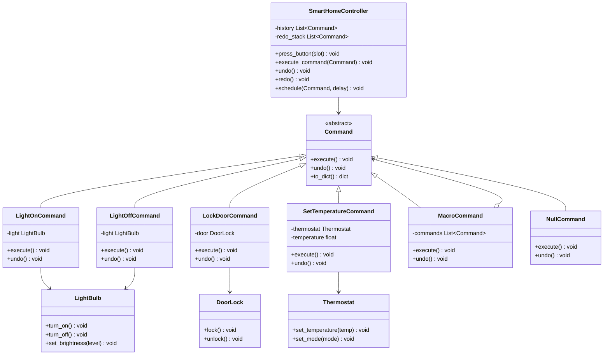

# Command

> **Command** — *"Encapsulate a request as an object, thereby letting you parameterize clients with different requests, queue or log requests, and support undoable operations."* — GoF, 1994

## Bài toán chi tiết

Hãy tưởng tượng bạn xây một ứng dụng smart home. Đèn Philips Hue dùng HTTP REST, khóa cửa Zigbee dùng MQTT, máy lạnh dùng IR blaster qua serial port. Mỗi thiết bị một giao thức riêng. Nếu dashboard gọi trực tiếp API từng thiết bị, nó phải import hàng chục thư viện — **vi phạm nghiêm trọng Dependency Inversion Principle.**

Vấn đề thứ hai: undo/redo. Người dùng muốn quay lại trạng thái trước: "tôi vừa tắt nhầm đèn phòng khách". Nếu mỗi hành động là lời gọi hàm trực tiếp, không có cách nào lưu lịch sử để rollback.

Bài toán thứ ba: lập lịch và queue. Người dùng tạo kịch bản "khi tôi rời khỏi nhà, tắt hết thiết bị". Các hành động cần được đóng gói và xếp hàng đợi — có thể thực thi ngay hoặc trì hoãn. Nếu dùng lời gọi hàm đồng bộ, không thể serialize để gửi qua message queue.

Cuối cùng, macro command. Người dùng muốn một nút "Good Night" thực hiện đồng loạt: tắt đèn, khóa cửa, giảm nhiệt độ. **Cần ghép nhiều command thành một — nhưng vẫn giữ khả năng undo toàn bộ.**

## Giải pháp với Pattern

Command pattern đóng gói mỗi hành động thành một object riêng biệt với interface thống nhất `execute()` và `undo()`. Invoker (dashboard, remote, scheduler) không biết chi tiết hành động — nó chỉ gọi `command.execute()`. Receiver (thiết bị thật) được tách biệt hoàn toàn.

Cụ thể: mỗi command là một class với constructor nhận receiver và các tham số. Command lưu đủ state để undo — ví dụ `LightOnCommand` lưu độ sáng trước khi tắt. Invoker giữ một stack command history, cho phép undo/redo unlimited.

**Command pattern giải quyết từng pain point:**
- **Decoupling**: Dashboard không import thư viện thiết bị — nó chỉ biết interface `Command`.
- **Undo/Redo**: Stack history cho phép pop và gọi `undo()`.
- **Queue/Schedule**: Command có thể serialize gửi qua queue hoặc lưu database.
- **Macro**: `MacroCommand` chứa list command con, `execute()` chạy từng cái, `undo()` chạy ngược lại.

## Phân tích thiết kế

**OOP Principles:**
- **Single Responsibility (SRP)**: Mỗi command class chỉ làm đúng một việc: bật đèn, tắt đèn, v.v.
- **Open/Closed (OCP)**: Thêm hành động mới chỉ việc viết class command mới — không sửa invoker hay receiver.
- **Dependency Inversion (DIP)**: Invoker phụ thuộc vào abstraction `Command`, không phụ thuộc vào concrete receiver.
- **Command-Query Separation (CQS)**: `execute()` là command (thay đổi state), không trả về dữ liệu; nếu cần query, dùng riêng method.

**Trade-offs:**
- **Class explosion**: Mỗi hành động mới cần một command class mới. Với hệ thống lớn (hàng trăm hành động), số lượng class có thể rất lớn. Có thể giảm bằng `CallableCommand` dùng lambda/closure cho hành động đơn giản.
- **Memory overhead**: Stack history lưu toàn bộ command object (kể cả tham số). Cần giới hạn dung lượng stack (ví dụ: max 100 undo).
- **Serialization phức tạp**: Nếu command chứa tham chiếu đến object phức tạp (socket, connection), serialize gặp khó khăn. Cần thiết kế command chỉ chứa dữ liệu (data-only) hoặc dùng Memento pattern kèm theo.

**Khi không nên dùng:**
- Hành động quá đơn giản, không cần undo (ví dụ: log message). Lambda/callback đủ dùng.
- Số lượng hành động nhỏ và cố định, không cần mở rộng (dùng Strategy pattern thay thế).
- Hệ thống real-time yêu cầu latency cực thấp — overhead tạo object command có thể không chấp nhận được.

## Ví dụ code hoàn chỉnh

### Cách làm sai: Gọi API trực tiếp từ dashboard

```python
from __future__ import annotations
import json
import httpx
from dataclasses import dataclass
from typing import Any


class SmartHomeDashboard:
    """Dashboard gọi trực tiếp API từng thiết bị — vi phạm DIP, khó bảo trì."""

    def turn_on_philips_light(self, light_id: str) -> None:
        with httpx.Client() as client:
            resp = client.put(
                f"http://philips-hub/api/{light_id}/state",
                json={"on": True, "bri": 254}
            )
            resp.raise_for_status()

    def turn_off_philips_light(self, light_id: str) -> None:
        with httpx.Client() as client:
            resp = client.put(
                f"http://philips-hub/api/{light_id}/state",
                json={"on": False}
            )
            resp.raise_for_status()

    def lock_zigbee_door(self, door_id: str) -> None:
        # Mỗi thiết bị dùng giao thức khác nhau
        import paho.mqtt.client as mqtt
        client = mqtt.Client()
        client.connect("mqtt.local")
        client.publish(f"zigbee/{door_id}/lock", "LOCK")

    def set_ac_temperature(self, temp: int) -> None:
        import serial
        ser = serial.Serial("COM3", 9600)
        ser.write(f"TEMP:{temp}\n".encode())

    # Mỗi lần thêm thiết bị mới: phải sửa class này + import thư viện mới
    # Không undo, không queue, không macro
```

### Cách làm đúng: Command Pattern

```python
from __future__ import annotations
from abc import ABC, abstractmethod
from dataclasses import dataclass, field
from typing import Optional, Protocol
import json
from enum import Enum, auto
import logging

logger = logging.getLogger(__name__)


# --- Receivers (thiết bị thật) ---

class LightBulb:
    """Receiver: bóng đèn thông minh."""
    def __init__(self, bulb_id: str, hub_url: str = "http://philips-hub/api"):
        self.bulb_id = bulb_id
        self.hub_url = hub_url
        self._state: bool = False
        self._brightness: int = 254

    def turn_on(self) -> None:
        self._state = True
        logger.info(f"Light {self.bulb_id} ON (brightness={self._brightness})")

    def turn_off(self) -> None:
        self._state = False
        logger.info(f"Light {self.bulb_id} OFF")

    def set_brightness(self, level: int) -> None:
        self._brightness = max(0, min(254, level))
        logger.info(f"Light {self.bulb_id} brightness set to {self._brightness}")

    @property
    def is_on(self) -> bool:
        return self._state

    @property
    def brightness(self) -> int:
        return self._brightness


class DoorLock:
    """Receiver: khóa cửa thông minh."""
    def __init__(self, door_id: str):
        self.door_id = door_id
        self._locked: bool = True

    def lock(self) -> None:
        self._locked = True
        logger.info(f"Door {self.door_id} LOCKED")

    def unlock(self) -> None:
        self._locked = False
        logger.info(f"Door {self.door_id} UNLOCKED")

    @property
    def is_locked(self) -> bool:
        return self._locked


class Thermostat:
    """Receiver: máy điều nhiệt."""
    def __init__(self, device_id: str):
        self.device_id = device_id
        self._temperature: float = 24.0
        self._mode: str = "COOL"

    def set_temperature(self, temp: float) -> None:
        self._temperature = temp
        logger.info(f"Thermostat {self.device_id} set to {temp}°C")

    def set_mode(self, mode: str) -> None:
        self._mode = mode
        logger.info(f"Thermostat {self.device_id} mode: {mode}")

    @property
    def temperature(self) -> float:
        return self._temperature

    @property
    def mode(self) -> str:
        return self._mode


# --- Abstract Command ---

class Command(ABC):
    """Interface thống nhất cho mọi command."""
    @abstractmethod
    def execute(self) -> None:
        ...

    @abstractmethod
    def undo(self) -> None:
        ...

    def to_dict(self) -> dict:
        """Serialize command để lưu / gửi queue."""
        return {"type": self.__class__.__name__}


# --- Concrete Commands ---

class LightOnCommand(Command):
    def __init__(self, light: LightBulb) -> None:
        self.light = light
        self._prev_state: bool = False
        self._prev_brightness: int = 0

    def execute(self) -> None:
        self._prev_state = self.light.is_on
        self._prev_brightness = self.light.brightness
        self.light.turn_on()

    def undo(self) -> None:
        if not self._prev_state:
            self.light.turn_off()
        else:
            self.light.set_brightness(self._prev_brightness)


class LightOffCommand(Command):
    def __init__(self, light: LightBulb) -> None:
        self.light = light
        self._prev_state: bool = False
        self._prev_brightness: int = 0

    def execute(self) -> None:
        self._prev_state = self.light.is_on
        self._prev_brightness = self.light.brightness
        self.light.turn_off()

    def undo(self) -> None:
        if self._prev_state:
            self.light.turn_on()
            self.light.set_brightness(self._prev_brightness)


class LockDoorCommand(Command):
    def __init__(self, door: DoorLock) -> None:
        self.door = door
        self._prev_locked: bool = True

    def execute(self) -> None:
        self._prev_locked = self.door.is_locked
        self.door.lock()

    def undo(self) -> None:
        if not self._prev_locked:
            self.door.unlock()


class SetTemperatureCommand(Command):
    def __init__(self, thermostat: Thermostat, temperature: float) -> None:
        self.thermostat = thermostat
        self.temperature = temperature
        self._prev_temp: float = 24.0

    def execute(self) -> None:
        self._prev_temp = self.thermostat.temperature
        self.thermostat.set_temperature(self.temperature)

    def undo(self) -> None:
        self.thermostat.set_temperature(self._prev_temp)

    def to_dict(self) -> dict:
        data = super().to_dict()
        data["temperature"] = self.temperature
        return data


# --- Macro Command (Composite) ---

class MacroCommand(Command):
    """Thực thi nhiều command tuần tự, undo theo thứ tự ngược."""
    def __init__(self, commands: list[Command], name: str = "Macro") -> None:
        self.commands = commands
        self.name = name

    def execute(self) -> None:
        logger.info(f"Executing macro: {self.name}")
        for cmd in self.commands:
            cmd.execute()

    def undo(self) -> None:
        logger.info(f"Undoing macro: {self.name}")
        for cmd in reversed(self.commands):
            cmd.undo()


# --- Null Command (no-op) ---

class NullCommand(Command):
    """Command mặc định — tránh kiểm tra None."""
    def execute(self) -> None:
        pass

    def undo(self) -> None:
        pass


# --- Invoker ---

class SmartHomeController:
    """Invoker: điều khiển trung tâm với undo/redo stack."""
    def __init__(self, max_history: int = 100) -> None:
        self._history: list[Command] = []
        self._redo_stack: list[Command] = []
        self._max_history = max_history
        self._slots: dict[str, Command] = {}
        self._scheduled: list[tuple[int, Command]] = []

    def assign_slot(self, slot_name: str, command: Command) -> None:
        self._slots[slot_name] = command

    def press_button(self, slot_name: str) -> None:
        command = self._slots.get(slot_name, NullCommand())
        self._execute_command(command)

    def execute_command(self, command: Command) -> None:
        self._execute_command(command)

    def _execute_command(self, command: Command) -> None:
        command.execute()
        self._history.append(command)
        if len(self._history) > self._max_history:
            self._history.pop(0)
        self._redo_stack.clear()

    def undo(self) -> None:
        if not self._history:
            logger.warning("Nothing to undo")
            return
        command = self._history.pop()
        command.undo()
        self._redo_stack.append(command)

    def redo(self) -> None:
        if not self._redo_stack:
            logger.warning("Nothing to redo")
            return
        command = self._redo_stack.pop()
        self._execute_command(command)

    def schedule(self, command: Command, delay_seconds: int) -> None:
        self._scheduled.append((delay_seconds, command))
        logger.info(f"Scheduled {command.__class__.__name__} in {delay_seconds}s")

    def run_scheduled(self) -> None:
        for delay, cmd in self._scheduled:
            import time
            time.sleep(delay)
            cmd.execute()


# --- Usage ---
if __name__ == "__main__":
    logging.basicConfig(level=logging.INFO, format="%(levelname)s: %(message)s")

    # Receivers
    living_room_light = LightBulb("lamp-01")
    bed_room_light = LightBulb("lamp-02")
    front_door = DoorLock("door-main")
    ac = Thermostat("ac-living")

    # Commands
    living_on = LightOnCommand(living_room_light)
    living_off = LightOffCommand(living_room_light)
    lock_door = LockDoorCommand(front_door)
    set_ac = SetTemperatureCommand(ac, 22.0)

    # Controller
    hub = SmartHomeController()
    hub.assign_slot("living_on", living_on)
    hub.assign_slot("living_off", living_off)
    hub.assign_slot("lock_door", lock_door)

    hub.press_button("living_on")
    hub.press_button("lock_door")

    # Undo
    hub.undo()  # Unlock door
    hub.undo()  # Turn off light

    # Redo
    hub.redo()  # Turn on light again

    # Macro
    good_night = MacroCommand([living_off, lock_door, set_ac], "Good Night")
    hub.execute_command(good_night)
    hub.undo()  # Undo toàn bộ macro
```

## Sơ đồ UML



## So sánh với Pattern liên quan

**1. Strategy Pattern:**

Nghe dễ nhầm với nhau phải không? Strategy thay đổi **thuật toán** của một object (cùng interface, khác behavior). Command đóng gói **request** — có execute và undo. Strategy thường không có undo. Về cấu trúc, cả hai đều dùng interface, nhưng mục đích khác nhau: Strategy thay đổi cách tính toán, Command thay đổi hành động có thể hoàn tác.

**2. Memento Pattern:**

Memento lưu **snapshot state** của object để restore. Command có thể dùng Memento bên trong để undo: thay vì lưu từng field, command lưu Memento của receiver trước khi execute. Hai pattern thường kết hợp: Command gọi `receiver.create_memento()` trước khi hành động, và `receiver.restore(memento)` khi undo.

**3. Observer Pattern:**

Observer phân phối event đến nhiều subscriber (1-to-n). Command là đóng gói request (1-to-1). Observer phù hợp khi nhiều object cần biết sự kiện; Command phù hợp khi bạn muốn hoãn, queue, hoặc undo hành động.

## Ứng dụng thực tế

**1. UI Framework (Qt):**

Qt dùng `QUndoCommand` và `QUndoStack` để implement undo/redo trong editor. Mỗi hành động (gõ chữ, xóa, format) là một command. Bạn có biết Ctrl+Z trong hầu hết app đều dùng Command pattern không?

```python
# PyQt6 Undo Framework
from PyQt6.QUndo import QUndoCommand

class InsertTextCommand(QUndoCommand):
    def __init__(self, cursor, text):
        super().__init__("Insert text")
        self.cursor = cursor
        self.text = text

    def redo(self):
        self.cursor.insertText(self.text)

    def undo(self):
        self.cursor.removeSelectedText()
```

**2. Celery Task Queue:**

Celery đóng gói lời gọi hàm thành task object — bản chất là Command pattern. Task có thể gửi qua broker (RabbitMQ, Redis), retry, schedule, và revoke.

```python
from celery import Celery

app = Celery("tasks", broker="redis://localhost")

@app.task
def send_welcome_email(user_id: int):
    # Logic gửi email
    pass

# Command được serialize và gửi qua queue
send_welcome_email.delay(user_id=42)
```

**3. Git (Version Control):**

Mỗi Git command (commit, checkout, revert, merge) là một Command. Git lưu history DAG, và mỗi commit có thể revert bằng `git revert <hash>` — undo ở cấp độ repository.

```bash
git commit -m "Add login feature"    # execute command
git revert abc123                      # undo command
git cherry-pick def456                # replay command
```

**4. Java Swing Action:**

`javax.swing.Action` interface định nghĩa `actionPerformed()` (execute). Menu item, button, toolbar đều dùng chung Action object.

```java
// Java Swing Action = Command pattern
Action saveAction = new AbstractAction("Save") {
    public void actionPerformed(ActionEvent e) {
        // Save logic
    }
};
JButton saveButton = new JButton(saveAction);
JMenuItem saveMenuItem = new JMenuItem(saveAction);
```

## Kiểm thử

```python
import pytest
from unittest.mock import Mock


class TestCommandPattern:
    def setup_method(self):
        self.light = LightBulb("test-bulb", "http://fake/api")
        self.door = DoorLock("test-door")
        self.thermostat = Thermostat("test-ac")

    def test_light_on_execute_changes_state(self):
        cmd = LightOnCommand(self.light)
        cmd.execute()
        assert self.light.is_on is True

    def test_light_on_undo_restores_state(self):
        self.light.turn_off()  # initial state: off
        cmd = LightOnCommand(self.light)
        cmd.execute()
        cmd.undo()
        assert self.light.is_on is False

    def test_light_off_undo_restores_previous_state(self):
        self.light.turn_on()
        self.light.set_brightness(200)
        cmd = LightOffCommand(self.light)
        cmd.execute()
        assert self.light.is_on is False
        cmd.undo()
        assert self.light.is_on is True
        assert self.light.brightness == 200

    def test_lock_door_command(self):
        cmd = LockDoorCommand(self.door)
        self.door.unlock()
        cmd.execute()
        assert self.door.is_locked is True
        cmd.undo()
        assert self.door.is_locked is False

    def test_macro_command_undo_reverse_order(self):
        cmd1 = Mock(spec=Command)
        cmd2 = Mock(spec=Command)
        macro = MacroCommand([cmd1, cmd2], "TestMacro")
        macro.execute()
        cmd1.execute.assert_called_once()
        cmd2.execute.assert_called_once()
        macro.undo()
        cmd2.undo.assert_called_once()
        cmd1.undo.assert_called_once()

    def test_invoker_undo_redo(self):
        controller = SmartHomeController(max_history=10)
        cmd = LightOnCommand(self.light)
        controller.execute_command(cmd)
        assert self.light.is_on is True
        controller.undo()
        assert self.light.is_on is False
        controller.redo()
        assert self.light.is_on is True

    def test_null_command_no_error(self):
        cmd = NullCommand()
        cmd.execute()  # Should not raise
        cmd.undo()     # Should not raise
```

## Ưu và nhược điểm

| Ưu điểm | Nhược điểm |
|---------|-----------|
| Tách hoàn toàn invoker khỏi receiver (DIP) | Class explosion: mỗi hành động cần một class |
| Hỗ trợ undo/redo dễ dàng qua history stack | Tốn bộ nhớ nếu lưu history không giới hạn |
| Command có thể serialize — queue, log, schedule | Thiết kế command phức tạp nếu cần undo deep copy |
| Dễ dàng tạo macro command (Composite) | Overhead tạo object cho hành động nhỏ |
| Thêm hành động mới không sửa code cũ (OCP) | Không phù hợp cho hành động real-time latency thấp |
| NullCommand tránh null-check | Khó đồng bộ nếu command chạy async |

---

## Kết luận

**Command pattern là giải pháp chuẩn mực cho kiến trúc hướng hành động.** Sử dụng khi bạn cần **tách request khỏi execution**, hỗ trợ **undo/redo**, **queue/schedule**, hoặc **macro**. Pattern này đặc biệt mạnh trong UI framework, task queue, transaction system, và smart home automation.

Tôi muốn bạn nhớ 5 điều này:
1. Mỗi command chỉ nên làm một việc — nếu cần ghép, dùng `MacroCommand`.
2. Luôn implement `undo()` — ngay cả khi chưa cần, vì về sau sẽ cần.
3. Lưu **đủ state** trong command để undo chính xác (dùng snapshot hoặc diff).
4. Giới hạn kích thước history stack (thường 20–100) để tránh memory leak.
5. Dùng **Serializable Command** nếu cần gửi qua queue: chỉ chứa dữ liệu, không chứa tham chiếu đến receiver.

Như một lập trình viên giàu kinh nghiệm từng nói: "Hãy đóng gói mọi thứ — bạn sẽ cảm ơn chính mình sau này."

---
*Trân trọng!*
