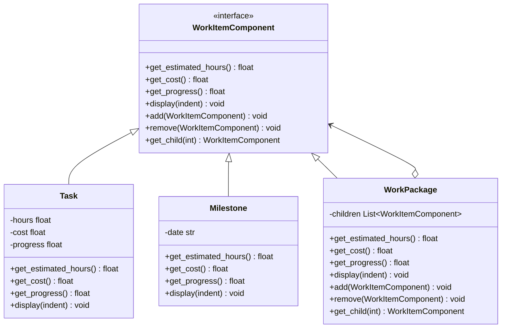

# Composite

> "Compose objects into tree structures to represent part-whole hierarchies. Composite lets clients treat individual objects and compositions of objects uniformly." — Erich Gamma, *Design Patterns: Elements of Reusable Object-Oriented Software*

Bạn đã bao giờ phải viết code với hàng tá câu lệnh `isinstance()` để phân biệt giữa "một cái" và "một đống" chưa? Tôi thì có, và nó không vui chút nào...

## Bài toán chi tiết

Hãy tưởng tượng bạn đang xây dựng hệ thống quản lý dự án — Work Breakdown Structure (WBS). Mỗi dự án bao gồm nhiều giai đoạn (phase), mỗi giai đoạn có thể chứa nhiều đầu mục công việc (work package), và mỗi đầu mục có thể chứa các task nhỏ hơn. Mỗi node trong cây đều có các thuộc tính như thời gian ước tính, ngân sách, và trạng thái hoàn thành. Yêu cầu cốt lõi: tính toán tổng thời gian, tổng ngân sách, và tiến độ tổng thể của toàn bộ dự án.

Ban đầu, các lập trình viên tạo ra hai class riêng biệt: `Task` (công việc đơn lẻ) và `ProjectPhase` (nhóm công việc). Khi cần tính tổng thời gian, client code phải kiểm tra kiểu của từng đối tượng:

```python
def calculate_total_hours(items):
    total = 0
    for item in items:
        if isinstance(item, Task):
            total += item.estimated_hours
        elif isinstance(item, ProjectPhase):
            for sub_item in item.children:
                if isinstance(sub_item, Task):
                    total += sub_item.estimated_hours
                elif isinstance(sub_item, ProjectPhase):
                    # Lại phải đệ quy — code dài và khó đọc
                    ...
```

Vấn đề trở nên trầm trọng hơn khi hệ thống mở rộng: có thêm các loại node khác như `Milestone`, `Deliverable`, `RiskItem`. Mỗi loại yêu cầu cách xử lý riêng trong vòng lặp. Client code tràn ngập các câu lệnh `isinstance()` và switch-case, vi phạm nghiêm trọng **Open/Closed Principle** — mỗi lần thêm loại node mới, tất cả các hàm xử lý cây đều phải sửa.

Hơn nữa, việc thêm các thao tác mới như xuất báo cáo PDF, visualize cây Gantt, hoặc tính toán critical path đều yêu cầu viết lại toàn bộ logic duyệt cây từ đầu. Code trở nên cực kỳ khó bảo trì. Team dành 40% thời gian để debug các lỗi liên quan đến duyệt cây không đúng — **một con số khủng khiếp**.

## Giải pháp với Pattern

Composite Pattern giải quyết vấn đề này bằng cách định nghĩa một interface chung (Component) cho cả leaf và composite, cho phép client tương tác với mọi đối tượng trong cây một cách đồng nhất — bất kể nó là một task đơn lẻ hay một phase phức tạp chứa hàng trăm task con. Từ đó, việc duyệt và xử lý cây trở nên đơn giản: **mỗi component tự chịu trách nhiệm về hành vi của mình.**

Cấu trúc Composite gồm ba thành phần:
- **Component**: Interface chung định nghĩa các method như `get_estimated_hours()`, `get_cost()`, `get_progress()`, và `display()`.
- **Leaf**: Node lá không có con — implement trực tiếp các method. Ví dụ: `Task`, `Milestone`.
- **Composite**: Node có con — lưu danh sách các Component con và implement các method bằng cách ủy quyền (delegate) cho từng con và tổng hợp kết quả.

Client code khi đó chỉ đơn giản gọi `component.get_estimated_hours()` mà không cần quan tâm component đó là leaf (tự trả về giá trị của nó) hay composite (đệ quy tính tổng từ các con). **Tính đa hình (polymorphism) xử lý mọi sự khác biệt.** Thêm loại component mới không yêu cầu sửa client — chỉ cần implement interface Component.

## Phân tích thiết kế

Composite Pattern thể hiện rõ nguyên lý **Polymorphism**: leaf và composite cùng implement một interface nhưng có hành vi khác nhau — leaf trả về giá trị thực, composite tính toán từ children. Nó cũng tuân thủ **Open/Closed Principle**: có thể thêm loại component mới mà không sửa code client, vì client chỉ phụ thuộc vào interface Component.

Một thiết kế quan trọng khác là **Uniformity vs Type Safety**: Composite truyền thống của GoF ưu tiên uniformity — component có cả method cho leaf lẫn method cho composite (ví dụ: `add()`, `remove()`). Điều này cho phép client xử lý hoàn toàn đồng nhất, nhưng leaf không cần các method này (nếu gọi sẽ gây lỗi runtime). Một cách tiếp cận khác là tách riêng child-management methods vào Composite, tăng type safety nhưng giảm uniformity. Python với duck typing nghiêng về uniformity hơn.

**Khi KHÔNG nên dùng Composite:**
- Khi cấu trúc cây quá nông (chỉ 1-2 cấp) — dùng list + loop đơn giản hơn.
- Khi leaf và composite có interface quá khác biệt — lúc đó composition không mang lại lợi ích.
- Khi hiệu suất là ưu tiên số một và cây rất lớn — việc tạo nhiều object và đệ quy có thể gây overhead.

**Trade-offs:**
- Uniformity có thể dẫn đến lỗi runtime nếu gọi sai method trên leaf.
- Thiết kế dễ bị over-engineer nếu cây chỉ có 1-2 loại node.
- Debugging khó hơn vì luồng xử lý đệ quy khó theo dõi.

## Ví dụ code hoàn chỉnh

### Cách làm sai: Dùng isinstance() kiểm tra kiểu

```python
from __future__ import annotations
from dataclasses import dataclass
from typing import List, Union
from datetime import date


@dataclass
class Task:
    name: str
    estimated_hours: float
    cost: float
    progress: float  # 0-100

    def display(self, indent: int = 0) -> None:
        print(" " * indent + f"Task: {self.name}")


@dataclass
class ProjectPhase:
    name: str
    children: List[Union[Task, ProjectPhase]]

    def display(self, indent: int = 0) -> None:
        print(" " * indent + f"Phase: {self.name}")
        for child in self.children:
            child.display(indent + 2)


# Client code phải kiểm tra kiểu liên tục
def calculate_total_hours(items: List[Union[Task, ProjectPhase]]) -> float:
    total = 0.0
    for item in items:
        if isinstance(item, Task):
            total += item.estimated_hours
        elif isinstance(item, ProjectPhase):
            total += calculate_total_hours(item.children)
    return total


def calculate_total_cost(items: List[Union[Task, ProjectPhase]]) -> float:
    total = 0.0
    for item in items:
        if isinstance(item, Task):
            total += item.cost
        elif isinstance(item, ProjectPhase):
            total += calculate_total_cost(item.children)
    return total


# Mỗi hàm xử lý cây đều phải viết lại logic duyệt!
# Thêm Milestone → sửa tất cả các hàm trên
```

### Cách đúng: Composite Pattern

```python
# --- Common Interface ---
class WorkItemComponent:
    """Interface chung cho mọi node trong cây công việc."""

    def get_estimated_hours(self) -> float:
        raise NotImplementedError

    def get_cost(self) -> float:
        raise NotImplementedError

    def get_progress(self) -> float:
        raise NotImplementedError

    def display(self, indent: int = 0) -> None:
        raise NotImplementedError

    def add(self, child: WorkItemComponent) -> None:
        raise NotImplementedError("Cannot add to leaf node")

    def remove(self, child: WorkItemComponent) -> None:
        raise NotImplementedError("Cannot remove from leaf node")

    def get_child(self, index: int) -> WorkItemComponent:
        raise NotImplementedError("Leaf has no children")


# --- Leaf Nodes ---
class Task(WorkItemComponent):
    """Công việc đơn lẻ — không có con."""

    def __init__(self, name: str, hours: float, cost: float, progress: float = 0.0) -> None:
        self._name = name
        self._hours = hours
        self._cost = cost
        self._progress = max(0.0, min(100.0, progress))

    def get_estimated_hours(self) -> float:
        return self._hours

    def get_cost(self) -> float:
        return self._cost

    def get_progress(self) -> float:
        return self._progress

    def display(self, indent: int = 0) -> None:
        bar = "█" * int(self._progress / 10) + "░" * (10 - int(self._progress / 10))
        print(f"{' ' * indent}📄 Task: {self._name} | {self._hours}h | ${self._cost:.2f} | [{bar}] {self._progress:.0f}%")


class Milestone(WorkItemComponent):
    """Cột mốc — đánh dấu sự kiện quan trọng."""

    def __init__(self, name: str, date_str: str) -> None:
        self._name = name
        self._date = date_str

    def get_estimated_hours(self) -> float:
        return 0.0  # Cột mốc không có giờ

    def get_cost(self) -> float:
        return 0.0

    def get_progress(self) -> float:
        return 100.0 if self._is_completed else 0.0

    def display(self, indent: int = 0) -> None:
        marker = "✅" if self._is_completed else "⏳"
        print(f"{' ' * indent}{marker} Milestone: {self._name} ({self._date})")

    def complete(self) -> None:
        self._is_completed = True
        self._completion_date = self._date


# --- Composite Node ---
class WorkPackage(WorkItemComponent):
    """Nhóm công việc — chứa các WorkItemComponent con."""

    def __init__(self, name: str) -> None:
        self._name = name
        self._children: list[WorkItemComponent] = []

    def get_estimated_hours(self) -> float:
        return sum(child.get_estimated_hours() for child in self._children)

    def get_cost(self) -> float:
        return sum(child.get_cost() for child in self._children)

    def get_progress(self) -> float:
        """Tiến độ trung bình có trọng số dựa trên estimated_hours."""
        total_hours = self.get_estimated_hours()
        if total_hours == 0:
            return 100.0 if all(c.get_progress() == 100.0 for c in self._children) else 0.0
        weighted = sum(child.get_progress() * child.get_estimated_hours() for child in self._children)
        return weighted / total_hours

    def display(self, indent: int = 0) -> None:
        progress = self.get_progress()
        bar = "█" * int(progress / 10) + "░" * (10 - int(progress / 10))
        print(f"{' ' * indent}📁 {self._name} | {self.get_estimated_hours():.0f}h | ${self.get_cost():.2f} | [{bar}] {progress:.0f}%")
        for child in self._children:
            child.display(indent + 2)

    def add(self, child: WorkItemComponent) -> None:
        self._children.append(child)

    def remove(self, child: WorkItemComponent) -> None:
        self._children.remove(child)

    def get_child(self, index: int) -> WorkItemComponent:
        return self._children[index]


# --- Advanced features without modifying client ---
class CriticalPathAnalyzer:
    """Phân tích đường găng — minh họa khả năng mở rộng."""

    @staticmethod
    def find_critical_path(component: WorkItemComponent, path: list[str] | None = None) -> tuple[float, list[str]]:
        """Tìm đường găng (longest path) — hoạt động với mọi WorkItemComponent."""
        if path is None:
            path = []
        path = path + [component._name]  # type: ignore

        if isinstance(component, Task):
            return component.get_estimated_hours(), path

        if isinstance(component, (WorkPackage,)):
            max_duration = 0.0
            critical_path: list[str] = []
            for child in component._children:  # type: ignore
                duration, cp = CriticalPathAnalyzer.find_critical_path(child, path)
                if duration > max_duration:
                    max_duration = duration
                    critical_path = cp
            return max_duration, critical_path

        return 0.0, path


# --- Usage ---
if __name__ == "__main__":
    # Xây dựng cây công việc
    project = WorkPackage("Website Redesign Project")

    # Phase 1: Frontend
    frontend = WorkPackage("Frontend Development")
    frontend.add(Task("Design Mockups", 40, 2000.0, 100.0))
    frontend.add(Task("HTML/CSS Coding", 80, 4000.0, 75.0))
    frontend.add(Task("React Implementation", 120, 6000.0, 50.0))
    frontend.add(Milestone("Frontend Approval", "2024-06-15"))

    # Phase 2: Backend
    backend = WorkPackage("Backend Development")
    backend.add(Task("API Design", 30, 1500.0, 100.0))
    backend.add(Task("Database Setup", 20, 1000.0, 80.0))
    backend.add(Task("Core Logic", 100, 5000.0, 30.0))
    backend.add(Task("Testing", 60, 3000.0, 10.0))

    # Phase 3: DevOps
    devops = WorkPackage("DevOps & Deployment")
    devops.add(Task("CI/CD Pipeline", 25, 1250.0, 60.0))
    devops.add(Task("Cloud Infrastructure", 35, 1750.0, 20.0))

    project.add(frontend)
    project.add(backend)
    project.add(devops)

    # Client code — không hề biết cấu trúc cây bên trong
    print("=== PROJECT TREE ===")
    project.display()

    print("\n=== PROJECT SUMMARY ===")
    print(f"Total Estimated Hours: {project.get_estimated_hours():.0f}h")
    print(f"Total Cost: ${project.get_cost():.2f}")
    print(f"Overall Progress: {project.get_progress():.1f}%")

    # Phân tích đường găng
    print("\n=== CRITICAL PATH ===")
    duration, crit_path = CriticalPathAnalyzer.find_critical_path(project)
    print(f"Critical Path Duration: {duration:.0f}h")
    print(f"Path: {' → '.join(crit_path)}")
```

## Sơ đồ UML



## So sánh với Pattern liên quan

**Composite vs Decorator**: Cả hai pattern đều có cấu trúc cây và dùng recursion. Decorator wrap một đối tượng duy nhất (single child) và thêm hành vi, trong khi Composite quản lý nhiều con (multiple children) và tổng hợp kết quả. Decorator tạo ra một "chuỗi" (chain), còn Composite tạo ra một "cây" (tree). Trong thực tế, hai pattern này thường kết hợp: Decorator có thể wrap một Composite node.

**Composite vs Visitor**: Visitor thường được dùng với Composite để tách biệt thao tác khỏi cấu trúc cây. Composite cung cấp cấu trúc dữ liệu, còn Visitor cung cấp thao tác xử lý trên cấu trúc đó. Kết hợp cả hai cho phép thêm thao tác mới mà không sửa các lớp Component — tuân thủ triệt để OCP.

**Composite vs Flyweight**: Flyweight có thể được dùng để tối ưu bộ nhớ trong Composite lớn. Ví dụ: trong một cây UI có hàng nghìn leaf node, Flyweight giúp chia sẻ trạng thái intrinsic (font, màu sắc) giữa các leaf thay vì mỗi leaf lưu riêng.

## Ứng dụng thực tế

**1. File System (os module)**: Hệ thống file là ví dụ kinh điển nhất của Composite. File là leaf, Directory là composite. Python `os.walk()` duyệt cây thư mục:

```python
import os

class FileSystemComponent:
    pass  # Interface trừu tượng

class FileLeaf(FileSystemComponent):
    def __init__(self, path: str):
        self.path = path
        self.size = os.path.getsize(path)

class DirectoryComposite(FileSystemComponent):
    def __init__(self, path: str):
        self.path = path
        self.children = [self._create_entry(os.path.join(path, f))
                        for f in os.listdir(path)]

    @classmethod
    def _create_entry(cls, full_path):
        return FileLeaf(full_path) if os.path.isfile(full_path) else cls(full_path)
```

**2. HTML DOM (BeautifulSoup)**: BeautifulSoup sử dụng Composite để biểu diễn cấu trúc HTML. `Tag` là composite (chứa children), `NavigableString` là leaf. Các thao tác như `find_all()`, `get_text()` hoạt động đồng nhất trên mọi node:

```python
from bs4 import BeautifulSoup, Tag, NavigableString

soup = BeautifulSoup("<div><p>Hello <b>World</b></p></div>", "html.parser")
# Tag (composite) và NavigableString (leaf) cùng là PageElement
for child in soup.div.p.children:
    print(repr(child))  # 'Hello ' (NavigableString), <b>World</b> (Tag)
```

**3. GUI Frameworks (Tkinter, PyQt)**: Cây widget trong Tkinter: `Frame` là composite, `Button`, `Label` là leaf. Khi gọi `.pack()`, layout manager duyệt toàn bộ cây đệ quy:

```python
import tkinter as tk

root = tk.Tk()          # Composite
frame = tk.Frame(root)   # Composite
button = tk.Button(frame, text="Click")  # Leaf
label = tk.Label(frame, text="Hello")    # Leaf
frame.pack()
button.pack()
label.pack()
root.mainloop()
```

**4. Django Template Engine**: Hệ thống template node của Django: `Node` là component, các leaf node như `VariableNode`, `TextNode`, và composite node như `IfNode`, `ForNode` chứa danh sách children (các `nodelist`). Khi `render()`, mỗi node tự xử lý và tổng hợp kết quả.

## Kiểm thử

```python
import pytest
from composite import (
    WorkItemComponent, Task, Milestone,
    WorkPackage, CriticalPathAnalyzer,
)


class TestTask:
    def test_leaf_returns_own_values(self) -> None:
        task = Task("Test", 10.0, 500.0, 50.0)
        assert task.get_estimated_hours() == 10.0
        assert task.get_cost() == 500.0
        assert task.get_progress() == 50.0

    def test_task_raises_on_add(self) -> None:
        task = Task("", 0, 0)
        with pytest.raises(NotImplementedError, match="Cannot add"):
            task.add(Task("", 0, 0))

    def test_progress_clamps(self) -> None:
        task = Task("", 0, 0, progress=150.0)
        assert task.get_progress() == 100.0
        task2 = Task("", 0, 0, progress=-10.0)
        assert task2.get_progress() == 0.0


class TestWorkPackage:
    def setup_method(self) -> None:
        self.pkg = WorkPackage("Root")
        self.child_a = Task("A", 10.0, 100.0, 60.0)
        self.child_b = Task("B", 20.0, 200.0, 90.0)
        self.pkg.add(self.child_a)
        self.pkg.add(self.child_b)

    def test_composite_aggregates_hours(self) -> None:
        assert self.pkg.get_estimated_hours() == 30.0

    def test_composite_aggregates_cost(self) -> None:
        assert self.pkg.get_cost() == 300.0

    def test_weighted_progress(self) -> None:
        # (60% * 10 + 90% * 20) / 30 = (600 + 1800) / 30 = 80
        assert self.pkg.get_progress() == 80.0

    def test_nested_composite(self) -> None:
        sub_pkg = WorkPackage("Sub")
        sub_pkg.add(Task("C", 5.0, 50.0, 50.0))
        self.pkg.add(sub_pkg)
        assert self.pkg.get_estimated_hours() == 35.0


class TestMilestone:
    def test_milestone_has_no_hours_or_cost(self) -> None:
        m = Milestone("Release", "2024-12-01")
        assert m.get_estimated_hours() == 0.0
        assert m.get_cost() == 0.0


class TestCriticalPath:
    def test_finds_longest_chain(self) -> None:
        project = WorkPackage("P")
        phase_a = WorkPackage("A")
        phase_a.add(Task("A1", 5.0, 0, 0))
        phase_b = WorkPackage("B")
        phase_b.add(Task("B1", 10.0, 0, 0))
        project.add(phase_a)
        project.add(phase_b)
        duration, path = CriticalPathAnalyzer.find_critical_path(project)
        assert duration == 10.0
        assert "B1" in " → ".join(path)


class TestUniformity:
    def test_treat_leaf_and_composite_uniformly(self) -> None:
        """Composite cho phép client xử lý đồng nhất mọi component."""
        items: list[WorkItemComponent] = [
            Task("Leaf", 5.0, 100.0),
            WorkPackage("Composite"),
        ]
        for item in items:
            # Client không cần biết kiểu cụ thể
            result = item.get_estimated_hours()
            assert result >= 0.0
```

## Ưu và nhược điểm

| Ưu điểm | Nhược điểm |
|---|---|
| Client xử lý đồng nhất leaf và composite — code đơn giản hơn | Thiết kế quá tổng quát (uniformity) có thể che giấu sự khác biệt |
| Tuân thủ OCP — thêm loại component mới không sửa client | Leaf phải implement các method add/remove vô dụng |
| Dễ dàng thêm thao tác mới (Visitor pattern kết hợp) | Cây quá sâu gây khó khăn cho debugging |
| Tái cấu trúc cây linh hoạt — có thể thay đổi leaf ↔ composite | Performance overhead do tạo nhiều object và đệ quy |
| Phù hợp với cấu trúc dữ liệu dạng cây tự nhiên | Không phù hợp với cây có cấu trúc bất thường |
| Tự nhiên cho UI, file system, parsing | Client có thể lạm dụng, tạo cây quá phức tạp |

---

Composite Pattern là giải pháp mạnh mẽ và tự nhiên cho mọi cấu trúc dữ liệu dạng cây với quan hệ whole-part. Nó cho phép client tương tác với cây một cách đơn giản, đồng thời tách biệt hoàn toàn logic duyệt cây khỏi logic nghiệp vụ. Với các hệ thống phức tạp như UI framework, HTML DOM, file system, hoặc WBS, Composite là lựa chọn gần như bắt buộc. Như tôi vẫn nói: "Ít hơn — tốt hơn." Composite giúp bạn viết ít code hơn, nhưng làm được nhiều hơn.

**Nguyên tắc vàng**: Khi bạn thấy code có các câu lệnh `isinstance()` hoặc `type() ==` để phân biệt giữa "đối tượng đơn" và "nhóm đối tượng", đó là lúc bạn cần Composite. Hãy tạo một interface chung, cho leaf implement trực tiếp, cho composite implement thông qua children, và client sẽ không bao giờ phải biết mình đang xử lý một lá đơn lẻ hay cả một nhánh cây đồ sộ.

---
*Trân trọng!*
