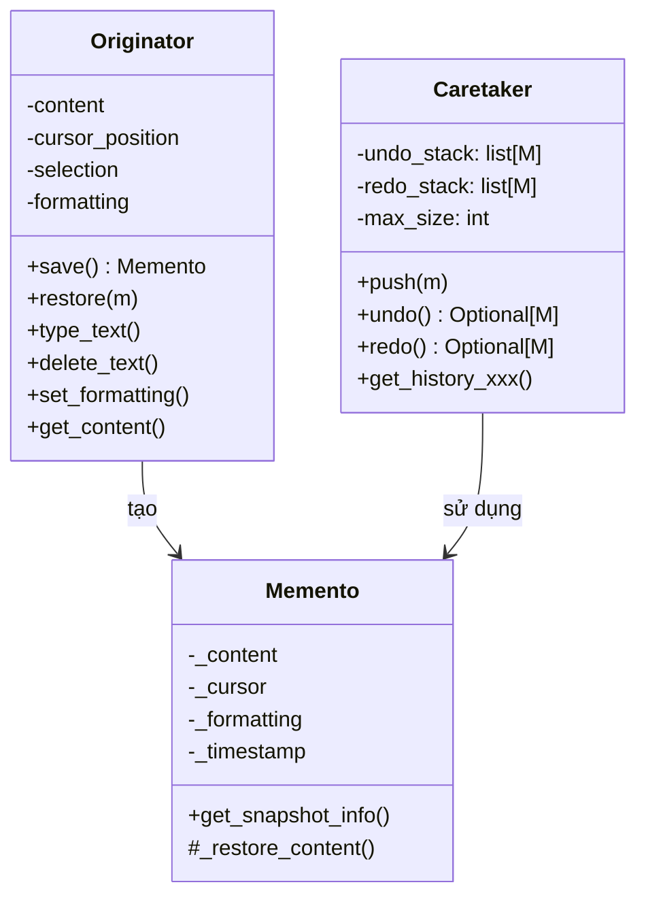

# Memento

> **Memento** — *"Without violating encapsulation, capture and externalize an object's internal state so that the object can be restored to this state later."* — GoF, 1994

## Bài toán chi tiết

Bạn đã bao giờ ấn Ctrl+Z và tự hỏi làm thế nào editor biết cách quay lại trạng thái trước? Tôi cũng từng thắc mắc — và câu trả lời là Memento pattern.

Hãy tưởng tượng bạn xây một text editor. Mỗi thao tác — gõ chữ, xóa, format, chèn ảnh — cần lưu một snapshot để có thể undo. **Vấn đề:** làm thế nào để external code lưu và khôi phục state của Editor mà không phá vỡ encapsulation?

**Cách sai thứ nhất:** Public toàn bộ state. Editor public `content`, `cursor_position`, `formatting`... Hậu quả: bất kỳ code nào cũng có thể sửa state tùy tiện — mất kiểm soát, khó debug.

**Cách sai thứ hai:** Editor tự quản lý history. Vừa lo editing vừa lo history — vi phạm SRP. Thêm tính năng mới (snapshot preview, so sánh diff) phải sửa Editor.

**Vấn đề thứ ba:** Hiệu năng. Snapshot toàn bộ state rất tốn kém. Editor có thể chứa hàng trăm KB dữ liệu — ảnh, table, embedded objects. Lưu full snapshot mỗi lần gõ phím là không khả thi.

**Vấn đề thứ tư:** Immutable snapshots. Một khi snapshot được tạo, không ai được sửa nó — kể cả Caretaker. Nếu Caretaker vô tình thay đổi snapshot, restore sẽ sai.

Cuối cùng, selective deep copy. Editor chứa object phức tạp — cần deep copy state cần thiết, nhưng không copy cache, connections.

## Giải pháp với Pattern

Memento pattern tách thành 3 vai trò rõ ràng:

- **Originator** (Editor): object có state cần lưu. Nó tự tạo snapshot và tự khôi phục.
- **Memento**: object immutable chứa snapshot. Chỉ Originator mới truy cập được state bên trong. Bên ngoài — Caretaker — chỉ biết Memento như black box.
- **Caretaker** (History): quản lý vòng đời Memento. **Không bao giờ đọc hoặc sửa nội dung.**

Cơ chế encapsulation trong Python: dùng convention `_state` (protected) hoặc `__state` (name mangling). Memento không public getter cho state — chỉ Originator mới gọi được method internal.

**Pattern giải quyết:**
- **Encapsulation**: Không ai ngoài Originator đọc được state.
- **SRP**: Editor chỉ lo state; History chỉ lo lưu trữ.
- **Immutability**: Memento chỉ được tạo một lần — không có setter.
- **Flexible snapshot**: Originator quyết định lưu gì vào Memento.

## Phân tích thiết kế

**OOP Principles:**
- **Encapsulation**: Memento ẩn state khỏi tất cả object ngoại trừ Originator.
- **Single Responsibility (SRP)**: Originator quản lý state; Caretaker quản lý lưu trữ.
- **Command-Query Separation**: Originator tạo và restore Memento — state không được truy cập trực tiếp.
- **Law of Demeter**: Caretaker chỉ gọi `save()` và `restore()` — không chạm vào Memento.

**Trade-offs:**
- **Memory cost**: Snapshot có thể lớn — có thể OOM nếu lưu full state mỗi lần.
- **Performance**: Deep copy chậm với object phức tạp.
- **Encapsulation trong Python khó**: Không có access modifier như Java/C++. Phải dùng naming convention.

**Khi không nên dùng:**
- State nhỏ, không cần undo — dùng Command pattern.
- Cần rollback external resource — dùng database snapshot.
- State không thay đổi nhiều — dùng event sourcing.

## Ví dụ code hoàn chỉnh

### Cách làm sai: Public state

```python
from __future__ import annotations
from dataclasses import dataclass, field
from typing import Optional, Any
import copy


class TextEditor:
    """Editor public toàn bộ state — vi phạm encapsulation."""
    def __init__(self) -> None:
        self.content: str = ""
        self.cursor_position: int = 0
        self.selection_start: Optional[int] = None
        self.selection_end: Optional[int] = None
        self.font_size: int = 14
        self.font_name: str = "Arial"
        self.is_bold: bool = False
        self.is_italic: bool = False
        self.text_color: str = "#000000"
        self.history: list["TextEditor"] = []

    def type_text(self, text: str) -> None:
        self._save_snapshot()
        self.content = (
            self.content[:self.cursor_position]
            + text
            + self.content[self.cursor_position:]
        )
        self.cursor_position += len(text)

    def _save_snapshot(self) -> None:
        self.history.append(copy.deepcopy(self))

    def undo(self) -> None:
        if self.history:
            prev: TextEditor = self.history.pop()
            # Nguy hiểm: bất kỳ code nào cũng có thể sửa history hoặc state
            self.content = prev.content
            self.cursor_position = prev.cursor_position
            # ...

# Problem: Bất kỳ ai cũng có thể làm:
# editor.content = "HACKED"  — không kiểm soát!
```

### Cách làm đúng: Memento Pattern

```python
from __future__ import annotations
from abc import ABC, abstractmethod
from dataclasses import dataclass, field
from typing import Optional, Any
import copy
import json
import logging
from enum import Enum, auto
import time

logger = logging.getLogger(__name__)


# --- Memento ---

class EditorMemento:
    """Memento immutable — chỉ Editor mới tạo và đọc được state."""
    def __init__(
        self,
        content: str,
        cursor: int,
        selection: tuple[Optional[int], Optional[int]],
        formatting: dict[str, Any],
        timestamp: float,
    ) -> None:
        self._content = content
        self._cursor = cursor
        self._selection = selection
        self._formatting = copy.deepcopy(formatting)
        self._timestamp = timestamp

    # Caretaker chỉ gọi get_snapshot_info() — không truy cập state thật
    def get_snapshot_info(self) -> dict:
        return {
            "timestamp": self._timestamp,
            "content_length": len(self._content),
            "formatted_time": time.strftime("%H:%M:%S", time.localtime(self._timestamp)),
        }

    # Chỉ Editor được gọi các method _internal
    def _restore_content(self) -> str:
        return self._content

    def _restore_cursor(self) -> int:
        return self._cursor

    def _restore_selection(self) -> tuple[Optional[int], Optional[int]]:
        return self._selection

    def _restore_formatting(self) -> dict[str, Any]:
        return copy.deepcopy(self._formatting)

    def __repr__(self) -> str:
        info = self.get_snapshot_info()
        return f"Memento({info['formatted_time']}, len={info['content_length']})"


# --- Originator ---

class TextEditor:
    """Originator — tạo và khôi phục Memento."""

    def __init__(self) -> None:
        self._content: str = ""
        self._cursor_position: int = 0
        self._selection_start: Optional[int] = None
        self._selection_end: Optional[int] = None
        self._formatting: dict[str, Any] = {
            "font_size": 14,
            "font_name": "Arial",
            "is_bold": False,
            "is_italic": False,
            "text_color": "#000000",
        }

    # --- Public API ---

    def type_text(self, text: str) -> None:
        self._content = (
            self._content[:self._cursor_position]
            + text
            + self._content[self._cursor_position:]
        )
        self._cursor_position += len(text)

    def delete_text(self, length: int = 1) -> None:
        if self._cursor_position == 0:
            return
        start = max(0, self._cursor_position - length)
        self._content = self._content[:start] + self._content[self._cursor_position:]
        self._cursor_position = start

    def select(self, start: int, end: int) -> None:
        self._selection_start = max(0, min(start, len(self._content)))
        self._selection_end = max(0, min(end, len(self._content)))

    def clear_selection(self) -> None:
        self._selection_start = None
        self._selection_end = None

    def set_formatting(self, **kwargs: Any) -> None:
        self._formatting.update(kwargs)

    def move_cursor(self, position: int) -> None:
        self._cursor_position = max(0, min(position, len(self._content)))

    def insert_image(self, image_path: str) -> None:
        placeholder = f"\n[Image: {image_path}]\n"
        self._content = (
            self._content[:self._cursor_position]
            + placeholder
            + self._content[self._cursor_position:]
        )
        self._cursor_position += len(placeholder)

    # --- Memento methods ---

    def save(self) -> EditorMemento:
        """Tạo snapshot — chỉ gọi bởi Caretaker."""
        return EditorMemento(
            content=self._content,
            cursor=self._cursor_position,
            selection=(self._selection_start, self._selection_end),
            formatting=self._formatting,
            timestamp=time.time(),
        )

    def restore(self, memento: EditorMemento) -> None:
        """Khôi phục từ snapshot."""
        self._content = memento._restore_content()
        self._cursor_position = memento._restore_cursor()
        self._selection_start, self._selection_end = memento._restore_selection()
        self._formatting = memento._restore_formatting()
        logger.info(f"Restored to state: {memento.get_snapshot_info()}")

    # --- Display ---

    def get_content(self) -> str:
        return self._content

    def get_cursor(self) -> int:
        return self._cursor_position

    def get_formatting_info(self) -> dict:
        return dict(self._formatting)

    def __str__(self) -> str:
        return (
            f"Editor(content={self._content[:50]}{'...' if len(self._content) > 50 else ''}, "
            f"cursor={self._cursor_position}, "
            f"format={self._formatting['font_name']} {self._formatting['font_size']}pt)"
        )


# --- Caretaker (History) ---

class HistoryManager:
    """Caretaker — quản lý Memento stack với undo/redo."""

    def __init__(self, max_size: int = 50) -> None:
        self._undo_stack: list[EditorMemento] = []
        self._redo_stack: list[EditorMemento] = []
        self._max_size = max_size

    def push(self, memento: EditorMemento) -> None:
        self._undo_stack.append(memento)
        if len(self._undo_stack) > self._max_size:
            self._undo_stack.pop(0)
        self._redo_stack.clear()

    def undo(self) -> Optional[EditorMemento]:
        if not self._undo_stack:
            return None
        memento = self._undo_stack.pop()
        self._redo_stack.append(memento)
        return memento

    def redo(self) -> Optional[EditorMemento]:
        if not self._redo_stack:
            return None
        memento = self._redo_stack.pop()
        self._undo_stack.append(memento)
        return memento

    def peek_undo(self) -> Optional[EditorMemento]:
        if not self._undo_stack:
            return None
        return self._undo_stack[-1]

    def size(self) -> int:
        return len(self._undo_stack)

    def clear(self) -> None:
        self._undo_stack.clear()
        self._redo_stack.clear()

    def get_history_snapshots(self) -> list[dict]:
        return [m.get_snapshot_info() for m in self._undo_stack]


# --- Advanced: Incremental Memento ---

class IncrementalMemento:
    """Chỉ lưu diff (thay đổi) thay vì full state — tiết kiệm memory."""

    def __init__(self, originator: TextEditor, previous: Optional["IncrementalMemento"]) -> None:
        self._timestamp = time.time()
        self._changes: dict[str, Any] = {}

        prev_state = previous._capture_full_state(originator) if previous else None

        if not prev_state or originator.get_content() != prev_state.get("content"):
            self._changes["content"] = originator.get_content()
        cursor = originator.get_cursor()
        if not prev_state or cursor != prev_state.get("cursor"):
            self._changes["cursor"] = cursor
        fmt = originator.get_formatting_info()
        if not prev_state or fmt != prev_state.get("formatting"):
            self._changes["formatting"] = fmt

    def _capture_full_state(self, originator: TextEditor) -> dict:
        return {
            "content": originator.get_content(),
            "cursor": originator.get_cursor(),
            "formatting": originator.get_formatting_info(),
        }

    def apply(self, originator: TextEditor) -> None:
        # Áp dụng changes lên originator — logic phức tạp hơn
        pass


# --- Advanced: Memento với Compression ---

class CompressedMemento:
    """Memento nén state để tiết kiệm memory."""
    def __init__(self, content: str, cursor: int, formatting: dict) -> None:
        import zlib
        self._compressed = zlib.compress(
            json.dumps({"c": content, "p": cursor, "f": formatting}).encode()
        )
        self._timestamp = time.time()

    def decompress(self) -> tuple[str, int, dict]:
        import zlib
        data = json.loads(zlib.decompress(self._compressed).decode())
        return data["c"], data["p"], data["f"]

    def get_info(self) -> dict:
        return {
            "timestamp": self._timestamp,
            "compressed_size": len(self._compressed),
        }


# --- Usage ---
if __name__ == "__main__":
    logging.basicConfig(level=logging.INFO, format="%(message)s")

    editor = TextEditor()
    history = HistoryManager(max_size=10)

    # Thao tác 1: gõ chữ
    editor.type_text("Hello, World!")
    history.push(editor.save())
    print(f"After typing: '{editor.get_content()}'")

    # Thao tác 2: thêm text
    editor.move_cursor(7)
    editor.type_text("Xin chào — ")
    history.push(editor.save())
    print(f"After insert: '{editor.get_content()}'")

    # Thao tác 3: chèn ảnh
    editor.move_cursor(len(editor.get_content()))
    editor.insert_image("/images/photo.png")
    history.push(editor.save())
    print(f"After image: '{editor.get_content()}'")

    # Undo x2
    print("\n--- Undo ---")
    m1 = history.undo()
    if m1:
        editor.restore(m1)
        print(f"Undo 1: '{editor.get_content()}'")

    m2 = history.undo()
    if m2:
        editor.restore(m2)
        print(f"Undo 2: '{editor.get_content()}'")

    # Redo
    print("\n--- Redo ---")
    m3 = history.redo()
    if m3:
        editor.restore(m3)
        print(f"Redo 1: '{editor.get_content()}'")

    # Formatting
    print("\n--- Formatting ---")
    editor.set_formatting(font_name="Times New Roman", font_size=16, is_bold=True)
    history.push(editor.save())
    print(f"Format: {editor.get_formatting_info()}")

    # History summary
    print(f"\n--- History ({history.size()} snapshots) ---")
    for snap in history.get_history_snapshots():
        print(f"  {snap}")
```

## Sơ đồ UML



Luồng tương tác:
  1. Client gọi editor.type_text()
  2. Client gọi history.push(editor.save())  → Memento được tạo
  3. Client gọi history.undo() → trả Memento
  4. Client gọi editor.restore(memento) → state khôi phục

  Caretaker KHÔNG BAO GIỜ đọc nội dung Memento.

## So sánh với Pattern liên quan

**1. Command Pattern:**

Command lưu **hành động** (action + reverse). Memento lưu **state snapshot**. Command undo bằng cách thực thi hành động ngược; Memento undo bằng cách restore snapshot. **Kết hợp là bộ đôi mạnh nhất:** Command dùng Memento để lưu state trước khi execute — phổ biến trong mọi UI framework.

**2. Prototype Pattern:**

Prototype copy object (clone). Memento là snapshot specialized. Khác: Prototype thường shallow copy; Memento yêu cầu deep copy. Prototype không có Caretaker. Memento thiết kế cho undo/redo — có history management.

**3. State Pattern:**

State thay đổi behavior dựa trên internal state. Memento lưu state để restore. State dùng trong runtime; Memento dùng để lưu lịch sử. Có thể kết hợp: state machine dùng Memento để lưu checkpoint.

## Ứng dụng thực tế

**1. Git Version Control:**

Mỗi commit là một Memento của toàn bộ project. `git checkout <hash>` = restore. `git revert` = undo. Bạn dùng Git mỗi ngày — đó là Memento pattern ở quy mô lớn nhất.

```bash
# Git: memento của toàn bộ repository
git commit -m "Add feature X"   # Tạo snapshot (memento)
git log --oneline               # Xem lịch sử snapshot
git checkout abc1234            # Restore snapshot
git revert abc1234              # Undo snapshot
```

**2. Ctrl+Z trong Text Editor / IDE:**
Mọi editor (VS Code, IntelliJ, Vim) dùng Memento cho undo/redo. VS Code dùng `IUndoRedoOperations` với snapshot stack.

```typescript
// VS Code undo stack (pseudo)
interface ISnapshot {
  content: string;
  selections: ISelection[];
  history: IUndoRedoOperation[];
}

class UndoManager {
  private stack: ISnapshot[] = [];

  push(snapshot: ISnapshot): void {
    this.stack.push(snapshot);
  }

  undo(): ISnapshot | undefined {
    return this.stack.pop();
  }
}
```

**3. Database Transaction / SAVEPOINT:**
Database dùng Memento cho transaction rollback. `BEGIN` tạo snapshot, `SAVEPOINT` tạo checkpoint, `ROLLBACK TO SAVEPOINT` restore.

```sql
BEGIN;                              -- Tạo memento implicit
INSERT INTO users VALUES (1, 'Alice');
SAVEPOINT before_update;            -- Tạo memento
UPDATE users SET name = 'Bob' WHERE id = 1;
ROLLBACK TO SAVEPOINT before_update; -- Restore memento
COMMIT;                             -- Xóa memento
```

**4. Serialization / Pickle:**
Python pickle là dạng Memento: serialize object state → bytes, có thể deserialize restore. Không có encapsulation protection (ai cũng unpickle được), nhưng cơ chế giống.

```python
import pickle

class Editor:
    def __init__(self):
        self.content = ""
        self.cursor = 0

    def save_pickle(self) -> bytes:
        return pickle.dumps(self.__dict__)

    def restore_pickle(self, data: bytes) -> None:
        self.__dict__.update(pickle.loads(data))

# Sử dụng
editor = Editor()
editor.content = "Hello"
snapshot = editor.save_pickle()  # Memento

# Sau nhiều thao tác
editor.restore_pickle(snapshot)  # Restore
```

## Kiểm thử

```python
import pytest
from unittest.mock import Mock, patch


class TestMementoPattern:
    def setup_method(self):
        self.editor = TextEditor()
        self.history = HistoryManager(max_size=10)

    def test_save_and_restore_content(self):
        """Lưu và khôi phục nội dung văn bản."""
        self.editor.type_text("Hello")
        memento = self.editor.save()
        self.editor.type_text(" World")
        self.editor.restore(memento)
        assert self.editor.get_content() == "Hello"

    def test_undo_restores_previous_state(self):
        """Undo quay lại trạng thái trước."""
        self.editor.type_text("Version 1")
        self.history.push(self.editor.save())
        self.editor.type_text("Version 2")
        self.history.push(self.editor.save())
        self.editor.type_text("Version 3")

        m = self.history.undo()
        assert m is not None
        self.editor.restore(m)
        assert "Version 2" in self.editor.get_content()

        m = self.history.undo()
        self.editor.restore(m)
        assert self.editor.get_content() == "Version 1"

    def test_redo_restores_after_undo(self):
        """Redo khôi phục sau undo."""
        self.editor.type_text("A")
        self.history.push(self.editor.save())
        self.editor.type_text("B")
        self.history.push(self.editor.save())

        # Undo
        m = self.history.undo()
        self.editor.restore(m)
        assert self.editor.get_content() == "A"

        # Redo
        m = self.history.redo()
        self.editor.restore(m)
        assert self.editor.get_content() == "AB"

    def test_redo_cleared_after_new_action(self):
        """Sau khi undo + hành động mới, redo stack bị xóa."""
        self.editor.type_text("A")
        self.history.push(self.editor.save())
        self.editor.type_text("B")
        self.history.push(self.editor.save())

        self.history.undo()  # Undo
        self.editor.type_text("C")  # New action
        # Redo stack should be cleared
        assert self.history.redo() is None

    def test_max_history_limit(self):
        """History không vượt quá max_size."""
        history = HistoryManager(max_size=3)
        editor = TextEditor()

        for i in range(5):
            editor.type_text(f"Ver{i}")
            history.push(editor.save())

        assert history.size() == 3

    def test_memento_immutable_outside_originator(self):
        """Caretaker không thể sửa nội dung Memento."""
        self.editor.type_text("Immutable")
        memento = self.editor.save()
        # Chỉ có get_snapshot_info — không có setter
        info = memento.get_snapshot_info()
        assert "content_length" in info
        assert "timestamp" in info

    def test_editor_encapsulation(self):
        """State của Editor không thể truy cập từ ngoài."""
        editor = TextEditor()
        editor.type_text("Secret")
        # Không thể đọc _content trực tiếp
        assert not hasattr(editor, "content")  # Convention: _content là private
        assert editor.get_content() == "Secret"

    def test_empty_history_undo(self):
        """Undo trên history rỗng trả về None."""
        empty_history = HistoryManager()
        assert empty_history.undo() is None
        assert empty_history.redo() is None

    def test_formatting_preserved_in_snapshot(self):
        """Formatting được lưu trong snapshot."""
        self.editor.set_formatting(font_size=20, is_bold=True)
        memento = self.editor.save()
        self.editor.set_formatting(font_size=12, is_bold=False)
        self.editor.restore(memento)
        fmt = self.editor.get_formatting_info()
        assert fmt["font_size"] == 20
        assert fmt["is_bold"] is True

    def test_memento_info_available(self):
        """Snapshot info có thể truy cập mà không lộ state."""
        self.editor.type_text("Test snapshot info")
        memento = self.editor.save()
        info = memento.get_snapshot_info()
        assert info["content_length"] == 17
        assert "formatted_time" in info
```

## Ưu và nhược điểm

| Ưu điểm | Nhược điểm |
|---------|-----------|
| Bảo vệ encapsulation (state ẩn) | Tốn memory nếu snapshot lớn |
| Dễ implement undo/redo | Deep copy chậm với object phức tạp |
| SRP: tách Originator khỏi Caretaker | Python không có access modifier thật sự |
| Memento immutable — an toàn | Cần quản lý vòng đời Memento (xóa khi không dùng) |
| Flexible: snapshot có thể chọn subset state | Khó implement incremental snapshot |
| Dễ kiểm thử từng component riêng | Snapshot large object (ảnh, video) không khả thi |
| Kết hợp tốt với Command Pattern | Không phù hợp real-time system |

---

## Kết luận

**Memento pattern là giải pháp chính thống cho undo/redo và snapshot/rollback.** Pattern này xuất hiện khắp nơi: text editor, IDE, design tool, game checkpoint, database transaction, và version control.

Tôi muốn bạn nhớ 6 điều này:
1. **Originator tự quyết định snapshot chứa gì** — không để Caretaker quyết định.
2. **Memento phải immutable** — không có setter.
3. **Caretaker không bao giờ đọc state Memento** — chỉ lưu và trả về.
4. **Giới hạn kích thước history** (20–100) để tránh memory leak.
5. Cân nhắc **Incremental Memento** — chỉ lưu diff cho state lớn.
6. Kết hợp với **Command pattern** — Command gọi `editor.save()` trước khi execute.

---
*Trân trọng!*
