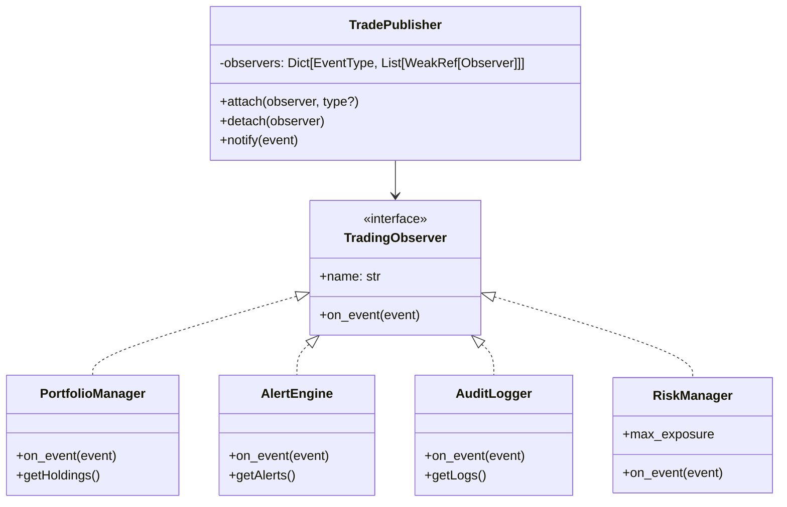

# Observer

> "Define a one-to-many dependency between objects so that when one object changes state, all its dependents are notified and updated automatically."
> — **GoF**, *Design Patterns* (1994)

Có bao giờ bạn tự hỏi — làm sao để một đối tượng chỉ việc "hét lên" và tất cả những đứa khác đều nghe thấy? Đó chính là Observer. **Nó đơn giản nhưng mạnh kinh khủng.**

**Observer** cho phép một đối tượng (gọi là **subject**) duy trì danh sách các đối tượng phụ thuộc (gọi là **observer**) và tự động thông báo đến chúng khi trạng thái thay đổi. Pattern này còn được gọi là **Publisher-Subscriber** hay **Event Emitter** — bạn đã nghe qua rồi đúng không? Nó có mặt ở khắp mọi nơi.

---

## Bài toán chi tiết

Tôi cá với bạn là ai làm phần mềm tài chính cũng từng đau đầu với cái bài toán này. Hãy tưởng tượng bạn đang xây dựng **một hệ thống giao dịch chứng khoán thời gian thực** (real-time stock trading platform) cho một công ty tài chính. Hệ thống nhận dữ liệu giá cổ phiếu từ nhiều sàn giao dịch (HOSE, HNX, NYSE) qua WebSocket stream và cần phản ứng tức thời theo nhiều cách khác nhau:

- **Portfolio Tracker**: Cập nhật giá trị danh mục đầu tư của từng user
- **Alert Engine**: Kích hoạt cảnh báo khi giá vượt ngưỡng (take-profit, stop-loss)
- **Trade Executor**: Tự động khớp lệnh nếu giá đạt điều kiện
- **Audit Logger**: Ghi lại mọi biến động giá vào cơ sở dữ liệu
- **Real-time Dashboard**: Đẩy dữ liệu lên frontend qua WebSocket để hiển thị biểu đồ nến

Cách tiếp cận ngây thơ (naive) là để module `StockExchange` gọi trực tiếp từng module khác sau mỗi lần giá thay đổi:

```python
class StockExchange:
    def update_price(self, symbol: str, price: float):
        self.save_to_database(symbol, price)
        portfolio_tracker.update(symbol, price)
        alert_engine.check(symbol, price)
        trade_executor.evaluate(symbol, price)
        dashboard.broadcast(symbol, price)
```

Cách này... dẫn đến hàng loạt vấn đề. Tôi thấy rất nhiều bạn mới vào nghề mắc phải cái bẫy này:

1. **Vi phạm Open/Closed Principle**: Mỗi lần thêm một module mới (ví dụ: AI price predictor), bạn phải sửa class `StockExchange` — một class đã hoạt động ổn định.
2. **Tight coupling**: `StockExchange` phải biết chi tiết về tất cả module khác. Chỉ cần một module đổi tên method hoặc thay đổi API là `StockExchange` phải sửa theo.
3. **Không linh hoạt**: Không thể bật/tắt module theo runtime. Không thể thêm module chỉ cho một số sự kiện nhất định.
4. **Khó kiểm thử**: Để test `StockExchange`, bạn phải khởi tạo toàn bộ hệ thống, kể cả database và WebSocket.
5. **Không tối ưu hiệu năng**: Mọi module đều được gọi dù có cần hay không. Không thể xử lý bất đồng bộ.

---

## Giải pháp với Pattern

Observer pattern giải quyết triệt để vấn đề trên. Và cách nó làm — tôi phải nói — rất thanh lịch:

- **Subject** (`StockPricePublisher`) làm nhiệm vụ quản lý danh sách observer và gửi thông báo — nó **chẳng cần biết** thằng observer nào đang lắng nghe
- **Observer** (`PriceObserver`) đăng ký (subscribe) vào subject để nhận thông báo — nó **cũng chẳng cần biết** subject hoạt động ra sao
- Khi có sự kiện (giá thay đổi), subject **notify** tất cả observer đã đăng ký. Thế là xong.

**Một subject — nhiều observer.** Đây là **one-to-many dependency** trong toàn bộ vẻ đẹp của nó. Observer có thể đến hoặc đi bất kỳ lúc nào, không ảnh hưởng gì đến subject.

---

## Phân tích thiết kế

### Nguyên lý OOP được áp dụng

Nhìn vào Observer, tôi thấy nó tôn trọng gần như mọi nguyên lý SOLID:

- **Open/Closed Principle**: Subject không cần sửa khi thêm observer mới. Observer không cần sửa khi thêm subject mới.
- **Dependency Inversion Principle**: Cả subject và observer đều phụ thuộc vào abstraction (`Observer` interface), không phụ thuộc vào concrete class.
- **Loose Coupling**: Subject chỉ biết observer qua interface `update()`. Observer chỉ biết subject qua interface `attach()`/`detach()`.
- **Single Responsibility**: Subject chịu trách nhiệm quản lý trạng thái và thông báo. Observer chịu trách nhiệm phản ứng.

### Trade-offs

Nhưng đời nào có cái gì hoàn hảo? Observer cũng có những cái giá phải trả:

1. **Memory leak tiềm ẩn**: Nếu observer không hủy đăng ký (detach) đúng cách, subject vẫn giữ reference, gây memory leak. Giải pháp: dùng weak references (`weakref` module trong Python).
2. **Không kiểm soát thứ tự thông báo**: Observer nhận thông báo theo thứ tự đăng ký, nhưng thứ tự này không được đảm bảo trong mọi implementation. Nếu thứ tự quan trọng, cần cơ chế priority queue.
3. **Hiệu năng nhiều observer**: Khi có hàng ngàn observer, notify có thể chậm. Giải pháp: async notification, batch processing.
4. **Cascade updates**: Một observer thay đổi subject → kích hoạt notify khác → vòng lặp vô hạn. Giải pháp: flag kiểm soát, event queue.

### Khi nào KHÔNG dùng

Tôi cũng muốn nói thẳng — có những trường hợp bạn **KHÔNG NÊN** dùng Observer:

- Khi có **ít hơn 2 observer** — dùng callback đơn giản hơn
- Khi observer cần thông tin **khác nhau từ subject** — mỗi observer kéo (pull) dữ liệu khác nhau, gây lãng phí
- Khi cần **giao tiếp two-way** — Observer là one-way

---

## Ví dụ code hoàn chỉnh

### Cách sai: Tight coupling

Đây là cách mà đa số người mới làm — kể cả tôi ngày xưa — từng viết:

```python
from dataclasses import dataclass, field
from datetime import datetime
from typing import Dict

@dataclass
class StockTrade:
    symbol: str
    quantity: int
    price: float
    action: str  # "BUY" or "SELL"

class NaiveTradingSystem:
    """Cách sai: gọi trực tiếp từng module"""
    def __init__(self):
        self.trades: list[StockTrade] = []
        self.portfolio: Dict[str, float] = {}
        self.alerts: list[str] = []
        self.logs: list[str] = []

    def execute_trade(self, trade: StockTrade) -> None:
        # Logic chính
        self.trades.append(trade)
        if trade.action == "BUY":
            self.portfolio[trade.symbol] = self.portfolio.get(trade.symbol, 0.0) + trade.quantity
        elif trade.action == "SELL":
            self.portfolio[trade.symbol] = self.portfolio.get(trade.symbol, 0.0) - trade.quantity

        # Phải gọi từng module một — vi phạm OCP
        self._update_portfolio_display(trade)
        self._check_alerts(trade)
        self._audit_log(trade)
        self._update_risk_metrics(trade)

    def _update_portfolio_display(self, trade: StockTrade) -> None:
        print(f"[PORTFOLIO] {trade.action} {trade.quantity} {trade.symbol} @ {trade.price}")

    def _check_alerts(self, trade: StockTrade) -> None:
        if trade.price > 1000000:
            print(f"[ALERT] Giá {trade.symbol} vượt 1,000,000!")
            self.alerts.append(f"ALERT: {trade.symbol} @ {trade.price}")

    def _audit_log(self, trade: StockTrade) -> None:
        entry = f"[AUDIT] {datetime.now()} {trade.action} {trade.symbol}: {trade.quantity} x {trade.price}"
        print(entry)
        self.logs.append(entry)

    def _update_risk_metrics(self, trade: StockTrade) -> None:
        total_exposure = sum(
            q * trade.price for s, q in self.portfolio.items()
        )
        print(f"[RISK] Total exposure: {total_exposure:,.0f}")
```

### Cách đúng: Observer Pattern

Và đây là cách viết đúng — tách biệt subject và observer:

```python
from abc import ABC, abstractmethod
from dataclasses import dataclass, field
from datetime import datetime
from enum import Enum, auto
from typing import Dict, List, Protocol, Optional
from weakref import ref, ReferenceType


class EventType(Enum):
    TRADE_EXECUTED = auto()
    PRICE_CHANGED = auto()
    ORDER_PLACED = auto()
    RISK_THRESHOLD_BREACHED = auto()


@dataclass(frozen=True)
class TradeEvent:
    """Immutable event data — Observer nhận object này"""
    symbol: str
    quantity: int
    price: float
    action: str
    timestamp: datetime = field(default_factory=datetime.now)
    event_type: EventType = EventType.TRADE_EXECUTED


# Abstract Observer
class TradingObserver(ABC):
    """Interface cho tất cả observer trong hệ thống giao dịch"""

    @abstractmethod
    def on_event(self, event: TradeEvent) -> None:
        """Được gọi khi subject phát sinh sự kiện"""
        pass

    @property
    @abstractmethod
    def name(self) -> str:
        """Tên observer để debug và logging"""
        pass


# Subject
class TradePublisher:
    """Subject — quản lý danh sách observer và phát sự kiện"""

    def __init__(self) -> None:
        self._observers: Dict[str, List[ReferenceType[TradingObserver]]] = {
            event_type: [] for event_type in EventType
        }

    def attach(self, observer: TradingObserver, event_type: Optional[EventType] = None) -> None:
        """Đăng ký observer. Nếu không chỉ định event_type, đăng ký tất cả."""
        if event_type:
            self._observers[event_type].append(ref(observer))
        else:
            for evt_type in EventType:
                self._observers[evt_type].append(ref(observer))
        print(f"[SUBSCRIBE] {observer.name} đã đăng ký nhận sự kiện")

    def detach(self, observer: TradingObserver) -> None:
        """Hủy đăng ký observer"""
        for event_type in EventType:
            self._observers[event_type] = [
                obs_ref for obs_ref in self._observers[event_type]
                if obs_ref() is not None and obs_ref() is not observer
            ]
        print(f"[UNSUBSCRIBE] {observer.name} đã hủy đăng ký")

    def notify(self, event: TradeEvent) -> None:
        """Thông báo đến tất cả observer đăng ký theo event_type"""
        dead_refs: list = []
        for obs_ref in self._observers[event.event_type]:
            observer = obs_ref()
            if observer is not None:
                observer.on_event(event)
            else:
                dead_refs.append(obs_ref)
        # Dọn dẹp weak reference đã chết
        for ref_item in dead_refs:
            self._observers[event.event_type].remove(ref_item)


# Concrete Observers
class PortfolioManager(TradingObserver):
    """Cập nhật danh mục đầu tư khi có giao dịch"""

    def __init__(self) -> None:
        self._holdings: Dict[str, int] = {}
        self._name = "PortfolioManager"

    @property
    def name(self) -> str:
        return self._name

    def on_event(self, event: TradeEvent) -> None:
        if event.event_type != EventType.TRADE_EXECUTED:
            return
        if event.action == "BUY":
            self._holdings[event.symbol] = self._holdings.get(event.symbol, 0) + event.quantity
        elif event.action == "SELL":
            self._holdings[event.symbol] = self._holdings.get(event.symbol, 0) - event.quantity
        total_value = sum(q * event.price for q in self._holdings.values())
        print(f"[{self._name}] ✅ Danh mục cập nhật: {dict(self._holdings)} — Tổng giá trị: {total_value:,.0f}")

    def get_holdings(self) -> Dict[str, int]:
        return dict(self._holdings)


class AlertEngine(TradingObserver):
    """Kiểm tra ngưỡng giá và phát cảnh báo"""

    def __init__(self, price_threshold: float = 1_000_000) -> None:
        self._threshold = price_threshold
        self._alerts: List[str] = []
        self._name = f"AlertEngine(threshold={price_threshold:,.0f})"

    @property
    def name(self) -> str:
        return self._name

    def on_event(self, event: TradeEvent) -> None:
        alert = None
        if event.price >= self._threshold:
            alert = f"🚨 {event.symbol} chạm ngưỡng {self._threshold:,.0f} tại {event.price:,.0f}!"
        if alert:
            print(f"[{self._name}] {alert}")
            self._alerts.append(alert)

    def get_alerts(self) -> List[str]:
        return list(self._alerts)


class AuditLogger(TradingObserver):
    """Ghi nhật ký giao dịch vào database (mô phỏng)"""

    def __init__(self) -> None:
        self._logs: List[str] = []
        self._name = "AuditLogger"

    @property
    def name(self) -> str:
        return self._name

    def on_event(self, event: TradeEvent) -> None:
        entry = (
            f"[{self._name}] 📝 AUDIT | "
            f"{event.timestamp.isoformat()} | "
            f"{event.action} {event.quantity} {event.symbol} @ {event.price:,.0f} VND"
        )
        print(entry)
        self._logs.append(entry)

    def get_logs(self) -> List[str]:
        return list(self._logs)


class RiskManager(TradingObserver):
    """Giám sát rủi ro — tự động chặn giao dịch nếu vượt ngưỡng"""

    def __init__(self, max_exposure: float = 5_000_000_000) -> None:
        self._max_exposure = max_exposure
        self._current_exposure: float = 0.0
        self._name = "RiskManager"

    @property
    def name(self) -> str:
        return self._name

    def on_event(self, event: TradeEvent) -> None:
        trade_value = event.quantity * event.price
        if event.action == "BUY":
            self._current_exposure += trade_value
        elif event.action == "SELL":
            self._current_exposure -= trade_value

        if self._current_exposure > self._max_exposure:
            print(f"[{self._name}] 🔴 RỦI RO CAO: Exposure {self._current_exposure:,.0f} > {self._max_exposure:,.0f}")
        else:
            print(f"[{self._name}] 🟢 Exposure hiện tại: {self._current_exposure:,.0f}")


# Sử dụng
def main() -> None:
    publisher = TradePublisher()

    portfolio = PortfolioManager()
    alerts = AlertEngine(price_threshold=800_000)
    audit = AuditLogger()
    risk = RiskManager(max_exposure=10_000_000_000)

    # Đăng ký observer
    publisher.attach(portfolio)
    publisher.attach(alerts)
    publisher.attach(audit)
    publisher.attach(risk)

    print("\n" + "=" * 60)
    print("GIAO DỊCH 1: Mua 100 cổ phiếu VIC giá 85,000")
    print("=" * 60)
    event1 = TradeEvent(symbol="VIC", quantity=100, price=85_000, action="BUY")
    publisher.notify(event1)

    print("\n" + "=" * 60)
    print("GIAO DỊCH 2: Bán 50 cổ phiếu VIC giá 820,000 (chạm ngưỡng alert)")
    print("=" * 60)
    event2 = TradeEvent(symbol="VIC", quantity=50, price=820_000, action="SELL")
    publisher.notify(event2)

    # Hủy đăng ký AlertEngine
    publisher.detach(alerts)

    print("\n" + "=" * 60)
    print("GIAO DỊCH 3: Mua 10000 cổ phiếu VNM giá 95,000 (AlertEngine đã bị detach)")
    print("=" * 60)
    event3 = TradeEvent(symbol="VNM", quantity=10_000, price=95_000, action="BUY")
    publisher.notify(event3)


if __name__ == "__main__":
    main()
```

---

## Sơ đồ UML



---

## So sánh với Pattern liên quan

Một câu hỏi tôi hay nhận được: "Khi nào dùng Observer, khi nào dùng pattern khác?" Đây là câu trả lời của tôi:

### 1. Observer vs Mediator

| Tiêu chí | Observer | Mediator |
|----------|----------|----------|
| Giao tiếp | One-to-many (subject → observers) | Many-to-many (các component qua mediator) |
| Coupling | Subject và observer biết nhau qua interface | Các component không biết nhau, chỉ biết mediator |
| Độ phức tạp | Thấp hơn, phù hợp broadcast | Cao hơn, phù hợp orchestration phức tạp |
| Ví dụ | Event emitter, pub/sub | Chat room, GUI dialog manager |

**Chọn Observer** khi một thằng cần nói với nhiều thằng. **Chọn Mediator** khi nhiều thằng cần nói chuyện lộn xộn với nhau — lúc đó Mediator làm tổng đài viên.

### 2. Observer vs Chain of Responsibility

| Tiêu chí | Observer | Chain of Responsibility |
|----------|----------|------------------------|
| Flow | Broadcast đến tất cả observer | Request đi qua chain, một handler xử lý |
| Số receiver | Nhiều (tất cả observer đều nhận) | Một (handler đầu tiên match) |
| Thứ tự | Không quan trọng (trừ khi có priority) | Rất quan trọng (thứ tự trong chain) |
| Dừng request | Không thể dừng broadcast | Handler có thể dừng chain |

**Chọn Observer** khi mọi component đều cần biết. **Chọn CoR** khi bạn muốn chỉ một thằng xử lý — dạng "ai rảnh thì làm".

### 3. Observer vs Pub-Sub (Event Bus)

Về bản chất, Pub-Sub là em họ của Observer. Điểm khác biệt:

- **Observer**: Observer đăng ký trực tiếp với subject. Hai thằng biết nhau (có coupling nhưng ở mức độ nhẹ).
- **Pub-Sub**: Có thằng môi giới (message broker) đứng giữa. Publisher và subscriber **hoàn toàn không biết mặt nhau**.

Pub-Sub thường dùng cho distributed systems (Kafka, RabbitMQ). Observer phù hợp cho in-process communication. **Chọn đúng tool cho đúng job.**

---

## Ứng dụng thực tế

Observer xuất hiện khắp nơi trong thực tế — tôi cá là bạn đã dùng nó mà không hề hay biết:

### 1. Django Signals

Django dùng Observer pattern qua cơ chế signals — và xài rất nhiều. Bạn signal đi, receiver nhận:

```python
# django/db/models/signal.py
from django.dispatch import Signal, receiver

# Định nghĩa signal (subject)
post_save = Signal()

# Observer đăng ký qua decorator
@receiver(post_save, sender=User)
def send_welcome_email(sender, instance, created, **kwargs):
    if created:
        print(f"Gửi email chào mừng đến {instance.email}")

# Observer khác cho cùng sự kiện
@receiver(post_save, sender=User)
def update_search_index(sender, instance, **kwargs):
    print(f"Cập nhật search index cho user {instance.id}")

# Khi save model, signal được gửi (notify)
# user.save() → post_save.send(sender=User, instance=user, created=True)
```

### 2. AsyncIO Event Loop

Event loop trong `asyncio` cũng xài Observer để quản lý callback:

```python
import asyncio

class ObservableFuture(asyncio.Future):
    """Future với observer pattern — thông báo khi hoàn thành"""
    def __init__(self):
        super().__init__()
        self._callbacks = []

    def add_done_callback(self, callback, *, context=None):
        """attach observer"""
        self._callbacks.append((callback, context))
        super().add_done_callback(callback, context=context)

    def set_result(self, result):
        """notify observers"""
        super().set_result(result)
        for cb, ctx in self._callbacks:
            if ctx:
                cb(result)
```

### 3. Kafka Consumer/Producer (Distributed Observer)

Apache Kafka — về bản chất — là Observer pattern nhưng ở quy mô khủng khiếp:

```python
from kafka import KafkaConsumer, KafkaProducer

# Subject (Producer)
producer = KafkaProducer(bootstrap_servers='localhost:9092')
producer.send('stock-prices', key=b'VIC', value=b'85000')

# Observer (Consumer)
consumer = KafkaConsumer(
    'stock-prices',
    bootstrap_servers='localhost:9092',
    group_id='portfolio-tracker'
)

for message in consumer:
    print(f"Nhận giá {message.key} = {message.value}")
    # Cập nhật portfolio
```

### 4. JavaScript Event Listeners (Web)

Cuối cùng, cái mà bất kỳ frontend dev nào cũng dùng — event listener:

```javascript
// Observer pattern trong frontend
const button = document.getElementById('submit-btn');

// attach observer
button.addEventListener('click', (event) => {
    console.log('Observer 1: Button clicked');
    validateForm();
});

// attach another observer
button.addEventListener('click', (event) => {
    console.log('Observer 2: Sending analytics');
    trackEvent('button-click');
});
```

---

## Kiểm thử

Một điểm tôi rất thích ở Observer — **nó cực kỳ dễ test**. Vì subject và observer độc lập, bạn chỉ cần mock thằng kia là xong:

```python
import unittest
from unittest.mock import MagicMock
from datetime import datetime


class TestObserverPattern(unittest.TestCase):
    def setUp(self):
        self.publisher = TradePublisher()
        self.mock_observer = MagicMock(spec=TradingObserver)
        self.mock_observer.name = "MockObserver"

    def test_attach_observer(self):
        """Observer được thêm vào danh sách sau khi attach"""
        self.publisher.attach(self.mock_observer)
        # Không raise exception — observer đã được thêm
        event = TradeEvent(symbol="TEST", quantity=1, price=1000, action="BUY")
        self.publisher.notify(event)
        self.mock_observer.on_event.assert_called_once_with(event)

    def test_detach_observer(self):
        """Observer không nhận sự kiện sau khi detach"""
        self.publisher.attach(self.mock_observer)
        self.publisher.detach(self.mock_observer)
        event = TradeEvent(symbol="TEST", quantity=1, price=1000, action="BUY")
        self.publisher.notify(event)
        self.mock_observer.on_event.assert_not_called()

    def test_notify_filter_by_event_type(self):
        """Observer chỉ nhận sự kiện đã đăng ký"""
        self.publisher.attach(self.mock_observer, EventType.TRADE_EXECUTED)
        price_event = TradeEvent(
            symbol="TEST", quantity=1, price=1000, action="BUY",
            event_type=EventType.PRICE_CHANGED
        )
        self.publisher.notify(price_event)
        self.mock_observer.on_event.assert_not_called()

    def test_multiple_observers(self):
        """Tất cả observer đều nhận sự kiện"""
        obs1 = MagicMock(spec=TradingObserver)
        obs1.name = "Obs1"
        obs2 = MagicMock(spec=TradingObserver)
        obs2.name = "Obs2"
        self.publisher.attach(obs1)
        self.publisher.attach(obs2)
        event = TradeEvent(symbol="TEST", quantity=1, price=1000, action="BUY")
        self.publisher.notify(event)
        obs1.on_event.assert_called_once_with(event)
        obs2.on_event.assert_called_once_with(event)

    def test_weak_reference_cleanup(self):
        """Observer bị garbage collected sẽ tự động được dọn dẹp"""
        obs = MagicMock(spec=TradingObserver)
        obs.name = "TempObs"
        self.publisher.attach(obs)
        del obs
        import gc
        gc.collect()
        event = TradeEvent(symbol="TEST", quantity=1, price=1000, action="BUY")
        # Không raise exception — weak ref được xử lý
        self.publisher.notify(event)

    def test_portfolio_manager_integration(self):
        """Integration test: PortfolioManager tính toán đúng holdings"""
        pm = PortfolioManager()
        self.publisher.attach(pm)
        events = [
            TradeEvent(symbol="VIC", quantity=100, price=85000, action="BUY"),
            TradeEvent(symbol="VNM", quantity=200, price=95000, action="BUY"),
            TradeEvent(symbol="VIC", quantity=30, price=90000, action="SELL"),
        ]
        for e in events:
            self.publisher.notify(e)
        holdings = pm.get_holdings()
        self.assertEqual(holdings["VIC"], 70)  # 100 - 30
        self.assertEqual(holdings["VNM"], 200)


if __name__ == "__main__":
    unittest.main()
```

---

## Ưu và nhược điểm

| Ưu điểm | Nhược điểm |
|---------|------------|
| **Loose coupling**: Subject và observer độc lập, chỉ giao tiếp qua interface | **Memory leak**: Observer không detach → subject giữ reference → không được GC |
| **Open/Closed**: Thêm observer mới không cần sửa subject | **Không kiểm soát thứ tự**: Observer nhận notify theo thứ tự không đảm bảo |
| **Dynamic relationship**: Observer có thể join/leave runtime | **Cascade updates**: Observer thay đổi subject → vòng lặp vô hạn |
| **Broadcast one-to-many**: Một sự kiện, nhiều receiver tự động | **Hiệu năng**: Nhiều observer → notify chậm nếu không async |
| **Tái sử dụng**: Observer và subject độc lập, có thể dùng lại ở nơi khác | **Không biết observer nào thay đổi**: Subject không biết observer nào gây ra lỗi |
| **Testing dễ dàng**: Mock observer để test subject, và ngược lại | **Debug khó**: Luồng sự kiện khó theo dõi khi có nhiều observer |

---

---

## Kết luận

Tôi nhớ có lần đọc được câu này: *"The most dangerous phrase in the language is: 'We've always done it this way.'"* — Ada Lovelace. Observer pattern là một minh chứng cho việc **nghĩ khác đi** có thể giải quyết vấn đề tốt thế nào.

Observer là một trong những pattern quan trọng nhất của nhóm Behavioral. **Nó là nền tảng cho gần như mọi hệ thống event-driven hiện đại** — từ Django signals, React event system, cho đến Kafka và message queues. Bạn không biết nó? Bạn đang bỏ lỡ một thứ cực kỳ mạnh mẽ đấy.

### Khi nào mang Observer ra xài

- ✅ Một thằng cần nói với nhiều thằng mà không biết trước có bao nhiêu thằng đang nghe
- ✅ Các object cần tự động phản ứng khi trạng thái thay đổi — đừng ai gọi ai, hãy để sự kiện làm việc đó
- ✅ Hệ thống cần mở rộng module mới mà không động đến code cũ — **đây là chân ái của Open/Closed Principle**
- ✅ Cần loose coupling — "ta không cần biết ngươi là ai, chỉ cần ngươi biết lắng nghe"

### Golden Rules — những điều tôi rút ra sau nhiều năm dùng Observer

1. **Weak references** cho observer — nếu không, memory leak sẽ đến như một cú lừa
2. **Immutable event objects** — tránh side effects. Đừng để thằng này sửa dữ liệu của thằng kia
3. **Filter events by type** — đừng gửi tất cả mọi thứ cho tất cả mọi người. Hãy để mỗi observer chỉ nhận thứ nó cần
4. **Detach ở cleanup** — như câu nói: *"Always clean up after yourself"*
5. **Async khi cần** — nếu một observer chậm, cả hệ thống sẽ ì ra. Dùng queue hoặc async notify

---

*Trân trọng!*
