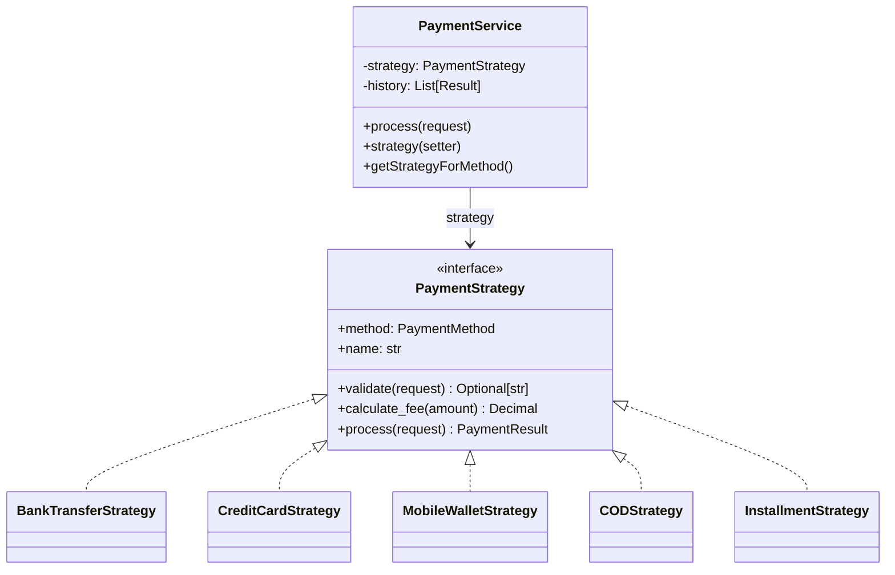

# Strategy

> "Define a family of algorithms, encapsulate each one, and make them interchangeable. Strategy lets the algorithm vary independently from clients that use it."
> — **GoF**, *Design Patterns* (1994)

Bạn có nhớ câu nói: *"Nếu bạn chỉ có một cái búa, mọi vấn đề đều trông giống cái đinh"*? Strategy pattern là cách để bạn có **cả một bộ công cụ** trong tay.

**Strategy** cho phép định nghĩa một họ các thuật toán, đóng gói từng thuật toán thành một class riêng, và — quan trọng nhất — **hoán đổi chúng cho nhau tại runtime**. Pattern này tách phần "làm thế nào" (how) khỏi phần "làm gì" (what). Và đó mới là cái hay.

---

## Bài toán chi tiết

Tôi từng làm cho một startup thương mại điện tử — và tôi biết thanh toán là một mớ hỗn độn. Hãy tưởng tượng bạn đang xây dựng **hệ thống xử lý thanh toán** (Payment Processing System) cho một nền tảng thương mại điện tử lớn tại Việt Nam. Hệ thống cần hỗ trợ nhiều phương thức thanh toán:

1. **Chuyển khoản ngân hàng** (Bank Transfer): Tính phí cố định 3,300 VND/giao dịch
2. **Thẻ tín dụng/ghi nợ** (Credit Card): Phí 2.5% + 5,000 VND, cần xác thực 3D Secure
3. **Ví điện tử** (MoMo, ZaloPay): Phí 1.8% + 2,000 VND, cần verify OTP
4. **Thanh toán khi nhận hàng** (COD): Phí 1.5% tối thiểu 10,000, tối đa 50,000 VND
5. **Trả góp** (Installment): Phí 5% + 20,000 VND, cần kiểm tra lịch sử tín dụng

Mỗi phương thức thanh toán có:
- Công thức tính phí khác nhau
- Quy trình xử lý khác nhau (xác thực, kiểm tra số dư, v.v.)
- Ràng buộc khác nhau (số tiền tối thiểu/tối đa, thời gian xử lý)

Và cách tiếp cận "ngây thơ" — tôi dùng từ này vì tôi cũng từng làm vậy — là viết tất cả trong một class:

```python
class NaivePaymentService:
    def process_payment(self, method, amount, order_info):
        if method == "bank_transfer":
            fee = 3300
            # 50 dòng code xử lý chuyển khoản
        elif method == "credit_card":
            fee = amount * 0.025 + 5000
            # 80 dòng code xử lý thẻ tín dụng
        elif method == "momo":
            fee = amount * 0.018 + 2000
            # 60 dòng code xử lý ví điện tử
        # ... cứ thế mỗi method thêm hàng chục dòng
```

Vấn đề — ôi trời, quá nhiều:

1. **Class phình to**: `NaivePaymentService` có thể lên đến 1000+ dòng. Một class ôm đồm mọi thứ.
2. **Vi phạm Single Responsibility**: Vừa quản lý giao dịch, vừa xử lý logic thanh toán — **một người làm việc của năm người**
3. **Vi phạm Open/Closed Principle**: Thêm PayOS? Sửa class. Thêm tính năng mới? Sửa class. **Mỗi lần thêm là một lần run rem.**
4. **Không thể tái sử dụng**: Logic xử lý thẻ tín dụng không thể dùng ở module khác. Viết lại từ đầu.
5. **Khó kiểm thử**: Một class khổng lồ, muôn vàn code path. Test là cực hình.
6. **Không linh hoạt**: Không thể thay đổi thuật toán runtime. Muốn chọn phương thức rẻ nhất tự động? Quên đi.

---

## Giải pháp với Pattern

Strategy pattern giải quyết vấn đề này cực kỳ đơn giản — **tách mỗi thuật toán thành một class riêng:**

- **Context** (`PaymentService`): Nhận Strategy qua constructor/setter. **Context không cần biết nó đang dùng strategy nào.** Nó chỉ cần gọi interface.
- **Strategy interface** (`PaymentStrategy`): Định nghĩa contract — tất cả strategy phải chơi theo cùng một luật
- **Concrete Strategies** (`BankTransferStrategy`, `CreditCardStrategy`, ...): Mỗi thằng lo việc của nó. **Cô lập hoàn toàn.**

Hãy tưởng tượng bạn vào một nhà hàng. Bạn gọi món (gọi method), đầu bếp (context) chọn công thức (strategy) để nấu. Bạn không cần biết món đó được nấu thế nào — bạn chỉ cần ăn. **Đó là Strategy.**

---

## Phân tích thiết kế

### Nguyên lý OOP được áp dụng

Strategy là một trong những pattern **tôn trọng hầu hết các nguyên lý SOLID**:

- **Single Responsibility**: Mỗi class strategy chỉ lo một thuật toán — **một việc, một class**
- **Open/Closed Principle**: Thêm strategy mới? **Thêm class là xong.** Không động đến code cũ.
- **Dependency Inversion**: Context phụ thuộc vào abstraction (`PaymentStrategy`), **không phải vào thằng cụ thể**
- **Favor Composition over Inheritance**: Đây là tinh hoa — thay vì subclass để override, composition cho phép thay đổi hành vi runtime. **Uyển chuyển hơn nhiều.**

### Trade-offs

Nhưng — **miễn phí không bao giờ tồn tại:**

1. **Class explosion**: Mỗi strategy là một class mới. Quá nhiều thuật toán nhỏ → quá nhiều class. Phải cân nhắc.
2. **Client phải biết về strategies**: Client cần biết strategy nào tồn tại. Giải pháp: dùng factory method hoặc registry. Tôi hay dùng cả hai.
3. **Overhead communication**: Nếu strategy cần nhiều dữ liệu từ context, phải truyền qua parameter — code trở nên dài dòng.

### Khi nào KHÔNG dùng

Tôi cũng muốn chia sẻ thật — **Strategy không phải lúc nào cũng là giải pháp tốt nhất:**

- Khi thuật toán đơn giản, ít thay đổi — dùng function callback. Python có first-class functions, **đừng class hóa mọi thứ**
- Khi chỉ có 1-2 strategy và không có khả năng mở rộng
- Khi thuật toán cần truy cập nhiều private data của context — Strategy làm lộ internal state, vi phạm encapsulation

---

## Ví dụ code hoàn chỉnh

### Cách sai: God Class với if-else

Nhìn vào đây — **God Class** điển hình. Một class làm tất cả, ôm đồm mọi thứ:

```python
from dataclasses import dataclass, field
from datetime import datetime
from decimal import Decimal, ROUND_HALF_UP
from typing import Dict, Optional, List


@dataclass
class NaivePaymentResult:
    success: bool
    transaction_id: str
    fee: Decimal
    net_amount: Decimal
    message: str
    processed_at: datetime = field(default_factory=datetime.now)


class NaivePaymentProcessor:
    """Cách sai: God class với mọi logic thanh toán"""

    SUPPORTED_METHODS = {
        "bank_transfer", "credit_card", "momo", "zalopay", "cod", "installment"
    }

    def __init__(self):
        self.transactions: List[NaivePaymentResult] = []

    def process_payment(
        self,
        method: str,
        amount: Decimal,
        customer_info: Dict[str, str],
        order_id: str
    ) -> NaivePaymentResult:
        if method not in self.SUPPORTED_METHODS:
            raise ValueError(f"Phương thức {method} không được hỗ trợ")

        # Validation chung
        if amount <= 0:
            raise ValueError("Số tiền không hợp lệ")

        # === Bank Transfer ===
        if method == "bank_transfer":
            if amount > 100_000_000:
                return NaivePaymentResult(False, "", Decimal(0), Decimal(0),
                                          "Chuyển khoản không hỗ trợ trên 100 triệu")
            fee = Decimal("3300")
            net = amount - fee
            # Gọi API bank
            tx_id = f"BT-{order_id}-{datetime.now().timestamp():.0f}"
            result = NaivePaymentResult(True, tx_id, fee, net,
                                        "Chuyển khoản thành công")

        # === Credit Card ===
        elif method == "credit_card":
            fee = (amount * Decimal("0.025") + Decimal("5000")).quantize(
                Decimal("0"), rounding=ROUND_HALF_UP)
            net = amount - fee
            # 3D Secure verification
            if "card_number" not in customer_info:
                return NaivePaymentResult(False, "", Decimal(0), Decimal(0),
                                          "Thiếu thông tin thẻ")
            # Validate thẻ (Luhn algorithm)
            card = customer_info["card_number"].replace(" ", "")
            if not self._luhn_check(card):
                return NaivePaymentResult(False, "", Decimal(0), Decimal(0),
                                          "Số thẻ không hợp lệ")
            tx_id = f"CC-{order_id}-{datetime.now().timestamp():.0f}"
            result = NaivePaymentResult(True, tx_id, fee, net,
                                        "Thanh toán thẻ thành công")

        # === MoMo ===
        elif method == "momo":
            if amount > 50_000_000:
                return NaivePaymentResult(False, "", Decimal(0), Decimal(0),
                                          "MoMo không hỗ trợ trên 50 triệu")
            fee = (amount * Decimal("0.018") + Decimal("2000")).quantize(
                Decimal("0"), rounding=ROUND_HALF_UP)
            net = amount - fee
            # Gọi MoMo API here...
            tx_id = f"MM-{order_id}-{datetime.now().timestamp():.0f}"
            result = NaivePaymentResult(True, tx_id, fee, net,
                                        "Thanh toán MoMo thành công")

        # === COD ===
        elif method == "cod":
            fee = (amount * Decimal("0.015")).quantize(
                Decimal("0"), rounding=ROUND_HALF_UP)
            fee = max(Decimal("10000"), min(Decimal("50000"), fee))
            net = amount - fee
            tx_id = f"COD-{order_id}-{datetime.now().timestamp():.0f}"
            result = NaivePaymentResult(True, tx_id, fee, net,
                                        "Đơn hàng sẽ được giao và thu tiền")

        # === Installment ===
        elif method == "installment":
            if amount < 1_000_000:
                return NaivePaymentResult(False, "", Decimal(0), Decimal(0),
                                          "Trả góp yêu cầu tối thiểu 1 triệu")
            fee = (amount * Decimal("0.05") + Decimal("20000")).quantize(
                Decimal("0"), rounding=ROUND_HALF_UP)
            net = amount - fee
            # Kiểm tra credit score
            tx_id = f"INS-{order_id}-{datetime.now().timestamp():.0f}"
            result = NaivePaymentResult(True, tx_id, fee, net,
                                        "Đăng ký trả góp thành công")

        else:
            raise ValueError(f"Phương thức không hỗ trợ: {method}")

        self.transactions.append(result)
        return result

    @staticmethod
    def _luhn_check(card_number: str) -> bool:
        """Luhn algorithm kiểm tra số thẻ"""
        digits = [int(d) for d in card_number if d.isdigit()]
        if len(digits) < 13 or len(digits) > 19:
            return False
        for i in range(len(digits) - 2, -1, -2):
            digits[i] *= 2
            if digits[i] > 9:
                digits[i] -= 9
        return sum(digits) % 10 == 0
```

### Cách đúng: Strategy Pattern

Và bây giờ — cách làm sạch sẽ, chuyên nghiệp. **Mỗi strategy là một class độc lập:**

```python
from abc import ABC, abstractmethod
from dataclasses import dataclass, field
from datetime import datetime
from decimal import Decimal, ROUND_HALF_UP
from enum import Enum, auto
from typing import Dict, Optional, List, Protocol


# ============================================================
# Domain Models
# ============================================================
@dataclass(frozen=True)
class PaymentRequest:
    """Request bất biến — dữ liệu đầu vào cho tất cả strategy"""
    amount: Decimal
    currency: str
    order_id: str
    customer_id: str
    customer_email: str
    customer_phone: str
    metadata: Dict[str, str] = field(default_factory=dict)


@dataclass
class PaymentResult:
    """Kết quả xử lý thanh toán"""
    success: bool
    transaction_id: str
    fee: Decimal
    net_amount: Decimal
    message: str
    raw_response: Optional[Dict] = None
    processed_at: datetime = field(default_factory=datetime.now)


class PaymentMethod(Enum):
    """Enum các phương thức thanh toán"""
    BANK_TRANSFER = auto()
    CREDIT_CARD = auto()
    MOMO = auto()
    ZALOPAY = auto()
    COD = auto()
    INSTALLMENT = auto()


# ============================================================
# Strategy Interface
# ============================================================
class PaymentStrategy(ABC):
    """Interface cho tất cả strategy thanh toán"""

    @abstractmethod
    def validate(self, request: PaymentRequest) -> Optional[str]:
        """Kiểm tra request có hợp lệ không. Trả về None nếu OK, str lỗi nếu không."""
        pass

    @abstractmethod
    def calculate_fee(self, amount: Decimal) -> Decimal:
        """Tính phí giao dịch"""
        pass

    @abstractmethod
    def process(self, request: PaymentRequest) -> PaymentResult:
        """Xử lý thanh toán — bao gồm validate, tính phí, gọi API"""
        pass

    @property
    @abstractmethod
    def method(self) -> PaymentMethod:
        """Loại phương thức thanh toán"""
        pass

    @property
    @abstractmethod
    def name(self) -> str:
        """Tên hiển thị"""
        pass


# ============================================================
# Concrete Strategies
# ============================================================
class BankTransferStrategy(PaymentStrategy):
    """Chuyển khoản ngân hàng — phí cố định 3,300 VND"""

    def __init__(self, max_amount: Decimal = Decimal("100_000_000")):
        self._max_amount = max_amount

    @property
    def method(self) -> PaymentMethod:
        return PaymentMethod.BANK_TRANSFER

    @property
    def name(self) -> str:
        return "Chuyển khoản ngân hàng"

    def validate(self, request: PaymentRequest) -> Optional[str]:
        if request.amount <= 0:
            return "Số tiền phải lớn hơn 0"
        if request.amount > self._max_amount:
            return f"Chuyển khoản không hỗ trợ trên {self._max_amount:,.0f} VND"
        return None

    def calculate_fee(self, amount: Decimal) -> Decimal:
        return Decimal("3300")

    def process(self, request: PaymentRequest) -> PaymentResult:
        error = self.validate(request)
        if error:
            return PaymentResult(False, "", Decimal(0), Decimal(0), error)

        fee = self.calculate_fee(request.amount)
        net = request.amount - fee

        # Mô phỏng gọi API bank
        tx_id = f"BT-{request.order_id}-{datetime.now().timestamp():.0f}"

        return PaymentResult(
            success=True,
            transaction_id=tx_id,
            fee=fee,
            net_amount=net,
            message=f"Chuyển khoản {net:,.0f} VND đến tài khoản 1903...",
            raw_response={"bank_code": "VCB", "transaction_id": tx_id}
        )


class CreditCardStrategy(PaymentStrategy):
    """Thẻ tín dụng — phí 2.5% + 5,000 VND, 3D Secure"""

    @property
    def method(self) -> PaymentMethod:
        return PaymentMethod.CREDIT_CARD

    @property
    def name(self) -> str:
        return "Thẻ tín dụng/ghi nợ"

    def validate(self, request: PaymentRequest) -> Optional[str]:
        if request.amount <= 0:
            return "Số tiền phải lớn hơn 0"
        card = request.metadata.get("card_number", "")
        if not card:
            return "Thiếu số thẻ"
        if not self._luhn_check(card):
            return "Số thẻ không hợp lệ"
        expiry = request.metadata.get("card_expiry", "")
        if expiry and not self._check_expiry(expiry):
            return "Thẻ đã hết hạn"
        return None

    def calculate_fee(self, amount: Decimal) -> Decimal:
        return (amount * Decimal("0.025") + Decimal("5000")).quantize(
            Decimal("0"), rounding=ROUND_HALF_UP)

    def process(self, request: PaymentRequest) -> PaymentResult:
        error = self.validate(request)
        if error:
            return PaymentResult(False, "", Decimal(0), Decimal(0), error)

        fee = self.calculate_fee(request.amount)
        net = request.amount - fee

        # Mô phỏng 3D Secure + gọi API
        tx_id = f"CC-{request.order_id}-{datetime.now().timestamp():.0f}"

        return PaymentResult(
            success=True,
            transaction_id=tx_id,
            fee=fee,
            net_amount=net,
            message=f"Thanh toán thẻ {net:,.0f} VND thành công",
            raw_response={
                "auth_code": "3DS-OK",
                "card_last4": request.metadata.get("card_number", "")[-4:]
            }
        )

    @staticmethod
    def _luhn_check(card_number: str) -> bool:
        digits = [int(d) for d in card_number if d.isdigit()]
        if len(digits) < 13 or len(digits) > 19:
            return False
        for i in range(len(digits) - 2, -1, -2):
            digits[i] *= 2
            if digits[i] > 9:
                digits[i] -= 9
        return sum(digits) % 10 == 0

    @staticmethod
    def _check_expiry(expiry: str) -> bool:
        """Kiểm tra MM/YY còn hạn"""
        try:
            month, year = expiry.split("/")
            exp_date = datetime(2000 + int(year), int(month), 1)
            return exp_date > datetime.now()
        except (ValueError, IndexError):
            return False


class MobileWalletStrategy(PaymentStrategy):
    """Ví điện tử (MoMo/ZaloPay) — phí 1.8% + 2,000 VND"""

    def __init__(self, wallet_type: str, max_amount: Decimal = Decimal("50_000_000")):
        self._wallet_type = wallet_type
        self._max_amount = max_amount

    @property
    def method(self) -> PaymentMethod:
        return PaymentMethod.MOMO if self._wallet_type == "momo" else PaymentMethod.ZALOPAY

    @property
    def name(self) -> str:
        names = {"momo": "MoMo", "zalopay": "ZaloPay"}
        return names.get(self._wallet_type, self._wallet_type)

    def validate(self, request: PaymentRequest) -> Optional[str]:
        if request.amount <= 0:
            return "Số tiền phải lớn hơn 0"
        if request.amount > self._max_amount:
            return f"{self.name} không hỗ trợ trên {self._max_amount:,.0f} VND"
        if not request.customer_phone:
            return "Cần số điện thoại để xác thực OTP"
        return None

    def calculate_fee(self, amount: Decimal) -> Decimal:
        return (amount * Decimal("0.018") + Decimal("2000")).quantize(
            Decimal("0"), rounding=ROUND_HALF_UP)

    def process(self, request: PaymentRequest) -> PaymentResult:
        error = self.validate(request)
        if error:
            return PaymentResult(False, "", Decimal(0), Decimal(0), error)

        fee = self.calculate_fee(request.amount)
        net = request.amount - fee

        # Mô phỏng gọi API + OTP
        tx_id = f"{self._wallet_type.upper()[:2]}-{request.order_id}-{datetime.now().timestamp():.0f}"

        return PaymentResult(
            success=True,
            transaction_id=tx_id,
            fee=fee,
            net_amount=net,
            message=f"Vui lòng xác thực OTP qua {request.customer_phone}",
            raw_response={"wallet": self._wallet_type, "otp_sent": True}
        )


class CODStrategy(PaymentStrategy):
    """COD — phí 1.5% (tối thiểu 10K, tối đa 50K)"""

    @property
    def method(self) -> PaymentMethod:
        return PaymentMethod.COD

    @property
    def name(self) -> str:
        return "Thanh toán khi nhận hàng"

    def validate(self, request: PaymentRequest) -> Optional[str]:
        if request.amount <= 0:
            return "Số tiền phải lớn hơn 0"
        if request.amount > 100_000_000:
            return "COD không hỗ trợ đơn hàng trên 100 triệu"
        if not request.metadata.get("shipping_address"):
            return "Cần địa chỉ giao hàng"
        return None

    def calculate_fee(self, amount: Decimal) -> Decimal:
        fee = (amount * Decimal("0.015")).quantize(
            Decimal("0"), rounding=ROUND_HALF_UP)
        return max(Decimal("10000"), min(Decimal("50000"), fee))

    def process(self, request: PaymentRequest) -> PaymentResult:
        error = self.validate(request)
        if error:
            return PaymentResult(False, "", Decimal(0), Decimal(0), error)

        fee = self.calculate_fee(request.amount)
        net = request.amount - fee

        tx_id = f"COD-{request.order_id}-{datetime.now().timestamp():.0f}"

        return PaymentResult(
            success=True,
            transaction_id=tx_id,
            fee=fee,
            net_amount=net,
            message=f"Đơn hàng sẽ giao đến {request.metadata.get('shipping_address')}",
            raw_response={"expected_delivery": "3-5 ngày làm việc"}
        )


class InstallmentStrategy(PaymentStrategy):
    """Trả góp — phí 5% + 20,000 VND"""

    def __init__(self, min_amount: Decimal = Decimal("1_000_000")):
        self._min_amount = min_amount

    @property
    def method(self) -> PaymentMethod:
        return PaymentMethod.INSTALLMENT

    @property
    def name(self) -> str:
        return "Trả góp"

    def validate(self, request: PaymentRequest) -> Optional[str]:
        if request.amount <= 0:
            return "Số tiền phải lớn hơn 0"
        if request.amount < self._min_amount:
            return f"Trả góp yêu cầu tối thiểu {self._min_amount:,.0f} VND"
        months = int(request.metadata.get("installment_months", "0"))
        if months not in (3, 6, 9, 12):
            return "Kỳ hạn trả góp: 3, 6, 9, hoặc 12 tháng"
        return None

    def calculate_fee(self, amount: Decimal) -> Decimal:
        return (amount * Decimal("0.05") + Decimal("20000")).quantize(
            Decimal("0"), rounding=ROUND_HALF_UP)

    def process(self, request: PaymentRequest) -> PaymentResult:
        error = self.validate(request)
        if error:
            return PaymentResult(False, "", Decimal(0), Decimal(0), error)

        fee = self.calculate_fee(request.amount)
        net = request.amount - fee
        months = request.metadata.get("installment_months", "0")
        monthly = (net / Decimal(months)).quantize(
            Decimal("0"), rounding=ROUND_HALF_UP)

        tx_id = f"INS-{request.order_id}-{datetime.now().timestamp():.0f}"

        return PaymentResult(
            success=True,
            transaction_id=tx_id,
            fee=fee,
            net_amount=net,
            message=f"Trả góp {months} tháng — {monthly:,.0f} VND/tháng",
            raw_response={"months": months, "monthly_payment": str(monthly)}
        )


# ============================================================
# Context
# ============================================================
class PaymentService:
    """Context — sử dụng strategy để xử lý thanh toán"""

    def __init__(self, strategy: Optional[PaymentStrategy] = None):
        self._strategy = strategy
        self.history: List[PaymentResult] = []

    @property
    def strategy(self) -> Optional[PaymentStrategy]:
        return self._strategy

    @strategy.setter
    def strategy(self, strategy: PaymentStrategy) -> None:
        self._strategy = strategy

    def process(self, request: PaymentRequest) -> PaymentResult:
        if not self._strategy:
            raise RuntimeError("Chưa thiết lập phương thức thanh toán")
        result = self._strategy.process(request)
        self.history.append(result)
        return result

    def get_strategy_for_method(self, method: PaymentMethod) -> PaymentStrategy:
        """Factory method — trả về strategy phù hợp"""
        mapping = {
            PaymentMethod.BANK_TRANSFER: BankTransferStrategy(),
            PaymentMethod.CREDIT_CARD: CreditCardStrategy(),
            PaymentMethod.MOMO: MobileWalletStrategy("momo"),
            PaymentMethod.ZALOPAY: MobileWalletStrategy("zalopay"),
            PaymentMethod.COD: CODStrategy(),
            PaymentMethod.INSTALLMENT: InstallmentStrategy(),
        }
        if method not in mapping:
            raise ValueError(f"Phương thức không hỗ trợ: {method}")
        return mapping[method]


# ============================================================
# Usage
# ============================================================
def main() -> None:
    service = PaymentService()

    # Đơn hàng mẫu
    order = PaymentRequest(
        amount=Decimal("2_500_000"),
        currency="VND",
        order_id="ORD-2024-001",
        customer_id="CUST-123",
        customer_email="user@example.com",
        customer_phone="0901234567",
        metadata={
            "card_number": "4111 1111 1111 1111",
            "card_expiry": "12/28",
            "installment_months": "6",
            "shipping_address": "123 Nguyễn Huệ, Q1, HCM",
        }
    )

    print("=" * 70)
    print("THANH TOÁN BẰNG CHUYỂN KHOẢN NGÂN HÀNG")
    print("=" * 70)
    service.strategy = service.get_strategy_for_method(PaymentMethod.BANK_TRANSFER)
    result = service.process(order)
    print(f"✅ {result.message}")
    print(f"Phí: {result.fee:,.0f} VND | Thực nhận: {result.net_amount:,.0f} VND")

    print("\n" + "=" * 70)
    print("THANH TOÁN BẰNG THẺ TÍN DỤNG")
    print("=" * 70)
    service.strategy = service.get_strategy_for_method(PaymentMethod.CREDIT_CARD)
    result = service.process(order)
    print(f"✅ {result.message}")
    print(f"Phí: {result.fee:,.0f} VND | Thực nhận: {result.net_amount:,.0f} VND")

    print("\n" + "=" * 70)
    print("THANH TOÁN BẰNG MOMO")
    print("=" * 70)
    service.strategy = service.get_strategy_for_method(PaymentMethod.MOMO)
    result = service.process(order)
    print(f"✅ {result.message}")

    print("\n" + "=" * 70)
    print("THANH TOÁN TRẢ GÓP")
    print("=" * 70)
    service.strategy = service.get_strategy_for_method(PaymentMethod.INSTALLMENT)
    result = service.process(order)
    print(f"✅ {result.message}")

    print("\n" + "=" * 70)
    print("LỊCH SỬ GIAO DỊCH")
    print("=" * 70)
    for i, txn in enumerate(service.history, 1):
        print(f"{i}. {txn.transaction_id} | {txn.message}")


if __name__ == "__main__":
    main()
```

---

## Sơ đồ UML



---

## So sánh với Pattern liên quan

Nhiều bạn hỏi tôi: "Strategy khác State ở chỗ nào?". Đây là câu trả lời:

### 1. Strategy vs State

| Tiêu chí | Strategy | State |
|----------|----------|-------|
| Intent | Chọn thuật toán từ họ các thuật toán | Thay đổi hành vi khi state thay đổi |
| Ai chọn? | Client chọn strategy và set cho context | Context tự động chuyển state |
| Strategy biết nhau? | ❌ Hoàn toàn độc lập | ✅ Thường biết state kế tiếp |
| Khi nào thay đổi? | Khi client gọi setter | Khi state tự quyết định |

**Cách phân biệt**: Nếu object **tự đổi** implementation → State. Nếu **client đổi** → Strategy. **Nhớ cái này là không bao giờ nhầm.**

### 2. Strategy vs Bridge

| Tiêu chí | Strategy | Bridge |
|----------|----------|--------|
| Mục đích | Thay đổi hành vi (thuật toán) | Tách abstraction khỏi implementation |
| Cấp độ | Method-level | Architecture-level |
| Khi nào dùng | Nhiều thuật toán cho một tác vụ | Nhiều implementation cho abstraction |
| Ví dụ | Nhiều phương thức thanh toán | Nhiều database driver (PostgreSQL, MySQL) |

**Điểm chung**: Cả hai đều dùng composition và delegate. **Nhưng mục đích khác xa nhau.**

### 3. Strategy vs Template Method

| Tiêu chí | Strategy | Template Method |
|----------|----------|-----------------|
| Cơ chế | Composition (delegate) | Inheritance (override) |
| Thay đổi runtime | ✅ Có, set strategy mới | ❌ Không, compile time |
| Số lượng thuật toán | Nhiều, độc lập | Một, các bước khác nhau |
| Độ phức tạp | Strategy class riêng biệt | Subclass override từng bước |

**Kết hợp**: Dùng Template Method để định nghĩa khung xử lý, Strategy để cắm các bước chi tiết. Tôi hay dùng cả hai cùng nhau.

---

## Ứng dụng thực tế

Strategy pattern xuất hiện **khắp mọi nơi**. Đây là vài cái tôi gặp hàng ngày:

### 1. Django Authentication Backends

Django cho phép cắm nhiều authentication strategy:

```python
# django/contrib/auth/backends.py
class BaseBackend:
    def authenticate(self, request, **kwargs):
        return None

    def get_user(self, user_id):
        return None

class ModelBackend(BaseBackend):
    """Xác thực qua database"""
    def authenticate(self, request, username=None, password=None, **kwargs):
        # Kiểm tra username/password trong DB
        ...

class LDAPBackend(BaseBackend):
    """Xác thực qua LDAP"""
    def authenticate(self, request, username=None, password=None, **kwargs):
        # Gọi LDAP server
        ...

# settings.py
AUTHENTICATION_BACKENDS = [
    'django.contrib.auth.backends.ModelBackend',
    'myapp.auth.LDAPBackend',
]
# Django thử từng backend cho đến khi một backend xác thực thành công
```

### 2. Python Serialization (Pickle, JSON, etc.)

Thư viện `pickle` cũng dùng Strategy pattern — **nhưng tinh tế hơn nhiều:**

```python
import pickle
import json
import yaml

# Chiến lược serialize khác nhau
class Serializer:
    def __init__(self, strategy):
        self.strategy = strategy

    def serialize(self, data):
        return self.strategy.dumps(data)

    def deserialize(self, data):
        return self.strategy.loads(data)

# Mỗi strategy là một module
pickle_serializer = Serializer(pickle)
json_serializer = Serializer(json)
# yaml_serializer = Serializer(yaml)
```

### 3. Compression Algorithms (zlib, gzip, bz2)

Nén dữ liệu — kinh điển của Strategy pattern:

```python
import gzip
import bz2
import lzma
from typing import Protocol

class CompressionStrategy(Protocol):
    """Protocol (structural typing) cho strategy"""
    def compress(self, data: bytes) -> bytes: ...
    def decompress(self, data: bytes) -> bytes: ...

class GZipStrategy:
    def compress(self, data: bytes) -> bytes:
        return gzip.compress(data)

    def decompress(self, data: bytes) -> bytes:
        return gzip.decompress(data)

class Bz2Strategy:
    def compress(self, data: bytes) -> bytes:
        return bz2.compress(data)

    def decompress(self, data: bytes) -> bytes:
        return bz2.decompress(data)

class Compressor:
    def __init__(self, strategy: CompressionStrategy):
        self._strategy = strategy

    def compress(self, data: bytes) -> bytes:
        return self._strategy.compress(data)
```

### 4. Route Calculation (Google Maps)

Cuối cùng — ví dụ dễ hiểu nhất. Bạn dùng Google Maps mỗi ngày mà không biết nó đang dùng Strategy pattern:

```python
# Chiến lược định tuyến khác nhau
class RouteStrategy(ABC):
    @abstractmethod
    def calculate(self, origin: tuple, dest: tuple) -> dict:
        pass

class DrivingRoute(RouteStrategy):
    def calculate(self, origin, dest):
        return {"mode": "driving", "distance": 15.3, "time": 25}

class CyclingRoute(RouteStrategy):
    def calculate(self, origin, dest):
        return {"mode": "cycling", "distance": 12.1, "time": 45}

class WalkingRoute(RouteStrategy):
    def calculate(self, origin, dest):
        return {"mode": "walking", "distance": 11.5, "time": 120}

class Navigator:
    def __init__(self, strategy: RouteStrategy):
        self.strategy = strategy

    def get_directions(self, origin, dest):
        return self.strategy.calculate(origin, dest)
```

---

## Kiểm thử

Strategy pattern rất dễ test — test từng strategy riêng biệt, test context với mock strategy:

```python
import unittest
from decimal import Decimal


class TestPaymentStrategies(unittest.TestCase):
    def setUp(self):
        self.service = PaymentService()
        self.base_request = PaymentRequest(
            amount=Decimal("1_000_000"),
            currency="VND",
            order_id="TEST-001",
            customer_id="CUST-TEST",
            customer_email="test@test.com",
            customer_phone="0900000000",
        )

    # === BankTransfer ===
    def test_bank_transfer_success(self):
        strategy = BankTransferStrategy()
        self.service.strategy = strategy
        result = self.service.process(self.base_request)
        self.assertTrue(result.success)
        self.assertEqual(result.fee, Decimal("3300"))
        self.assertEqual(result.net_amount, Decimal("996700"))

    def test_bank_transfer_exceeds_max(self):
        strategy = BankTransferStrategy(max_amount=Decimal("100_000_000"))
        request = PaymentRequest(
            amount=Decimal("200_000_000"), currency="VND",
            order_id="T1", customer_id="C1", customer_email="a@b", customer_phone="0"
        )
        result = strategy.process(request)
        self.assertFalse(result.success)

    # === CreditCard ===
    def test_credit_card_success(self):
        request = PaymentRequest(
            amount=Decimal("1_000_000"), currency="VND", order_id="T2",
            customer_id="C1", customer_email="a@b", customer_phone="0",
            metadata={"card_number": "4111111111111111", "card_expiry": "12/28"}
        )
        strategy = CreditCardStrategy()
        result = strategy.process(request)
        self.assertTrue(result.success)
        expected_fee = Decimal("1_000_000") * Decimal("0.025") + Decimal("5000")
        self.assertEqual(result.fee, expected_fee.quantize(Decimal("0")))

    def test_credit_card_invalid_number(self):
        request = PaymentRequest(
            amount=Decimal("100_000"), currency="VND", order_id="T3",
            customer_id="C1", customer_email="a@b", customer_phone="0",
            metadata={"card_number": "1234"}
        )
        strategy = CreditCardStrategy()
        result = strategy.process(request)
        self.assertFalse(result.success)
        self.assertIn("không hợp lệ", result.message)

    def test_luhn_check_valid(self):
        self.assertTrue(CreditCardStrategy._luhn_check("4111111111111111"))
        self.assertTrue(CreditCardStrategy._luhn_check("5500000000000004"))

    def test_luhn_check_invalid(self):
        self.assertFalse(CreditCardStrategy._luhn_check("4111111111111112"))

    # === MoMo ===
    def test_momo_success(self):
        strategy = MobileWalletStrategy("momo")
        self.service.strategy = strategy
        request = PaymentRequest(
            amount=Decimal("500_000"), currency="VND", order_id="T4",
            customer_id="C1", customer_email="a@b", customer_phone="0901234567"
        )
        result = self.service.process(request)
        self.assertTrue(result.success)

    def test_momo_exceeds_max(self):
        strategy = MobileWalletStrategy("momo")
        request = PaymentRequest(
            amount=Decimal("100_000_000"), currency="VND", order_id="T5",
            customer_id="C1", customer_email="a@b", customer_phone="0901234567"
        )
        result = strategy.process(request)
        self.assertFalse(result.success)

    def test_momo_missing_phone(self):
        strategy = MobileWalletStrategy("momo")
        request = PaymentRequest(
            amount=Decimal("100_000"), currency="VND", order_id="T6",
            customer_id="C1", customer_email="a@b", customer_phone=""
        )
        result = strategy.process(request)
        self.assertFalse(result.success)

    # === COD ===
    def test_cod_fee_bounds(self):
        strategy = CODStrategy()
        # Minimum fee
        r1 = PaymentRequest(
            amount=Decimal("100_000"), currency="VND", order_id="T7",
            customer_id="C1", customer_email="a@b", customer_phone="0",
            metadata={"shipping_address": "123 ABC"}
        )
        result = strategy.process(r1)
        self.assertEqual(result.fee, Decimal("10000"))  # min cap

        # Maximum fee
        r2 = PaymentRequest(
            amount=Decimal("10_000_000"), currency="VND", order_id="T8",
            customer_id="C1", customer_email="a@b", customer_phone="0",
            metadata={"shipping_address": "123 ABC"}
        )
        result = strategy.process(r2)
        self.assertEqual(result.fee, Decimal("50000"))  # max cap

    # === Installment ===
    def test_installment_below_min(self):
        strategy = InstallmentStrategy()
        request = PaymentRequest(
            amount=Decimal("500_000"), currency="VND", order_id="T9",
            customer_id="C1", customer_email="a@b", customer_phone="0",
            metadata={"installment_months": "6"}
        )
        result = strategy.process(request)
        self.assertFalse(result.success)

    def test_installment_invalid_months(self):
        strategy = InstallmentStrategy()
        request = PaymentRequest(
            amount=Decimal("5_000_000"), currency="VND", order_id="T10",
            customer_id="C1", customer_email="a@b", customer_phone="0",
            metadata={"installment_months": "24"}
        )
        result = strategy.process(request)
        self.assertFalse(result.success)

    # === Context tests ===
    def test_context_swap_strategy(self):
        """Có thể đổi strategy runtime"""
        service = PaymentService()
        request = PaymentRequest(
            amount=Decimal("1_000_000"), currency="VND", order_id="T11",
            customer_id="C1", customer_email="a@b", customer_phone="0"
        )

        service.strategy = BankTransferStrategy()
        r1 = service.process(request)
        self.assertEqual(r1.fee, Decimal("3300"))

        service.strategy = CODStrategy()
        request_v2 = PaymentRequest(
            amount=Decimal("1_000_000"), currency="VND", order_id="T11",
            customer_id="C1", customer_email="a@b", customer_phone="0",
            metadata={"shipping_address": "Address"}
        )
        r2 = service.process(request_v2)
        self.assertNotEqual(r2.fee, Decimal("3300"))

    def test_no_strategy_raises(self):
        """Không có strategy thì raise error"""
        service = PaymentService()
        with self.assertRaises(RuntimeError):
            service.process(self.base_request)

    def test_factory_method(self):
        """Factory method trả về đúng strategy type"""
        service = PaymentService()
        bt = service.get_strategy_for_method(PaymentMethod.BANK_TRANSFER)
        self.assertIsInstance(bt, BankTransferStrategy)
        cc = service.get_strategy_for_method(PaymentMethod.CREDIT_CARD)
        self.assertIsInstance(cc, CreditCardStrategy)


if __name__ == "__main__":
    unittest.main()
```

---

## Ưu và nhược điểm

| Ưu điểm | Nhược điểm |
|---------|------------|
| **Open/Closed**: Thêm strategy = thêm class, không sửa code cũ | **Class explosion**: Nhiều strategy → nhiều class |
| **Loại bỏ if-else/switch**: Mỗi strategy là một class | **Client phải biết strategy**: Client cần biết strategy nào tồn tại |
| **Tái sử dụng**: Strategy có thể dùng ở nhiều context | **Overhead**: Strategy object allocation, interface call |
| **Thay đổi runtime**: Đổi strategy bất kỳ lúc nào | **Không phù hợp logic đơn giản**: Nếu thuật toán chỉ khác nhau 1-2 dòng |
| **Dễ kiểm thử**: Test từng strategy riêng biệt | **Dữ liệu truyền qua parameter**: Context phải expose dữ liệu cho strategy |

---

---

## Kết luận

Có câu nói tôi rất thích: *"Khi người ta có nhiều lựa chọn, họ thường chọn không làm gì cả — nhưng khi không có lựa chọn, họ chọn bừa."* Strategy pattern cho bạn **cả một tủ công cụ** để lựa chọn một cách thông minh.

Strategy là pattern cơ bản nhưng cực kỳ hữu ích. Nó xuất hiện ở khắp mọi nơi. **Nó chính là hiện thực của "Favor Composition over Inheritance" và "Open/Closed Principle".** Hai nguyên lý mà bất kỳ dev nào cũng cần nằm lòng.

### Khi nào mang Strategy ra xài

- ✅ Có nhiều thuật toán khác nhau cho cùng một tác vụ — **đừng gói hết vào một class**
- ✅ Cần chọn thuật toán tại runtime — dựa vào input, config, hay user preference
- ✅ Cần thêm thuật toán mới mà không sửa code hiện tại — **Strategy sinh ra cho việc này**
- ✅ Các thuật toán có cùng interface đầu vào/đầu ra
- ✅ Muốn ẩn chi tiết implementation khỏi client — "đừng hỏi tôi làm thế nào, chỉ cần biết kết quả"

### Golden Rules — những gì tôi học được sau nhiều năm

1. **Đơn giản nhất có thể**: Python có first-class functions. Nếu strategy chỉ là một hàm — **dùng function, đừng class**. `PaymentStrategy` có thể là một `Protocol` hoặc `Callable`.
2. **Strategy + Factory**: Luôn kết hợp với Factory Method. Client không cần biết tất cả strategy — như `get_strategy_for_method()`. **Che giấu là sức mạnh.**
3. **Strategy Registry**: Dùng dictionary map key → strategy class. Cho phép đăng ký strategy động. **Mở rộng dễ dàng.**
4. **Immutable Strategies**: Strategy nên stateless nếu có thể. Giống như một công thức nấu ăn — nó không thay đổi, người nấu mới thay đổi.
5. **Đừng lạm dụng**: 2 strategy và không định thêm? Dùng `if-else` hoặc `match-case`. **Công cụ nào việc nấy.**

---

*Trân trọng!*
