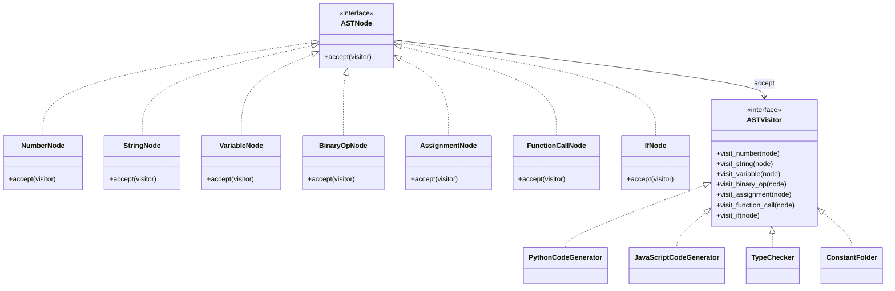

# Visitor

> "Represent an operation to be performed on the elements of an object structure. Visitor lets you define a new operation without changing the classes of the elements on which it operates."
> — **GoF**, *Design Patterns* (1994)

Có bao giờ bạn nhìn vào một cấu trúc object và nghĩ: "Trời ơi, mình muốn thêm một thao tác mới mà không muốn sửa từng class một!"? **Visitor là câu trả lời cho lời cầu nguyện đó.**

**Visitor** là một behavioral pattern cho phép tách các thao tác (operations) khỏi object hierarchy. Pattern này đặc biệt hữu ích khi bạn có một cấu trúc object **ổn định** (ít thay đổi) nhưng lại cần thêm **nhiều thao tác mới** lên cấu trúc đó. Nói như một ông già từng trải: *"Nếu cái cây không thể đến gặp nhà tiều phu, hãy để nhà tiều phu đến gặp cái cây."*

---

## Bài toán chi tiết

Tôi từng làm cho một công ty phần mềm — và một trong những dự án ác mộng nhất là xây dựng **hệ thống phân tích mã nguồn tĩnh** (Static Code Analysis). Hãy tưởng tượng bạn phải đọc và phân tích cây cú pháp trừu tượng (AST — Abstract Syntax Tree) của code Python để thực hiện đủ thứ việc:

**Cấu trúc AST (object hierarchy) ổn định gồm các node:**

| Node | Ý nghĩa | Thuộc tính |
|------|---------|-----------|
| `NumberNode` | Số nguyên/thực | `value: int` |
| `StringNode` | Chuỗi | `value: str` |
| `BinaryOpNode` | Phép toán hai ngôi | `left: Node, right: Node, op: str` |
| `VariableNode` | Biến | `name: str` |
| `AssignmentNode` | Gán giá trị | `target: str, value: Node` |
| `FunctionCallNode` | Gọi hàm | `name: str, args: List[Node]` |
| `IfNode` | Câu lệnh if | `condition: Node, then_body: List[Node], else_body: List[Node]` |

**Các thao tác (operations) muốn thêm lên AST:**
1. **Code Generator**: Sinh code Python, JavaScript, hoặc bytecode từ AST
2. **Type Checker**: Kiểm tra kiểu dữ liệu, phát hiện lỗi type mismatch
3. **Optimizer**: Tối ưu hóa (constant folding, dead code elimination)
4. **Formatter**: Format code theo chuẩn PEP 8
5. **Complexity Analyzer**: Tính độ phức tạp cyclomatic
6. **Security Auditor**: Phát hiện lỗ hổng bảo mật (SQL injection, XSS)

Cách tiếp cận ngây thơ — tôi dám cá nhiều bạn sẽ nghĩ đến đầu tiên — là thêm method vào mỗi node class:

```python
class NumberNode:
    def generate_code(self): ...
    def check_type(self): ...
    def optimize(self): ...
    def format(self): ...
    def complexity(self): ...
    def security_audit(self): ...

class BinaryOpNode:
    def generate_code(self): ...
    def check_type(self): ...
    def optimize(self): ...
    # ... cứ thế cho mỗi thao tác mới
```

Vấn đề — nói thật, đây là cơn ác mộng bảo trì:

1. **Vi phạm Single Responsibility**: Mỗi node class phải lo code gen, type check, optimize, format, security... **Một class mà làm việc của năm class**
2. **Vi phạm Open/Closed Principle**: Thêm thao tác mới? **Sửa TẤT CẢ node class.** Một cơn ác mộng.
3. **Class phình to**: `BinaryOpNode` 500+ dòng. Với 10 thao tác, bạn có thể hình dung.
4. **Logic phân tán**: Cùng một thao tác code generation mà bị phân mảnh khắp các class. Muốn sửa? Mất cả buổi để tìm.
5. **Khó maintain**: Thêm ngôn ngữ target mới (ví dụ: Java) = đi sửa từng node một. **Không có tương lai.**

---

## Giải pháp với Pattern

Visitor pattern giải quyết vấn đề này bằng cơ chế **double dispatch** — nghe cao siêu nhưng thực ra rất đơn giản:

- **Element** (`ASTNode`): Interface với `accept(visitor)` method — mỗi element gọi đúng `visitor.visit_XXX(self)`
- **Visitor** (`ASTVisitor`): Interface với `visit_XXX(node)` method cho mỗi loại element
- **ConcreteVisitor** (`CodeGenerator`, `TypeChecker`, ...): Implement các thao tác cụ thể
- **ObjectStructure** (AST tree): Collection các element, iterate và apply visitor

**Điều kỳ diệu:** Khi cần thêm thao tác mới, bạn chỉ cần thêm một ConcreteVisitor. **Không sửa bất kỳ node class nào.** Tôi nhớ lần đầu áp dụng Visitor, tôi đã thốt lên: "Trời, tại sao không ai nói cho tôi biết sớm hơn?"

---

## Phân tích thiết kế

### Double Dispatch

Double dispatch là cơ chế cho phép chọn method dựa trên runtime type của **hai** object (element + visitor), không chỉ một:

```python
# Single dispatch (Python thông thường)
node.process()  # Chọn dựa trên type của node

# Double dispatch (Visitor pattern)
node.accept(visitor)  # visitor.visit_xxx(node) — dựa trên type của cả node và visitor
```

Python không hỗ trợ double dispatch natively (không có method overloading như Java/C#). Visitor pattern implement nó bằng cách:
1. `node.accept(visitor)` gọi `visitor.visit_XXX(node)` dựa trên type của node
2. `visitor.visit_XXX(node)` thực thi thao tác dựa trên type của visitor

### Nguyên lý OOP

Visitor là một trong những pattern thú vị nhất khi nhìn qua góc nhìn OOP:

- **Single Responsibility**: Node chỉ biết accept visitor. Visitor chỉ biết thao tác trên một loại node — **mỗi thằng một việc**
- **Open/Closed Principle**: Thêm thao tác = thêm Visitor. **Không đụng đến Node.** Open/Closed ở dạng thuần khiết nhất.
- **Acyclic Dependency**: Visitor phụ thuộc vào Node, Node phụ thuộc vào Visitor — nhưng là vòng dependency kiểm soát được, không phải mớ bòng bong

### Trade-offs

Nhưng — **không có gì là hoàn hảo**. Và Visitor có những cái giá rất rõ ràng:

1. **Khó thêm Element mới**: Thêm node type mới (`WhileNode`) — **sửa TẤT CẢ visitor.** Đây là trade-off kinh điển: dễ thêm operation, khó thêm element. **Hai mặt của một đồng xu.**
2. **Vi phạm encapsulation**: Visitor cần biết internal state của element. Phải expose public API — đánh đổi sự riêng tư.
3. **Circular dependency**: Element biết Visitor, Visitor biết Element — nhưng như tôi nói, nó có thể kiểm soát được.
4. **Complexity**: Pattern này **phức tạp hơn hầu hết các pattern behavioral khác.** Không phải ai cũng hiểu ngay.

### Khi nào KHÔNG dùng

Tôi muốn nhấn mạnh điều này — **Visitor không phải ai cũng nên dùng:**

- Khi object hierarchy thường xuyên thay đổi — thêm element mới là cực hình
- Khi chỉ có 1-2 operation và không có kế hoạch mở rộng — **dùng method trong element cho lành**
- Khi operation đơn giản — đừng "dùng dao mổ trâu để cắt rau"
- Khi element hierarchy không ổn định — thêm/xóa node liên tục thì Visitor là cơn ác mộng

---

## Ví dụ code hoàn chỉnh

### Cách sai: God class nodes

Đây là cách mà hầu hết mọi người sẽ viết — và sẽ hối hận sau này. **Mỗi node làm đủ thứ việc:**

```python
from dataclasses import dataclass, field
from typing import List, Optional, Any


@dataclass
class NaiveASTNode:
    """Cách sai: mỗi node chứa mọi thao tác"""

    def generate_code_python(self) -> str:
        raise NotImplementedError

    def generate_code_javascript(self) -> str:
        raise NotImplementedError

    def check_type(self, env: dict) -> str:
        raise NotImplementedError

    def optimize(self) -> 'NaiveASTNode':
        raise NotImplementedError

    def calculate_complexity(self) -> int:
        raise NotImplementedError


@dataclass
class NaiveNumberNode(NaiveASTNode):
    value: Any

    def generate_code_python(self) -> str:
        return str(self.value)

    def generate_code_javascript(self) -> str:
        return str(self.value)

    def check_type(self, env: dict) -> str:
        if isinstance(self.value, int):
            return "int"
        elif isinstance(self.value, float):
            return "float"
        return "unknown"

    def optimize(self) -> 'NaiveASTNode':
        return self

    def calculate_complexity(self) -> int:
        return 1


@dataclass
class NaiveBinaryOpNode(NaiveASTNode):
    left: NaiveASTNode
    right: NaiveASTNode
    op: str

    def generate_code_python(self) -> str:
        l = self.left.generate_code_python()
        r = self.right.generate_code_python()
        return f"({l} {self.op} {r})"

    def generate_code_javascript(self) -> str:
        l = self.left.generate_code_javascript()
        r = self.right.generate_code_javascript()
        op_map = {"and": "&&", "or": "||"}
        js_op = op_map.get(self.op, self.op)
        return f"({l} {js_op} {r})"

    def check_type(self, env: dict) -> str:
        l_type = self.left.check_type(env)
        r_type = self.right.check_type(env)
        if self.op in ("+", "-", "*", "/"):
            if l_type == r_type:
                return l_type
            return "error: type mismatch"
        return "unknown"

    def optimize(self) -> 'NaiveASTNode':
        left = self.left.optimize()
        right = self.right.optimize()
        if isinstance(left, NaiveNumberNode) and isinstance(right, NaiveNumberNode):
            if self.op == "+":
                return NaiveNumberNode(left.value + right.value)
            elif self.op == "*":
                return NaiveNumberNode(left.value * right.value)
        return NaiveBinaryOpNode(left, right, self.op)

    def calculate_complexity(self) -> int:
        return self.left.calculate_complexity() + self.right.calculate_complexity() + 1

# Khi thêm IfNode:
# @dataclass
# class NaiveIfNode(NaiveASTNode):
#     condition: NaiveASTNode
#     then_body: List[NaiveASTNode]
#     else_body: List[NaiveASTNode]
#     # Phải implement LẠI 5 method trên...
```

### Cách đúng: Visitor Pattern

Và đây — cách làm đúng. **Tách thao tác khỏi cấu trúc. Các bạn đi chơi, tôi ở nhà trông nhà:**

```python
from abc import ABC, abstractmethod
from dataclasses import dataclass, field
from typing import List, Optional, Any, Dict


# ============================================================
# Element Interface & Concrete Elements
# ============================================================
class ASTNode(ABC):
    """Interface cho tất cả node trong AST"""

    @abstractmethod
    def accept(self, visitor: 'ASTVisitor') -> Any:
        """Accept visitor — double dispatch entry point"""
        pass


@dataclass
class NumberNode(ASTNode):
    value: Any

    def accept(self, visitor: 'ASTVisitor') -> Any:
        return visitor.visit_number(self)


@dataclass
class StringNode(ASTNode):
    value: str

    def accept(self, visitor: 'ASTVisitor') -> Any:
        return visitor.visit_string(self)


@dataclass
class VariableNode(ASTNode):
    name: str

    def accept(self, visitor: 'ASTVisitor') -> Any:
        return visitor.visit_variable(self)


@dataclass
class BinaryOpNode(ASTNode):
    left: ASTNode
    right: ASTNode
    op: str

    def accept(self, visitor: 'ASTVisitor') -> Any:
        return visitor.visit_binary_op(self)


@dataclass
class AssignmentNode(ASTNode):
    target: str
    value: ASTNode

    def accept(self, visitor: 'ASTVisitor') -> Any:
        return visitor.visit_assignment(self)


@dataclass
class FunctionCallNode(ASTNode):
    name: str
    args: List[ASTNode] = field(default_factory=list)

    def accept(self, visitor: 'ASTVisitor') -> Any:
        return visitor.visit_function_call(self)


@dataclass
class IfNode(ASTNode):
    condition: ASTNode
    then_body: List[ASTNode] = field(default_factory=list)
    else_body: List[ASTNode] = field(default_factory=list)

    def accept(self, visitor: 'ASTVisitor') -> Any:
        return visitor.visit_if(self)


# ============================================================
# Visitor Interface
# ============================================================
class ASTVisitor(ABC):
    """Interface cho tất cả visitor"""

    @abstractmethod
    def visit_number(self, node: NumberNode) -> Any:
        pass

    @abstractmethod
    def visit_string(self, node: StringNode) -> Any:
        pass

    @abstractmethod
    def visit_variable(self, node: VariableNode) -> Any:
        pass

    @abstractmethod
    def visit_binary_op(self, node: BinaryOpNode) -> Any:
        pass

    @abstractmethod
    def visit_assignment(self, node: AssignmentNode) -> Any:
        pass

    @abstractmethod
    def visit_function_call(self, node: FunctionCallNode) -> Any:
        pass

    @abstractmethod
    def visit_if(self, node: IfNode) -> Any:
        pass


# ============================================================
# Concrete Visitor 1: Code Generator (Python)
# ============================================================
class PythonCodeGenerator(ASTVisitor):
    """Sinh code Python từ AST"""

    def visit_number(self, node: NumberNode) -> str:
        return str(node.value)

    def visit_string(self, node: StringNode) -> str:
        return f"'{node.value}'"

    def visit_variable(self, node: VariableNode) -> str:
        return node.name

    def visit_binary_op(self, node: BinaryOpNode) -> str:
        left = node.left.accept(self)
        right = node.right.accept(self)
        return f"({left} {node.op} {right})"

    def visit_assignment(self, node: AssignmentNode) -> str:
        value = node.value.accept(self)
        return f"{node.target} = {value}"

    def visit_function_call(self, node: FunctionCallNode) -> str:
        args = ", ".join(arg.accept(self) for arg in node.args)
        return f"{node.name}({args})"

    def visit_if(self, node: IfNode) -> str:
        cond = node.condition.accept(self)
        then_code = "\n".join(stmt.accept(self) for stmt in node.then_body)
        result = f"if {cond}:\n    {then_code}"
        if node.else_body:
            else_code = "\n".join(stmt.accept(self) for stmt in node.else_body)
            result += f"\nelse:\n    {else_code}"
        return result


# ============================================================
# Concrete Visitor 2: JavaScript Code Generator
# ============================================================
class JavaScriptCodeGenerator(ASTVisitor):
    """Sinh code JavaScript từ AST"""

    OP_MAP = {
        "and": "&&", "or": "||", "not": "!",
        "==": "===", "!=": "!==",
    }

    def visit_number(self, node: NumberNode) -> str:
        return str(node.value)

    def visit_string(self, node: StringNode) -> str:
        return f"'{node.value}'"

    def visit_variable(self, node: VariableNode) -> str:
        return f"let {node.name}"  # simplified

    def visit_binary_op(self, node: BinaryOpNode) -> str:
        left = node.left.accept(self)
        right = node.right.accept(self)
        js_op = self.OP_MAP.get(node.op, node.op)
        return f"({left} {js_op} {right})"

    def visit_assignment(self, node: AssignmentNode) -> str:
        value = node.value.accept(self)
        return f"{node.target} = {value};"

    def visit_function_call(self, node: FunctionCallNode) -> str:
        args = ", ".join(arg.accept(self) for arg in node.args)
        return f"{node.name}({args})"

    def visit_if(self, node: IfNode) -> str:
        cond = node.condition.accept(self)
        then_code = "\n".join(f"    {stmt.accept(self)}" for stmt in node.then_body)
        result = f"if ({cond}) {{\n{then_code}\n}}"
        if node.else_body:
            else_code = "\n".join(f"    {stmt.accept(self)}" for stmt in node.else_body)
            result += f" else {{\n{else_code}\n}}"
        return result


# ============================================================
# Concrete Visitor 3: Type Checker
# ============================================================
class TypeChecker(ASTVisitor):
    """Kiểm tra kiểu dữ liệu — phát hiện type mismatch"""

    def __init__(self):
        self.symbol_table: Dict[str, str] = {}
        self.errors: List[str] = []

    def visit_number(self, node: NumberNode) -> str:
        if isinstance(node.value, int):
            return "int"
        elif isinstance(node.value, float):
            return "float"
        return "unknown"

    def visit_string(self, node: StringNode) -> str:
        return "str"

    def visit_variable(self, node: VariableNode) -> str:
        var_type = self.symbol_table.get(node.name, "unknown")
        if var_type == "unknown":
            self.errors.append(f"Warning: variable '{node.name}' not declared")
        return var_type

    def visit_binary_op(self, node: BinaryOpNode) -> str:
        left_type = node.left.accept(self)
        right_type = node.right.accept(self)
        if left_type != right_type and left_type != "unknown" and right_type != "unknown":
            self.errors.append(
                f"Type mismatch: {left_type} {node.op} {right_type}"
            )
        if node.op in ("+", "-", "*", "/", "%"):
            return left_type
        elif node.op in ("==", "!=", "<", ">", "<=", ">="):
            return "bool"
        elif node.op in ("and", "or"):
            return "bool"
        return "unknown"

    def visit_assignment(self, node: AssignmentNode) -> str:
        value_type = node.value.accept(self)
        self.symbol_table[node.target] = value_type
        return value_type

    def visit_function_call(self, node: FunctionCallNode) -> str:
        arg_types = [arg.accept(self) for arg in node.args]
        return "any"

    def visit_if(self, node: IfNode) -> str:
        cond_type = node.condition.accept(self)
        if cond_type != "bool" and cond_type != "unknown":
            self.errors.append(f"Condition must be bool, got {cond_type}")
        for stmt in node.then_body:
            stmt.accept(self)
        for stmt in node.else_body:
            stmt.accept(self)
        return "void"


# ============================================================
# Concrete Visitor 4: Constant Folder (Optimizer)
# ============================================================
class ConstantFolder(ASTVisitor):
    """Tối ưu hóa constant folding — tính toán biểu thức hằng số tại compile time"""

    def visit_number(self, node: NumberNode) -> ASTNode:
        return node

    def visit_string(self, node: StringNode) -> ASTNode:
        return node

    def visit_variable(self, node: VariableNode) -> ASTNode:
        return node

    def visit_binary_op(self, node: BinaryOpNode) -> ASTNode:
        left = node.left.accept(self)
        right = node.right.accept(self)
        if isinstance(left, NumberNode) and isinstance(right, NumberNode):
            if isinstance(left.value, (int, float)) and isinstance(right.value, (int, float)):
                try:
                    result = eval(f"{left.value} {node.op} {right.value}")
                    return NumberNode(result)
                except (ZeroDivisionError, TypeError):
                    pass
        return BinaryOpNode(left=left, right=right, op=node.op)

    def visit_assignment(self, node: AssignmentNode) -> ASTNode:
        value = node.value.accept(self)
        return AssignmentNode(target=node.target, value=value)

    def visit_function_call(self, node: FunctionCallNode) -> ASTNode:
        args = [arg.accept(self) for arg in node.args]
        return FunctionCallNode(name=node.name, args=args)

    def visit_if(self, node: IfNode) -> ASTNode:
        cond = node.condition.accept(self)
        then_body = [stmt.accept(self) for stmt in node.then_body]
        else_body = [stmt.accept(self) for stmt in node.else_body]
        if isinstance(cond, NumberNode):
            if cond.value:
                return then_body[0] if then_body else NumberNode(None)
            else:
                return else_body[0] if else_body else NumberNode(None)
        return IfNode(condition=cond, then_body=then_body, else_body=else_body)


# ============================================================
# Usage
# ============================================================
def build_sample_ast() -> IfNode:
    """Xây dựng AST mẫu: if (x + 2) * 3 > 10: result = 1 + 2 else: result = 0"""
    return IfNode(
        condition=BinaryOpNode(
            left=BinaryOpNode(
                left=BinaryOpNode(
                    left=VariableNode("x"),
                    right=NumberNode(2),
                    op="+"
                ),
                right=NumberNode(3),
                op="*"
            ),
            right=NumberNode(10),
            op=">"
        ),
        then_body=[
            AssignmentNode(
                target="result",
                value=BinaryOpNode(
                    left=NumberNode(1),
                    right=NumberNode(2),
                    op="+"
                )
            )
        ],
        else_body=[
            AssignmentNode(
                target="result",
                value=NumberNode(0)
            )
        ]
    )


def main() -> None:
    ast = build_sample_ast()

    print("=" * 65)
    print("1. CODE GENERATOR — PYTHON")
    print("=" * 65)
    py_gen = PythonCodeGenerator()
    py_code = ast.accept(py_gen)
    print(py_code)

    print("\n" + "=" * 65)
    print("2. CODE GENERATOR — JAVASCRIPT")
    print("=" * 65)
    js_gen = JavaScriptCodeGenerator()
    js_code = ast.accept(js_gen)
    print(js_code)

    print("\n" + "=" * 65)
    print("3. TYPE CHECKER")
    print("=" * 65)
    type_checker = TypeChecker()
    ast.accept(type_checker)
    print(f"Symbol table: {type_checker.symbol_table}")
    if type_checker.errors:
        for err in type_checker.errors:
            print(f"  ⚠️  {err}")
    else:
        print("  ✅ No type errors")

    print("\n" + "=" * 65)
    print("4. CONSTANT FOLDER (OPTIMIZER)")
    print("=" * 65)
    optimizer = ConstantFolder()
    optimized_ast = ast.accept(optimizer)
    py_code_opt = optimized_ast.accept(py_gen)
    print(f"Trước: {py_code}")
    print(f"Sau:   {py_code_opt}")

    print("\n" + "=" * 65)
    print("5. CHAIN VISITORS")
    print("=" * 65)
    print("Có thể chain nhiều visitor trên cùng AST:")
    ast2 = build_sample_ast()
    # Optimize trước, rồi generate code
    opt = ast2.accept(ConstantFolder())
    final_code = opt.accept(PythonCodeGenerator())
    print(f"Optimized Python: {final_code}")


if __name__ == "__main__":
    main()
```

---

## Sơ đồ UML



Double Dispatch Flow:
  node.accept(visitor)
    → visitor.visit_XXX(node)     ← dispatch lần 1 (trong accept)
      → visitor thực thi logic     ← dispatch lần 2 (trong visit_XXX)

---

## So sánh với Pattern liên quan

Nhiều bạn hỏi tôi — "Visitor khác gì Iterator? Khác gì Strategy?" Đây là câu trả lời:

### 1. Visitor vs Iterator

| Tiêu chí | Visitor | Iterator |
|----------|---------|----------|
| Mục đích | Thêm thao tác trên cấu trúc | Duyệt cấu trúc tuần tự |
| Kết hợp | ✅ Có thể dùng Iterator để duyệt, Visitor để xử lý | - |
| Thay đổi structure | Visitor thường không thay đổi | Iterator chỉ đọc |
| Độ phức tạp | Cao | Thấp |

**Kết hợp**: Dùng Iterator để duyệt tree (DFS/BFS), Visitor để xử lý từng node. **Đây là cách compiler design thường làm.**

### 2. Visitor vs Strategy

| Tiêu chí | Visitor | Strategy |
|----------|---------|----------|
| Scope | Nhiều thao tác trên nhiều class | Một thao tác, nhiều thuật toán |
| Dispatch | Double dispatch | Single dispatch |
| Object structure | Cần cấu trúc ổn định, nhiều class | Một class, nhiều thuật toán |
| Khi nào dùng | Cần thêm operation lên object hierarchy | Cần thay đổi thuật toán |

### 3. Visitor vs Command

Command đóng gói **một** request. Visitor đóng gói **nhiều** thao tác liên quan. **Sự khác biệt nằm ở số lượng và mối quan hệ:**

| Tiêu chí | Visitor | Command |
|----------|---------|---------|
| Số lượng thao tác | Nhiều (một visitor = nhiều thao tác) | Một (một command = một thao tác) |
| Object structure | Cần object hierarchy phức tạp | Không cần cấu trúc đặc biệt |
| State | Visitor có thể có state | Command thường stateless |

---

## Ứng dụng thực tế

Visitor xuất hiện ở rất nhiều nơi — đặc biệt là trong compiler và code analysis:

### 1. Python `ast` Module

Mô-đun `ast` của Python — **ví dụ kinh điển nhất của Visitor pattern.** Tôi dùng nó hằng ngày:

```python
import ast
from ast import NodeVisitor

class CodeAnalyzer(NodeVisitor):
    """Visitor phân tích code Python — kế thừa từ ast.NodeVisitor"""

    def __init__(self):
        self.function_count = 0
        self.class_count = 0
        self.imports = []

    def visit_FunctionDef(self, node: ast.FunctionDef):
        """Được gọi khi gặp function definition"""
        self.function_count += 1
        self.generic_visit(node)  # Tiếp tục duyệt children

    def visit_ClassDef(self, node: ast.ClassDef):
        self.class_count += 1
        self.generic_visit(node)

    def visit_Import(self, node: ast.Import):
        for alias in node.names:
            self.imports.append(alias.name)
        self.generic_visit(node)

    def visit_ImportFrom(self, node: ast.ImportFrom):
        if node.module:
            self.imports.append(node.module)
        self.generic_visit(node)


# Sử dụng
source_code = """
import os
import sys
from datetime import datetime

class MyClass:
    def my_method(self):
        print("hello")

def my_function():
    pass
"""

tree = ast.parse(source_code)
analyzer = CodeAnalyzer()
analyzer.visit(tree)  # Template Method pattern gọi đúng visit_XXX

print(f"Functions: {analyzer.function_count}")   # 1
print(f"Classes: {analyzer.class_count}")         # 1
print(f"Imports: {analyzer.imports}")             # ['os', 'sys', 'datetime']
```

### 2. Django Template Engine

Django template engine cũng dùng Visitor để render template — **bạn đã dùng mà không hề hay biết:**

```python
# django/template/base.py (simplified)
class Node:
    def render(self, context):
        """Template Method"""
        pass

    def accept(self, visitor):
        """Visitor pattern hook"""
        return visitor.visit(self)

class VariableNode(Node):
    def __init__(self, var_name):
        self.var_name = var_name

    def accept(self, visitor):
        return visitor.visit_variable(self)

class ForNode(Node):
    def __init__(self, loop_var, sequence, body):
        self.loop_var = loop_var
        self.sequence = sequence
        self.body = body

    def accept(self, visitor):
        return visitor.visit_for(self)

# Visitor để render template
class TemplateRenderer:
    def visit(self, node):
        return node.render({})

    def visit_variable(self, node):
        return f"{{{{ {node.var_name} }}}}"

    def visit_for(self, node):
        body = "\n".join(self.visit(n) for n in node.body)
        return f"{}{{{body}}}{}"
```

### 3. Compiler Design (LLVM, GCC)

Đây là nơi Visitor thể hiện sức mạnh thực sự — **trong compiler, nó hiện diện ở mọi giai đoạn:**

```python
# Các phase của compiler đều là Visitor:
# 1. Lexical Analysis → Token stream
# 2. Parser → AST
# 3. Semantic Analysis (TypeChecker) → Decorated AST
# 4. Optimizer (ConstantFolder) → Optimized AST
# 5. Code Generator → Target code
# 6. Machine Code Generator → Assembly/Bytecode

# Mỗi phase là một ConcreteVisitor
ast = parser.parse(source_code)

ast = SemanticAnalyzer().visit(ast)      # kiểm tra type
ast = ConstantFolder().visit(ast)        # tối ưu hằng số
ast = DeadCodeEliminator().visit(ast)    # xóa code chết
assembly = CodeGenerator().visit(ast)    # sinh assembly
```

### 4. Lint Tools (Pylint, Flake8)

Cuối cùng — lint tools. Bạn dùng Pylint mỗi ngày? **Nó chính là một Visitor đấy:**

```python

```python
# Pylint dùng Visitor để duyệt AST và phát hiện lỗi
class PylintChecker(ast.NodeVisitor):
    """Base visitor cho pylint checks"""

    def visit_compare(self, node):
        """Phát hiện so sánh với None sai: x == None thay vì x is None"""
        if isinstance(node.ops[0], (ast.Eq, ast.Is)):
            if isinstance(node.comparators[0], ast.Constant) and node.comparators[0].value is None:
                self.add_message("C0121", node=node,
                               message="Use 'is None' instead of '== None'")
        self.generic_visit(node)
```

---

## Kiểm thử

Visitor pattern có thể test từng visitor riêng biệt — rất dễ dàng:

```python
import unittest
from typing import List


class TestVisitorPattern(unittest.TestCase):
    def setUp(self):
        # AST: x = 1 + 2 * 3
        self.simple_ast = AssignmentNode(
            target="x",
            value=BinaryOpNode(
                left=NumberNode(1),
                right=BinaryOpNode(
                    left=NumberNode(2),
                    right=NumberNode(3),
                    op="*"
                ),
                op="+"
            )
        )

    def test_python_code_generation(self):
        """PythonCodeGenerator sinh code đúng"""
        gen = PythonCodeGenerator()
        code = self.simple_ast.accept(gen)
        self.assertEqual(code, "x = (1 + (2 * 3))")

    def test_javascript_code_generation(self):
        """JavaScriptCodeGenerator sinh code đúng"""
        gen = JavaScriptCodeGenerator()
        code = self.simple_ast.accept(gen)
        self.assertEqual(code, "x = (1 + (2 * 3));")

    def test_constant_folding(self):
        """ConstantFolder tối ưu biểu thức hằng số"""
        ast = BinaryOpNode(
            left=NumberNode(10),
            right=BinaryOpNode(
                left=NumberNode(5),
                right=NumberNode(3),
                op="+"
            ),
            op="*"
        )
        optimizer = ConstantFolder()
        optimized = ast.accept(optimizer)
        gen = PythonCodeGenerator()
        code = optimized.accept(gen)
        # 10 * (5 + 3) = 10 * 8 = 80
        self.assertEqual(code, "80")

    def test_nested_constant_folding(self):
        """Constant folding với biểu thức lồng nhau"""
        ast = BinaryOpNode(
            left=BinaryOpNode(left=NumberNode(2), right=NumberNode(3), op="+"),
            right=BinaryOpNode(left=NumberNode(4), right=NumberNode(5), op="+"),
            op="*"
        )
        optimizer = ConstantFolder()
        optimized = ast.accept(optimizer)
        self.assertIsInstance(optimized, NumberNode)
        self.assertEqual(optimized.value, 45)  # (2+3) * (4+5) = 5 * 9 = 45

    def test_type_checking(self):
        """TypeChecker phát hiện type mismatch"""
        ast = AssignmentNode(
            target="result",
            value=BinaryOpNode(
                left=NumberNode(10),
                right=StringNode("hello"),
                op="+"
            )
        )
        checker = TypeChecker()
        ast.accept(checker)
        self.assertGreater(len(checker.errors), 0)
        self.assertTrue(any("Type mismatch" in err for err in checker.errors))

    def test_type_checking_no_errors(self):
        """TypeChecker không báo lỗi với code đúng kiểu"""
        ast = BinaryOpNode(
            left=NumberNode(10),
            right=NumberNode(20),
            op="+"
        )
        checker = TypeChecker()
        ast.accept(checker)
        self.assertEqual(len(checker.errors), 0)

    def test_type_checker_symbol_table(self):
        """TypeChecker xây dựng symbol table đúng"""
        assign = AssignmentNode(
            target="my_var",
            value=BinaryOpNode(left=NumberNode(1), right=NumberNode(2), op="+")
        )
        checker = TypeChecker()
        assign.accept(checker)
        self.assertEqual(checker.symbol_table.get("my_var"), "int")

    def test_if_node_python_code(self):
        """IfNode sinh code Python đúng"""
        ast = IfNode(
            condition=BinaryOpNode(left=NumberNode(1), right=NumberNode(2), op="<"),
            then_body=[AssignmentNode(target="x", value=NumberNode(10))],
            else_body=[AssignmentNode(target="x", value=NumberNode(20))]
        )
        gen = PythonCodeGenerator()
        code = ast.accept(gen)
        self.assertIn("if", code)
        self.assertIn("else", code)
        self.assertIn("x = 10", code)
        self.assertIn("x = 20", code)

    def test_visitor_chain(self):
        """Có thể chain visitor: optimize → generate"""
        ast = BinaryOpNode(
            left=NumberNode(100),
            right=BinaryOpNode(left=NumberNode(0), right=NumberNode(5), op="*"),
            op="+"
        )
        # Optimize trước
        optimized = ast.accept(ConstantFolder())
        # Generate code
        code = optimized.accept(PythonCodeGenerator())
        self.assertEqual(code, "100")  # 100 + (0 * 5) = 100

    def test_function_call_visitor(self):
        """FunctionCallNode visitor"""
        ast = FunctionCallNode(
            name="print",
            args=[StringNode("hello"), NumberNode(42)]
        )
        gen = PythonCodeGenerator()
        code = ast.accept(gen)
        self.assertEqual(code, "print('hello', 42)")

    def test_variable_accept(self):
        """VariableNode visitor"""
        gen = PythonCodeGenerator()
        code = VariableNode("counter").accept(gen)
        self.assertEqual(code, "counter")

    def test_multiple_visitors_same_ast(self):
        """Cùng AST có thể áp dụng nhiều visitor"""
        ast = NumberNode(42)
        py = ast.accept(PythonCodeGenerator())
        js = ast.accept(JavaScriptCodeGenerator())
        self.assertEqual(py, js)  # Number giống nhau


if __name__ == "__main__":
    unittest.main()
```

---

## Ưu và nhược điểm

| Ưu điểm | Nhược điểm |
|---------|------------|
| **Open/Closed**: Thêm operation = thêm Visitor, không sửa Element | **Khó thêm Element**: Thêm element mới = sửa tất cả Visitor |
| **Single Responsibility**: Element chỉ chịu trách nhiệm accept | **Vi phạm encapsulation**: Visitor cần biết internal state |
| **Logic tập trung**: Cùng operation gom vào một Visitor | **Circular dependency**: Element biết Visitor, Visitor biết Element |
| **Tái sử dụng**: Visitor có thể dùng trên nhiều cấu trúc | **Phức tạp**: Double dispatch khó hiểu với dev mới |
| **Dễ thêm operation**: Không sửa class hiện tại | **Nếu Element hierarchy thay đổi**: Phải sửa tất cả Visitor |
| **Accumulate state**: Visitor có thể tích lũy state qua nhiều node | **Return type khác nhau**: Visitor có thể trả về type bất kỳ → type safety giảm |

---

---

## Kết luận

Tôi nhớ có lần đọc được câu: *"Với một cái búa đủ lớn, mọi thứ trông giống như một cái đinh."* Visitor pattern là cái búa — nhưng **chỉ dùng khi bạn thực sự cần đóng đinh.**

Visitor là một pattern mạnh, nhưng — **CHỈ nên dùng khi thực sự cần**. Nó giải quyết một vấn đề rất cụ thể: "Object hierarchy ổn định, nhưng cần thêm nhiều operation không liên quan". Pattern này đặc biệt phổ biến trong **compiler design, code analysis, và document processing**. Nếu bạn đang làm những lĩnh vực này — Visitor là bạn đồng hành.

### Khi nào mang Visitor ra xài

- ✅ Có object hierarchy ổn định (ít thay đổi) với nhiều class
- ✅ Cần thêm nhiều thao tác khác nhau — **Visitor sinh ra cho việc này**
- ✅ Các thao tác không liên quan đến nhau — đừng gộp chung vào Element
- ✅ Hierarchy được dùng chung giữa nhiều module/framework

### Golden Rules — bài học từ những lần vấp ngã

1. **Dùng Visitor khi hierarchy ổn định, operation thay đổi**: Nếu cả hai đều thay đổi — **chuẩn bị tinh thần đi.**
2. **Tên method visit_XXX rõ ràng**: `visit_Number`, `visit_BinaryOp` — đọc là biết ngay. **Convention là vàng.**
3. **Cân nhắc `@singledispatchmethod`**: Python 3.8+ có singledispatch. Có thể thay thế Visitor cho các case đơn giản. **Đừng phức tạp hóa mọi thứ.**
4. **Visitor có state là bình thường**: TypeChecker cần symbol table? Tốt. **State trong Visitor là hoàn toàn OK.**
5. **Đừng lạm dụng**: 2-3 operation và 2-3 element? Dùng method thông thường. **Đơn giản luôn là tốt nhất.**

---

*Trân trọng!*
