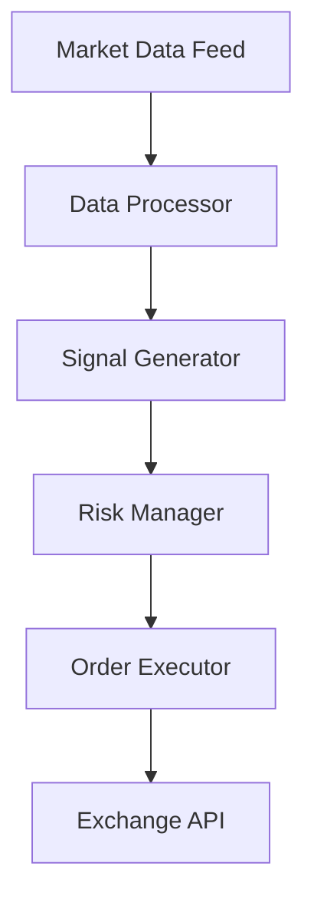

# Trading System

The core trading engine handles order execution, risk management, and market data processing.

## Architecture

## Key Components

### Market Data Feed
- WebSocket connections to Binance, Bybit, OKX
- Real-time order book aggregation
- Tick-level data processing

### Signal Generator
- Technical indicators pipeline
- ML-based pattern recognition
- Multi-timeframe analysis

### Risk Manager
- Position sizing calculator
- Maximum drawdown limits
- Correlation-based exposure control

### Order Executor
- Smart order routing
- Slippage protection
- FIX protocol support

## Integration Points

| Component | Protocol | Latency |
|-----------|----------|---------|
| Exchange | WebSocket/REST | < 100ms |
| Database | PostgreSQL | < 10ms |
| Cache | Redis | < 1ms |
